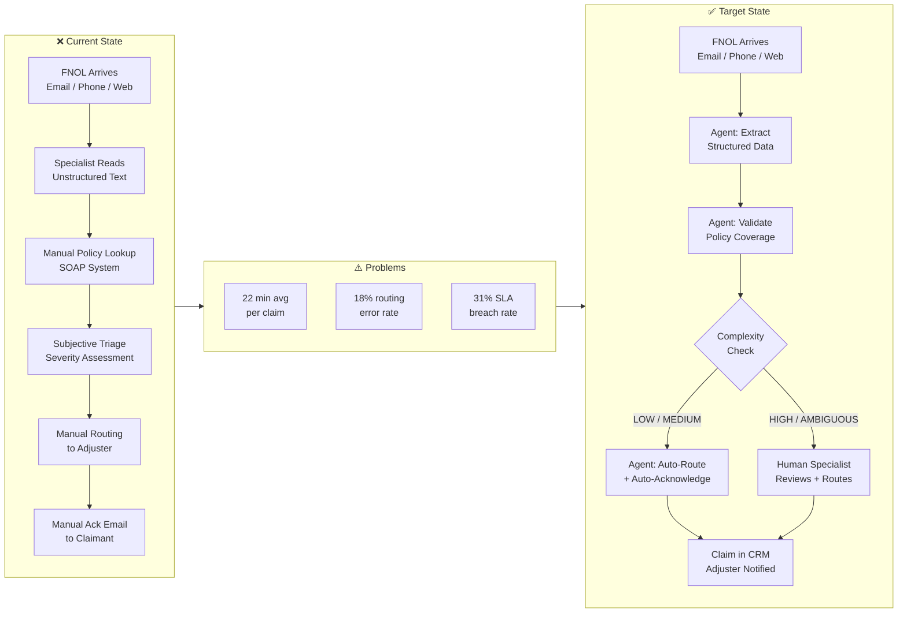
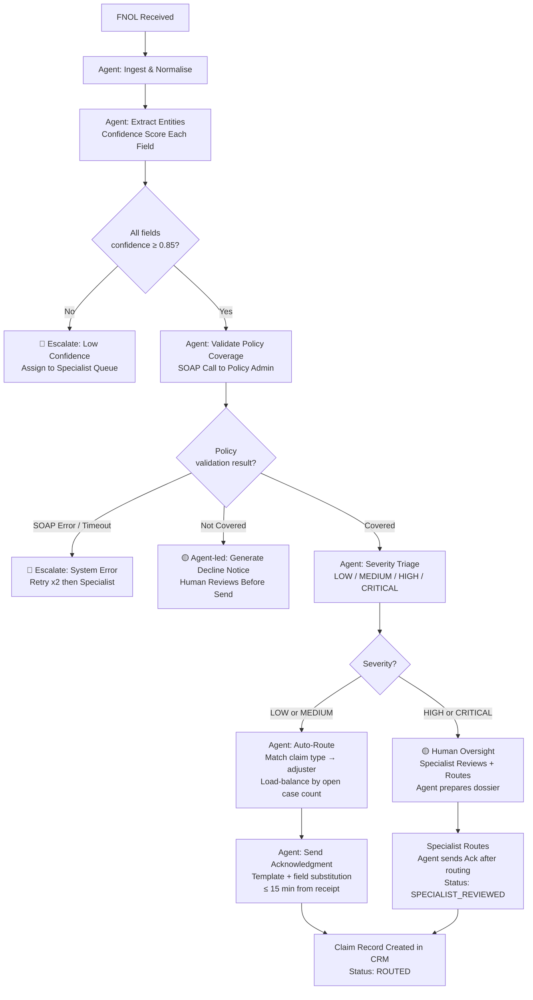
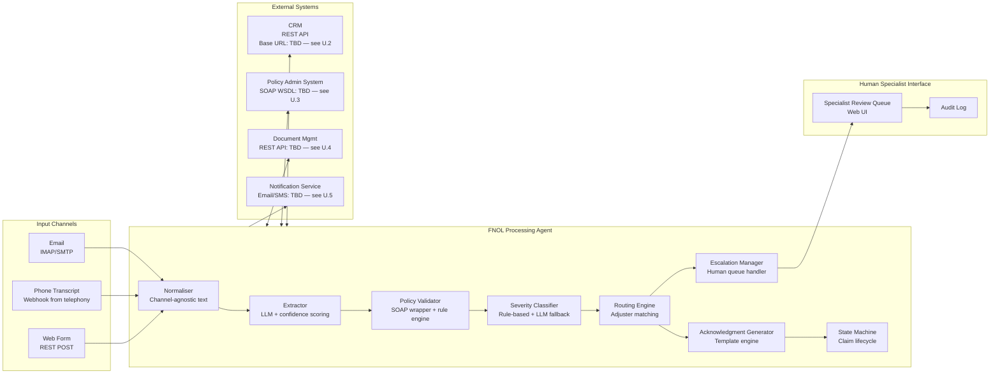
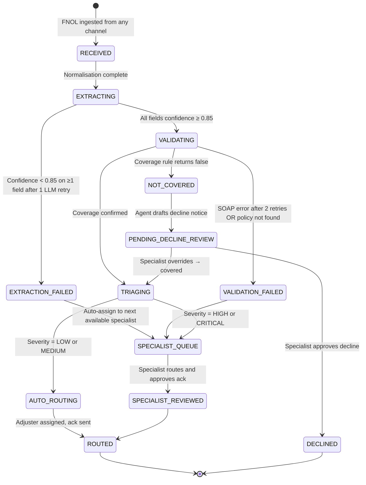

# Gate 1 — FNOL Claims Processing Agent
## Nadia Rahmatulla | AI-Native Specification

**Scenario:** Mid-size insurance company. 300 FNOL reports/day. 12 specialists. 22 min/claim average. 18% routing error rate. 31% SLA breach rate. 2-hour SLA. Inputs: unstructured text (email, phone transcript, web form). Systems: CRM (REST API), legacy policy admin (SOAP), document management system (DMS). No AI infrastructure today.

---

## Table of Contents

1. [Problem Statement & Success Metrics](#1-problem-statement--success-metrics)
2. [Delegation Analysis](#2-delegation-analysis)
3. [Agent Specification](#3-agent-specification)
4. [Validation Design](#4-validation-design)
5. [Assumptions & Unknowns](#5-assumptions--unknowns)

---

## 1. Problem Statement & Success Metrics

### 1.1 The Problem — Business Perspective

The claims intake process is at full utilisation and failing on quality. With 300 claims/day and 12 specialists at 22 min/claim, the team consumes approximately **110 person-hours/day** — leaving zero slack for complexity spikes, absences, or re-work.

The quality numbers are the real signal:

| Metric | Current | Impact |
|---|---|---|
| Routing error rate | 18% | 54 claims/day sent to wrong adjuster → rework, delay |
| SLA breach rate | 31% | 93 claimants/day not acknowledged within 2 hours |
| Avg handling time | 22 min/claim | Includes manual lookup, copy-paste, coverage check |

**Root cause:** Specialists are doing structured work (data extraction, policy lookup, routing logic) manually, from unstructured inputs, under time pressure. The inconsistency is a function of the process design, not specialist capability.

---

### 1.2 The Problem — Claimant Perspective

FNOL is the highest-stakes moment in the customer relationship. A claimant reporting a house fire, car accident, or theft is emotionally distressed and expecting a rapid, professional response. Currently:

- **31% of claimants** (93/day) receive no acknowledgment within the 2-hour SLA
- **18% of claimants** (54/day) have their claims routed incorrectly, causing unexplained delays and re-contact
- There is no evidence in the scenario of proactive claimant communication when SLA is at risk

This is not an efficiency problem for the claimant — it is a **trust problem**. The insurance relationship is built on the promise of support at the moment of loss. Failing at FNOL damages that promise.

---

### 1.3 Success Metrics

Every metric below must be measurable against current baseline in a 30-day pilot. Metrics without a measurement method are not accepted.

#### Primary Metrics (Investment Justification)

| Metric | Baseline | Target | Measurement Method |
|---|---|---|---|
| Routing error rate | 18% | ≤ 5% | Adjuster re-assignment events / total claims over 30 days |
| SLA breach rate | 31% | ≤ 10% | Timestamp: claim received → acknowledgment sent; % exceeding 120 min |
| Average handling time (specialist) | 22 min | ≤ 8 min | Time-tracked per claim for human-reviewed cases; ≤ 3 min for fully agentic |
| Claimant acknowledgment time | Unknown baseline | ≤ 15 min from receipt for LOW/MEDIUM claims | Timestamp: FNOL received → ack email/SMS sent |

#### Secondary Metrics (Quality Assurance)

| Metric | Target | Measurement Method |
|---|---|---|
| Triage accuracy (severity) | ≥ 92% agreement with specialist review on sampled 10% | Weekly audit: specialist reviews 30 randomly sampled agent triage decisions |
| Policy coverage validation accuracy | 0 false-positives (valid claim marked invalid) in pilot | All coverage rejections reviewed by specialist before action |
| Escalation rate | 15–35% of claims escalated to human | Too low = agent over-confident; too high = agent not adding value |
| False escalation rate | ≤ 10% of escalated claims returned to agent as "should have auto-processed" | Post-adjuster review tagging |

#### Business Case Threshold

> **The system pays for itself if:** routing errors drop below 8% (saving ~30 specialist-hours/week of rework) AND claimant acknowledgment SLA compliance reaches ≥ 90% within 60 days of full deployment.

---

### 1.4 Problem Flow — Current State vs. Target State



---

## 2. Delegation Analysis

### 2.1 Framework

A task is **fully agentic** when:
- The decision logic can be fully codified (deterministic or rule-based)
- Errors are detectable and recoverable without human harm
- Latency requirement favours automation (< 2 min)
- Regulatory/compliance review does not require a named human

A task is **agent-led, human oversight** when:
- The logic is partially codifiable but edge cases require judgment
- Errors have downstream financial or legal consequences
- The client has explicitly required oversight (high-value, ambiguous claims)

A task is **human-led, agent support** when:
- The decision requires tacit knowledge, relationship context, or regulatory accountability
- The agent can prepare but not decide

A task is **human only** when:
- The decision carries legal liability, cannot be reversed, or requires professional sign-off

---

### 2.2 Delegation Table

| FNOL Step | Delegation Level | Justification | What Makes the Boundary Defensible |
|---|---|---|---|
| **Ingestion & normalisation** (receive FNOL, parse channel, extract raw text) | ✅ Fully Agentic | Zero judgment required. Text arrives, gets timestamped, stored. Failure is detectable (missing fields, parse error). No downstream harm if agent stores incorrectly — it escalates. | Codifiable: input → structured record. Reversible: re-parse from raw. No regulatory risk. |
| **Entity extraction** (policy number, claimant name, incident date, claim type, damage description) | ✅ Fully Agentic | LLM extraction with confidence scoring. If confidence < threshold (defined in spec), escalate. The agent never silently drops a field. | Rule: confidence ≥ 0.85 per field → proceed. Below → escalation flag. Failure is loud, not silent. |
| **Policy coverage validation** (does the extracted incident type fall within the policy?) | ✅ Fully Agentic (with escalation trigger) | Coverage rules are deterministic once the policy is retrieved. SOAP call returns policy data; rule engine applies. Edge: policy data ambiguous or SOAP timeout → escalate. | Codifiable: policy terms are binary (covered/not covered). Escalation on ambiguity means errors are surfaced, not hidden. |
| **Severity triage** (LOW / MEDIUM / HIGH / CRITICAL) | 🟡 Agent-led, Human Oversight for HIGH/CRITICAL | LOW and MEDIUM can be reliably classified by rule + LLM (damage value threshold, claim type). HIGH and CRITICAL claims have financial and legal stakes — client explicitly requires oversight. | Boundary: HIGH/CRITICAL are defined by claim value > £[threshold — see A.UK.1] OR claim type in [total_loss, liability, bodily_injury]. These cannot be agent-only because: (1) client stated it, (2) misclassification = financial exposure. |
| **Routing to adjuster** (assign to correct adjuster by specialisation, availability, caseload) | 🟡 Agent-led, Human Oversight for HIGH/CRITICAL | Routing logic for LOW/MEDIUM is codifiable: match claim type → adjuster specialisation, then load-balance by open case count. HIGH/CRITICAL routing involves negotiation, relationship, and regulatory accountability. | Routing for LOW/MEDIUM is a lookup + assignment. No judgment needed. Routing for HIGH/CRITICAL requires adjuster buy-in, potential escalation to senior, and audit trail — human signs off. |
| **Claimant acknowledgment** (send confirmation of receipt + reference number + next steps) | ✅ Fully Agentic for LOW/MEDIUM | Template-driven. Content is deterministic: reference number, incident type, adjuster name (if assigned), expected timeline. Personalisation is field substitution. | Codifiable: template + field substitution. No judgment. Failure = no email sent → alert. HIGH/CRITICAL acks are still agent-generated but human-reviewed before send. |
| **Duplicate detection** (is this a re-submission of an existing claim?) | ✅ Fully Agentic | Policy number + incident date + claim type match = probable duplicate. Agent flags, does not process. Specialist reviews flagged duplicates. | Deterministic matching logic. False positive = specialist reviews (low cost). False negative = duplicate processed (medium cost, detectable later). Net: agentic with audit. |
| **Fraud signal detection** | 🟡 Agent-led, Human Oversight | Agent can flag known fraud patterns (duplicate policy use, inconsistent dates, known-flagged claimants). Decision to act on fraud signal is human only — legal and regulatory risk. | Fraud action without human sign-off = legal liability. Agent surfaces signals; specialist decides. This is not arbitrary — it is the standard in regulated financial services. |
| **Exception handling** (SOAP timeout, missing policy, unreadable input) | 🟡 Agent-led, Human Oversight | Agent retries (2x, with backoff). On third failure, creates exception record, assigns to specialist queue with context. Agent cannot resolve system outages. | Automated retry is safe. Unresolved system failure requires human intervention. |

---

### 2.3 Delegation Flow



---

## 3. Agent Specification

### 3.1 System Overview

**Agent Name:** FNOL Processing Agent (FPA)
**Purpose:** Receive unstructured FNOL submissions, extract structured claim data, validate against policy, triage by severity, route to the appropriate adjuster, and acknowledge the claimant — all within a 2-hour SLA, with human escalation for HIGH/CRITICAL/ambiguous claims.
**Scope:** Intake-to-routing. FPA does not perform claims investigation, settlement calculation, or adjuster communication beyond initial assignment notification.

---

### 3.2 System Architecture



---

### 3.3 Claim State Machine

A claim **must** be in exactly one state at any time. Transitions are logged with timestamp, actor (agent or specialist ID), and reason.



**State definitions:**

| State | Definition | Max Time in State |
|---|---|---|
| `RECEIVED` | Raw FNOL stored, channel tagged, timestamp set | 30 seconds |
| `EXTRACTING` | LLM extraction in progress | 60 seconds |
| `EXTRACTION_FAILED` | ≥1 field below confidence threshold | Until specialist acts |
| `VALIDATING` | SOAP call to policy admin in progress | 45 seconds (incl. 2 retries) |
| `VALIDATION_FAILED` | SOAP unavailable or policy not found | Until specialist acts |
| `NOT_COVERED` | Coverage rule returned false | Until specialist reviews |
| `TRIAGING` | Severity classification in progress | 30 seconds |
| `AUTO_ROUTING` | Routing engine selecting adjuster | 30 seconds |
| `SPECIALIST_QUEUE` | Awaiting human action | SLA clock continues |
| `SPECIALIST_REVIEWED` | Specialist completed review | Transition immediate |
| `ROUTED` | Adjuster assigned, claimant acknowledged | Terminal |
| `DECLINED` | Claim declined, claimant notified | Terminal |
| `PENDING_DECLINE_REVIEW` | Agent-drafted decline awaiting specialist approval | Until specialist acts |

---

### 3.4 Module Specifications

#### Module 1: Normaliser

**Input:** Raw text payload + channel tag (`EMAIL` | `PHONE_TRANSCRIPT` | `WEB_FORM`) + receipt timestamp (ISO 8601 UTC)

**Processing:**
- Strip HTML if channel = `EMAIL` (retain plain text body only)
- If channel = `PHONE_TRANSCRIPT`: text is pre-transcribed by telephony system; no further audio processing by FPA
- If channel = `WEB_FORM`: concatenate all free-text fields in field-order; prefix each with field label (`Incident Description: [text]`)
- Assign `claim_id`: UUID v4, generated at ingestion, never reused
- Store raw text in DMS with `claim_id` as key before any processing begins

**Output:**
```json
{
  "claim_id": "uuid-v4",
  "channel": "EMAIL | PHONE_TRANSCRIPT | WEB_FORM",
  "received_at": "ISO8601 UTC",
  "raw_text": "string",
  "dms_ref": "string"
}
```

**Error handling:** If DMS write fails, retry once after 5 seconds. If retry fails, log to local fallback store and continue processing (DMS failure must not block claim processing). Alert ops team via monitoring webhook.

---

#### Module 2: Extractor

**Model:** LLM with structured output (JSON mode). Model version pinned in config — not resolved at runtime. [Assumption: GPT-4o or Claude 3.5 Sonnet; actual model is deployment decision — see A.8]

**Input:** Normaliser output

**Fields to extract (all required unless marked optional):**

| Field | Type | Extraction Rule | Confidence Threshold |
|---|---|---|---|
| `policy_number` | string | Pattern: alphanumeric, 8–12 chars; if multiple found, flag ambiguity | 0.90 |
| `claimant_name` | string | First + last name of reporting party | 0.85 |
| `claimant_contact` | string | Email or phone; prefer email if both present | 0.80 |
| `incident_date` | date (ISO 8601) | Date of loss event; if range given, use earliest date | 0.85 |
| `incident_type` | enum | One of: `VEHICLE` \| `PROPERTY` \| `LIABILITY` \| `HEALTH` \| `OTHER` | 0.85 |
| `incident_description` | string | Verbatim extracted summary, max 500 chars | 0.75 |
| `estimated_damage_value` | number (optional) | If stated explicitly; null if not present | 0.80 |
| `third_party_involved` | boolean | True if any third party mentioned | 0.80 |
| `bodily_injury_mentioned` | boolean | True if injury to any person mentioned | 0.85 |

**Confidence scoring:**
- Each field is scored 0.0–1.0 by the LLM (via logprob or explicit self-assessment prompt)
- If any **required** field scores below its threshold: state → `EXTRACTION_FAILED`
- If all required fields meet threshold: state → `VALIDATING`
- One retry permitted: re-run extraction with a structured re-prompt before failing

**LLM prompt contract (must not be changed without spec revision):**

```
You are an insurance claim data extractor. Extract the following fields from the FNOL text below.
For each field, provide:
1. The extracted value
2. A confidence score from 0.0 to 1.0
3. The exact span of text you drew from

Return valid JSON matching this schema: [schema above]

If a field is not present in the text, return null with confidence 0.0.
Do not infer values not present in the text.
Text: {raw_text}
```

**Output:**
```json
{
  "claim_id": "uuid-v4",
  "extracted_fields": { ... },
  "confidence_scores": { "policy_number": 0.94, ... },
  "extraction_spans": { "policy_number": "Policy No. AB123456", ... },
  "extraction_status": "COMPLETE | PARTIAL_FAILURE",
  "low_confidence_fields": ["field_name", ...]
}
```

---

#### Module 3: Policy Validator

**Purpose:** Confirm that the policy exists, is active, and covers the reported incident type.

**Integration: Legacy Policy Administration System (SOAP)**

> ⚠️ **Scope-out with plan:** The exact WSDL endpoint URL, authentication method (basic auth / WS-Security / API key), and response schema are unknown at spec time — see Unknown U.3. Resolution: client technical contact provides WSDL within sprint 1. The SOAP wrapper below is spec'd to interface contract; actual WSDL binding is a sprint 1 deliverable.

**SOAP Call:**

```
Operation: GetPolicyDetails
Input:
  <GetPolicyDetailsRequest>
    <PolicyNumber>{policy_number}</PolicyNumber>
    <RequestDate>{today ISO8601}</RequestDate>
  </GetPolicyDetailsRequest>

Expected Response fields (minimum):
  <PolicyStatus>ACTIVE | LAPSED | CANCELLED</PolicyStatus>
  <CoverageTypes><CoverageType>{enum}</CoverageType>...</CoverageTypes>
  <PolicyHolder><Name>...</Name></PolicyHolder>
  <ExpiryDate>{ISO8601}</ExpiryDate>
  <SumInsured>{decimal}</SumInsured>
```

**Retry logic:**
- Timeout per call: 10 seconds
- Retry: 2 times with 5-second backoff
- After 2 retries with no response: state → `VALIDATION_FAILED`, escalate

**Coverage validation rule engine:**

```
IF PolicyStatus != "ACTIVE" → NOT_COVERED (reason: "Policy not active")
IF incident_type NOT IN policy.CoverageTypes → NOT_COVERED (reason: "Incident type not covered")
IF incident_date > policy.ExpiryDate → NOT_COVERED (reason: "Policy expired before incident")
IF all above pass → COVERED
```

**Output:**
```json
{
  "claim_id": "uuid-v4",
  "policy_status": "ACTIVE | LAPSED | CANCELLED",
  "coverage_result": "COVERED | NOT_COVERED | VALIDATION_FAILED",
  "coverage_reason": "string",
  "sum_insured": 50000.00,
  "policy_holder_name": "string",
  "policy_expiry": "ISO8601"
}
```

---

#### Module 4: Severity Classifier

**Purpose:** Assign one of four severity levels: `LOW` | `MEDIUM` | `HIGH` | `CRITICAL`

**Classification rules (applied in order; first match wins):**

| Priority | Condition | Severity |
|---|---|---|
| 1 | `bodily_injury_mentioned = true` | `CRITICAL` |
| 2 | `incident_type = LIABILITY` | `HIGH` |
| 3 | `estimated_damage_value ≥ £50,000` [see A.UK.1 — threshold TBC] | `HIGH` |
| 4 | `third_party_involved = true` AND `estimated_damage_value ≥ £10,000` | `HIGH` |
| 5 | `incident_type = VEHICLE` AND `estimated_damage_value ≥ £5,000` | `MEDIUM` |
| 6 | `incident_type = PROPERTY` AND `estimated_damage_value ≥ £10,000` | `MEDIUM` |
| 7 | `estimated_damage_value < £5,000` AND `third_party_involved = false` AND `bodily_injury_mentioned = false` | `LOW` |
| 8 | None of the above match (incl. `estimated_damage_value = null`) | `MEDIUM` (conservative default) |

> **Why rule 8 defaults to MEDIUM not LOW:** When damage value is missing or unclassifiable, the conservative choice is human review if elevated, not auto-processing. LOW claims are auto-routed without specialist review; an incorrect LOW classification is the highest-risk error in the system.

**LLM override (only for rule 8 cases):**
- If rule 8 applies, run LLM classification with extracted incident_description
- LLM returns `LOW | MEDIUM | HIGH | CRITICAL` + rationale
- If LLM returns HIGH or CRITICAL: treat as HIGH (human oversight)
- If LLM returns LOW or MEDIUM: keep MEDIUM (do not downgrade without human)
- LLM output logged with claim record for audit

**Output:**
```json
{
  "claim_id": "uuid-v4",
  "severity": "LOW | MEDIUM | HIGH | CRITICAL",
  "severity_rule_matched": "rule_N or llm_override",
  "severity_rationale": "string"
}
```

---

#### Module 5: Routing Engine

**Purpose:** Assign the claim to the correct adjuster queue.

**Adjuster data source:** CRM REST API

> ⚠️ **Scope-out with plan:** CRM base URL, auth (OAuth2 / API key), and adjuster endpoint schema are unknown — see Unknown U.2. Resolution: client CRM admin provides API credentials and schema in sprint 1.

**CRM call to get available adjusters:**

```
GET {CRM_BASE_URL}/adjusters
Headers: Authorization: Bearer {token}
Query params: specialisation={incident_type}&status=AVAILABLE
Response: [{ "adjuster_id": "string", "name": "string", "open_cases": int, "specialisations": ["string"] }]
```

**Routing logic:**

```
1. Filter adjusters: specialisation matches incident_type AND status = AVAILABLE
2. If no adjusters available: state → SPECIALIST_QUEUE (routing cannot proceed)
3. From filtered list, select adjuster with lowest open_cases count
4. If tie: select adjuster with earliest last_assigned_at timestamp (round-robin tiebreak)
5. Assign claim to selected adjuster via CRM POST
```

**CRM call to assign claim:**

```
POST {CRM_BASE_URL}/claims
Headers: Authorization: Bearer {token}
Body:
{
  "claim_id": "string",
  "policy_number": "string",
  "adjuster_id": "string",
  "severity": "string",
  "incident_type": "string",
  "received_at": "ISO8601",
  "channel": "string",
  "dms_ref": "string"
}
Response: { "crm_claim_id": "string", "assigned_at": "ISO8601" }
```

**Timeout:** 10 seconds. Retry once. On failure: state → `SPECIALIST_QUEUE`.

---

#### Module 6: Acknowledgment Generator

**Purpose:** Send claimant a confirmation of receipt with reference number and next steps.

**Trigger:** Called after successful routing (AUTO_ROUTING path) or after specialist approval (SPECIALIST_REVIEWED path).

**Notification service:** Email preferred; SMS fallback if no email in `claimant_contact`. [See U.5 for notification service spec.]

**Template — LOW/MEDIUM (auto-sent):**

```
Subject: Your claim has been received — Reference {claim_id}

Dear {claimant_name},

We have received your {incident_type} claim reported on {incident_date}.

Your reference number is: {claim_id}
Your claim has been assigned to our {incident_type} team.
We aim to contact you within {sla_contact_hours} business hours.

If you need to provide additional information, please quote your reference number.

[Company Name]
Claims Team
```

**Template — HIGH/CRITICAL (sent after specialist approval):**

```
Subject: Your claim has been received — Reference {claim_id} — Priority Handling

Dear {claimant_name},

We have received your {incident_type} claim and it has been assigned for priority review.

Your reference number is: {claim_id}
A specialist will contact you within {priority_sla_hours} business hours.

[Company Name]
Claims Team
```

> **Template variable `sla_contact_hours`:** Set to `4` for LOW, `8` for MEDIUM. [These values are assumptions — see A.5]
> **Template variable `priority_sla_hours`:** Set to `2` for HIGH/CRITICAL. [Assumption — see A.5]

**Failure handling:** If notification fails (email bounce, SMS failure): log as `ACK_FAILED`, set alert for specialist to make manual contact. Do not silently drop.

---

#### Module 7: Escalation Manager

**Purpose:** Route claims requiring human action to the correct specialist queue and provide full context.

**Specialist queue record (written to CRM):**

```json
{
  "queue_item_id": "uuid-v4",
  "claim_id": "string",
  "escalation_reason": "EXTRACTION_FAILED | VALIDATION_FAILED | HIGH_SEVERITY | CRITICAL_SEVERITY | FRAUD_SIGNAL | DUPLICATE_DETECTED | COVERAGE_AMBIGUOUS",
  "escalation_detail": "string (human-readable explanation)",
  "agent_dossier": {
    "extracted_fields": { ... },
    "confidence_scores": { ... },
    "policy_validation_result": { ... },
    "severity_classification": { ... },
    "raw_text_dms_ref": "string"
  },
  "created_at": "ISO8601",
  "sla_deadline": "ISO8601 (received_at + 2 hours)"
}
```

**Specialist UI must display (minimum viable):**
- [ ] Claim ID and receipt timestamp
- [ ] Remaining SLA time (live countdown)
- [ ] Escalation reason in plain English
- [ ] Agent dossier (pre-filled fields for specialist to accept/edit)
- [ ] One-click routing to adjuster from dropdown
- [ ] Approve/reject for decline notices

---

### 3.5 Integration Contracts Summary

| System | Protocol | Auth | Endpoint | Timeout | Retry | Fallback | Status |
|---|---|---|---|---|---|---|---|
| Policy Admin | SOAP | Unknown — U.3 | Unknown — U.3 | 10s | 2x, 5s backoff | VALIDATION_FAILED → queue | 🔴 Scope-out |
| CRM (read adjusters) | REST GET | Unknown — U.2 | `{BASE}/adjusters` | 10s | 1x | SPECIALIST_QUEUE | 🔴 Scope-out |
| CRM (write claim) | REST POST | Unknown — U.2 | `{BASE}/claims` | 10s | 1x | SPECIALIST_QUEUE | 🔴 Scope-out |
| DMS (store raw) | REST PUT | Unknown — U.4 | Unknown — U.4 | 5s | 1x | Local fallback, ops alert | 🔴 Scope-out |
| Notification (email/SMS) | Unknown — U.5 | Unknown — U.5 | Unknown — U.5 | 5s | 1x | ACK_FAILED alert | 🔴 Scope-out |

> All four integration scope-outs must be resolved in sprint 1 before any integration work begins. See Section 5 for resolution plan per unknown.

---

### 3.6 CLAUDE.md Skeleton for AI Builder

> This section provides the cognitive frame for an AI coding agent building FPA. Based on `claude-md-examples-guide.md` Tier 3 pattern.

```markdown
# CLAUDE.md — FNOL Processing Agent (FPA)

## What this project is
An agentic claims intake processor for an insurance company. Receives unstructured FNOL text,
extracts structured claim data, validates policy coverage, triages severity, routes to adjusters,
and acknowledges claimants. Handles 300 claims/day with a 2-hour SLA.

## Core entities
- Claim: {claim_id (UUID v4), state (see state machine), channel, received_at, ...}
- Policy: fetched from SOAP; never stored locally beyond the processing session
- Adjuster: fetched from CRM; specialisation + open_cases drive routing
- QueueItem: escalated claim record visible to specialists

## Critical rules — never violate
1. NEVER process a claim without first writing raw_text to DMS. If DMS fails, continue but alert ops.
2. NEVER auto-route a HIGH or CRITICAL claim. Always → SPECIALIST_QUEUE.
3. NEVER send a decline notice without specialist approval.
4. NEVER downgrade severity from MEDIUM to LOW based on LLM output alone.
5. NEVER retry SOAP calls more than 2 times. On third failure → VALIDATION_FAILED state.
6. claim_id is set at ingestion and never changes. Never generate a new claim_id for an existing claim.

## State machine
Claims have exactly one state at a time. All transitions are logged with timestamp + actor.
See state machine diagram in spec Section 3.3.

## Confidence thresholds
policy_number: 0.90 | claimant_name: 0.85 | incident_date: 0.85 | incident_type: 0.85
claimant_contact: 0.80 | estimated_damage_value: 0.80 | third_party_involved: 0.80

## When to ask vs. decide
- If an integration contract (SOAP WSDL, CRM base URL) is not in config: STOP and ask.
- If a severity rule is ambiguous for a specific claim: default to MEDIUM (conservative).
- If the LLM extraction confidence is borderline (within 0.02 of threshold): flag for review, do not auto-fail.

## Forbidden patterns
- Do not store policy data beyond the current request
- Do not call the LLM for severity if a deterministic rule matches (rules 1–7)
- Do not send any external communication (ack, decline) without writing to CRM first
```

---

## 4. Validation Design

### 4.1 What "Working" Means in Testable Terms

The agent is working if and only if:

1. **Routing error rate ≤ 5%** measured over any 5-day rolling window (≥ 500 claims)
2. **SLA compliance ≥ 90%** — ≥ 90% of claims reach `ROUTED` or `SPECIALIST_QUEUE` within 120 minutes of `received_at`
3. **Zero silent failures** — every claim in a terminal state (`ROUTED`, `DECLINED`) has a complete audit trail from `RECEIVED` to terminal
4. **Zero unacknowledged claims** — every claim in `ROUTED` state has a corresponding notification record in the notification log
5. **Escalation rate 15–35%** — outside this band triggers investigation (too low = agent overconfident; too high = agent not working)

---

### 4.2 Test Suite Structure

```mermaid
flowchart TD
    T[Test Suite] --> T1[Unit Tests]
    T[Test Suite] --> T2[Integration Tests]
    T[Test Suite] --> T3[End-to-End Tests]
    T[Test Suite] --> T4[Failure Mode Tests]
    T[Test Suite] --> T5[Quiet Failure Tests]

    T1 --> T1A[Extractor: 50 synthetic FNOLs\nwith known ground truth]
    T1 --> T1B[Severity Classifier: 30 cases\ncovering all 8 rules]
    T1 --> T1C[Routing Logic: adjuster\nselection with known load]
    T1 --> T1D[Ack Templates: all\nvariable substitutions]

    T2 --> T2A[SOAP mock: happy path\n+ timeout + malformed response]
    T2 --> T2B[CRM mock: adjuster list\n+ claim write]
    T2 --> T2C[DMS mock: write success\n+ write failure]

    T3 --> T3A[LOW claim: email → ROUTED\n< 3 min end-to-end]
    T3 --> T3B[HIGH claim: phone → SPECIALIST_QUEUE\nfull dossier populated]
    T3 --> T3C[NOT_COVERED: web form → PENDING_DECLINE_REVIEW]
    T3 --> T3D[EXTRACTION_FAILED: garbled input → SPECIALIST_QUEUE]

    T4 --> T4A[SOAP down: VALIDATION_FAILED\ncorrectly triggered]
    T4 --> T4B[CRM down: SPECIALIST_QUEUE\nnot silent drop]
    T4 --> T4C[Notification fail: ACK_FAILED\nalert raised]
    T4 --> T4D[All adjusters at capacity:\nSPECIALIST_QUEUE not infinite loop]

    T5 --> T5A[Quiet Failure Tests\nsee Section 4.3]
```



---

### 4.3 Quiet Failure Tests

> Quiet failures are the most dangerous: the agent processes the claim, no error is raised, but the output is wrong and no one notices.

| Quiet Failure Mode | Why It's Dangerous | Detection Test |
|---|---|---|
| **Extraction extracts wrong policy number** (high confidence but wrong) | Claim validated against wrong policy; routed to wrong team | Weekly audit: 5% random sample of LOW/MEDIUM claims reviewed by specialist for field accuracy. Target: ≥ 97% field accuracy |
| **Severity rule 8 defaults to MEDIUM but should be HIGH** (damage described in narrative, not as a number) | HIGH claim auto-routed without oversight | Test: 20 synthetic claims with high-value damage described only in prose (no numeric estimate). Verify: all classified MEDIUM and escalated (not LOW). Note: MEDIUM is human-reviewed if marked by LLM as potentially HIGH |
| **Routing assigns to specialist with wrong specialisation** (because CRM data is stale) | Claim goes to wrong adjuster; no immediate error | CRM data freshness test: verify adjuster specialisation data is ≤ 24 hours old at time of routing call |
| **Duplicate claim processed as new** (same claimant, different wording) | Two claims created for one incident; adjuster works duplicate | Duplicate detection test: submit 10 pairs of reformulated but identical claims. Target: ≥ 8/10 duplicate pairs flagged |
| **Acknowledgment sent with wrong SLA promise** (template variable populated with wrong tier) | Claimant told "4 hours" for a HIGH claim | Template test: verify every ack sent for HIGH/CRITICAL uses `priority_sla_hours` not `sla_contact_hours` |
| **Claim stuck in EXTRACTING state** (LLM call hangs; no timeout enforced) | Claim never progresses; SLA breaches silently | Watchdog test: inject a claim and mock the LLM to hang. Verify: watchdog process detects claim in `EXTRACTING` > 90 seconds and moves to `SPECIALIST_QUEUE` |

---

### 4.4 Failure Modes Tied to Specific Spec Decisions

| Spec Decision | Failure Mode | Test |
|---|---|---|
| Confidence threshold 0.85 for `policy_number` | Threshold too high → too many escalations; threshold too low → wrong policies validated | Calibration test on 100 real FNOLs (with known policy numbers). Measure: false escalation rate vs. extraction error rate at thresholds 0.80, 0.85, 0.90 |
| Rule 8 defaults to MEDIUM | A genuinely LOW claim is escalated to specialist unnecessarily | Acceptable cost — false positives on escalation are preferable to false negatives (missed HIGH). Monitor: rate of specialist "this was LOW" overrides; if > 20%, recalibrate rule 8 |
| SOAP retry: 2x with 5s backoff | During SOAP outage, 30-second delay per claim × 300 claims = cascading queue backup | Load test: simulate SOAP outage for 10 minutes. Verify: queue drains correctly when SOAP recovers; no claims lost |
| Routing by lowest open_cases | Specialist gaming (manually keeping open_cases low to avoid assignment) | Monitor: open_cases distribution across adjusters. Alert if any adjuster's open_cases < 2 standard deviations below mean for > 3 consecutive days |

---

### 4.5 Pilot Validation Plan

**Pilot design:** 30 days, 20% of daily volume (60 claims/day) processed by FPA in shadow mode (agent processes, specialist reviews all outputs before action). This is the validation design, not the production rollout.

| Week | Activity | Pass Condition |
|---|---|---|
| Week 1 | Shadow mode, all channels, 60 claims/day | Zero state machine errors; all claims reach terminal state |
| Week 2 | Shadow mode + specialist accuracy review | Extraction accuracy ≥ 95%; severity accuracy ≥ 92% vs. specialist |
| Week 3 | Live mode for LOW claims only; HIGH/MEDIUM still shadow | LOW claim routing error ≤ 5%; LOW ack sent ≤ 15 min |
| Week 4 | Live mode for LOW + MEDIUM; HIGH/CRITICAL shadow | Combined routing error ≤ 5%; SLA breach ≤ 12% |

**Rollback trigger:** If routing error rate exceeds 10% in any 48-hour window during pilot, automatically revert all claims to `SPECIALIST_QUEUE` and alert lead.

---

## 5. Assumptions & Unknowns

### 5.1 Assumptions Log

Each assumption uses the thinking-discipline format from `Week1-Thinking-Discipline-Primer.md`.

---

**A.1 — FNOL inputs contain an extractable policy number**

> **Assumption:** The majority (≥ 80%) of FNOL submissions include a policy number in the text, even if in varied formats.
> **Hypothesis:** If ≥ 80% of FNOLs contain a policy number, then the extraction module can validate most claims automatically, because policy lookup is the gating step. If < 50% include one, the entire validation pipeline stalls and most claims escalate.
> **How I'd test it:** Request a sample of 100 anonymised FNOLs from the client (any channel) and count how many contain an identifiable policy number.
> **Confidence:** Medium — insurers typically require policy number on FNOL web forms, but phone transcripts and emails from distressed claimants often omit it.

---

**A.2 — Policy coverage rules are fully deterministic**

> **Assumption:** Whether a given incident type is covered under a given policy can be determined by looking up the policy record and applying a rule (e.g., `incident_type IN policy.coverage_types`). No underwriter judgment is required.
> **Hypothesis:** If coverage rules are deterministic, then a rule engine can validate 95%+ of claims without escalation. If rules are fuzzy (e.g., "accidental damage" covers some but not all property damage types), the validation layer will over-escalate or over-decline.
> **How I'd test it:** Ask the client: "Can you give me three examples of claims that were declined for coverage reasons? Were those decisions rule-based or judgment-based?" Review the policy admin WSDL for coverage field granularity.
> **Confidence:** Medium — standard personal lines (motor, home) tend to have codifiable rules; commercial or specialty lines often don't.

---

**A.3 — The legacy SOAP system is queryable within SLA latency budget**

> **Assumption:** The policy admin SOAP endpoint responds within 5 seconds under normal load, allowing the 2-retry pattern to complete within 15 seconds total.
> **Hypothesis:** If the SOAP system responds in ≤ 5 seconds, then the validation step adds ≤ 15 seconds to processing time, well within the 2-hour SLA. If the system regularly takes 30+ seconds, the latency budget collapses and the SLA is at risk from the validation step alone.
> **How I'd test it:** Run 50 test SOAP calls in a staging environment during business hours. Measure p50, p95, p99 latency. If p99 > 15 seconds, redesign the retry logic or add a policy data cache.
> **Confidence:** Low — "legacy SOAP system" is a red flag for unpredictable latency. No performance data is provided in the scenario.

---

**A.4 — "High-value" and "ambiguous" have client-agreed definitions**

> **Assumption:** The client's requirement for "human oversight for high-value or ambiguous claims" can be translated into concrete thresholds: HIGH/CRITICAL severity triggers oversight; the severity rules in Module 4 implement this correctly.
> **Hypothesis:** If the client agrees that `bodily_injury`, `liability`, and `estimated_damage_value ≥ £50,000` constitute "high-value or ambiguous", then the spec's severity rules correctly operationalise their requirement. If the client means something different (e.g., any claim > £10,000, or any new claimant's first claim), the routing logic is wrong.
> **How I'd test it:** Present the severity rule table to the client in sprint 0 review. Ask: "Which of these would you want a human to see before action?" Adjust thresholds accordingly.
> **Confidence:** Low — "high-value" is undefined in the scenario. £50,000 is a placeholder assumption. This is load-bearing.

---

**A.5 — Claimants accept automated acknowledgment**

> **Assumption:** Receiving an automated email/SMS acknowledgment from the claims system is acceptable to claimants as a "first response" and satisfies the acknowledgment requirement.
> **Hypothesis:** If automated acks are acceptable, then the agent can close the acknowledgment loop for LOW/MEDIUM claims within 15 minutes of receipt with zero specialist involvement. If claimants expect a human call or human-authored email, automated acks will generate complaints.
> **How I'd test it:** Review any existing claimant satisfaction surveys or complaint logs for mentions of acknowledgment quality. Ask the client: "Have claimants ever complained about automated responses?"
> **Confidence:** High — automated acknowledgment is industry standard in insurance; the expectation is receipt confirmation, not relationship contact at this stage.

---

**A.6 — The CRM adjuster data is accurate and current**

> **Assumption:** The CRM's adjuster records (specialisation, availability, open_cases count) reflect real-time or near-real-time state. Routing decisions based on this data will produce correct assignments.
> **Hypothesis:** If CRM data is stale (updated end-of-day rather than real-time), then routing will send claims to adjusters who are actually at capacity or out of office, recreating the current routing error problem under a new system.
> **How I'd test it:** Ask the client: "How often is adjuster availability updated in the CRM? Is it manual or automatic?" If manual/daily, design a staleness flag in the routing logic.
> **Confidence:** Medium — CRM with APIs suggests some integration, but adjuster availability is often manually managed.

---

**A.7 — The 18% routing error rate is caused by extraction/matching errors, not by adjuster availability or specialisation gaps**

> **Assumption:** Routing errors occur because specialists misread or misclassify unstructured FNOL data. The errors are not caused by adjusters being incorrectly assigned specialisations or by there being too few adjusters for certain claim types.
> **Hypothesis:** If the root cause is extraction inconsistency, then automating extraction + applying deterministic routing rules will reduce errors to ≤ 5%. If the root cause is adjuster availability/specialisation mismatch, the agent will reduce errors by only 5–10% and the rest will remain.
> **How I'd test it:** Ask specialists: "When you route a claim incorrectly, what usually caused it — misreading the claim, or not knowing who to send it to?" Review 20 historical routing errors and classify root cause.
> **Confidence:** Medium — the scenario's description ("manual interpretation of unstructured data") implies extraction inconsistency, but this is inferred.

---

**A.8 — LLM access is available in the client's deployment environment**

> **Assumption:** The client can provision API access to a capable LLM (GPT-4o, Claude 3.5 Sonnet, or equivalent) within the build timeline. Since they have "no AI infrastructure today", this is not guaranteed.
> **Hypothesis:** If LLM access can be provisioned within 4 weeks, the extraction module can be built as spec'd. If procurement or security approval takes 3+ months, the extraction module must be re-scoped to regex + NLP fallback for sprint 1.
> **How I'd test it:** Raise LLM procurement as a sprint 0 blocker. Get written confirmation of which LLM provider and what data residency requirements apply before writing a single line of extraction code.
> **Confidence:** Low — insurance companies often have strict data residency and third-party processing rules. This could be a hard blocker.

---

**A.9 — Phone transcripts arrive as text (pre-transcribed)**

> **Assumption:** The telephony system transcribes phone calls to text before passing them to FPA. FPA does not perform speech-to-text conversion.
> **Hypothesis:** If transcription is pre-done, FPA receives phone FNOLs in the same format as email and web form inputs (unstructured text) and the normaliser handles all three channels identically. If FPA must handle audio files, the ingestion architecture is fundamentally different.
> **How I'd test it:** Ask: "When a claimant phones to report a loss, what does your telephony system produce — a text transcript, an audio recording, or both?"
> **Confidence:** Medium — "phone transcript" in the scenario implies text, but is not explicit.

---

**A.10 — The DMS supports write operations via API at the volume required**

> **Assumption:** The document management system can accept 300 write operations per day (one per FNOL) via REST API without rate limiting or performance degradation.
> **Hypothesis:** If DMS can handle 300 writes/day (≈ 0.2 writes/second on average, with burst to 2/second during peak), then raw FNOL storage is not a bottleneck. If DMS has a rate limit below peak throughput, the ingestion step will back up.
> **How I'd test it:** Request DMS API documentation (rate limits, concurrent connection limits). Test with a load simulation of 10 concurrent writes.
> **Confidence:** Medium — DMS systems vary widely; many are designed for human upload, not programmatic high-volume write.

---

### 5.2 Critical Unknowns (Must Resolve Before Build)

| # | Unknown | Why It Blocks Build | Resolution Path | Sprint |
|---|---|---|---|---|
| **U.1** | What does "high-value" mean numerically to this client? | Severity thresholds in Module 4 are placeholders. Wrong thresholds = wrong human oversight boundary = regulatory exposure. | Client workshop: present draft threshold table; get sign-off | Sprint 0 |
| **U.2** | CRM API: base URL, authentication method, adjuster schema | Cannot build routing module without this | Client CRM admin provides API docs + sandbox credentials | Sprint 1 |
| **U.3** | Policy Admin SOAP: WSDL URL, auth, response schema, latency profile | Cannot build validation module without this | Client IT provides WSDL + test environment access | Sprint 1 |
| **U.4** | DMS: API endpoint, auth, supported content types, rate limits | Cannot build ingestion without confirming DMS write path | Client IT provides DMS API docs | Sprint 1 |
| **U.5** | Notification service: does the client have an existing email/SMS provider, or must we provision one? | Cannot build acknowledgment module without knowing send mechanism | Client confirms existing provider (e.g., SendGrid, Twilio) or requires new provisioning | Sprint 0 |
| **U.6** | What is the actual distribution of FNOL inputs by channel? | If 90% are phone transcripts and phone data quality is poor, extraction accuracy will be significantly lower than assumed | Request channel breakdown from client operations team | Sprint 0 |
| **U.7** | Are there regulatory requirements (FCA, state insurance commission) that constrain automated coverage validation or acknowledgment? | If automated decline notices require human sign-off by regulation, the NOT_COVERED flow must be redesigned entirely | Legal/compliance review before sprint 1 begins | Sprint 0 |
| **U.8** | What is the SOAP system's availability record? Does it have known maintenance windows? | If SOAP is down 2 hours/week during business hours, VALIDATION_FAILED escalations will spike and overwhelm the specialist queue | Request SOAP uptime data for last 90 days from client IT | Sprint 1 |

---

### 5.3 Scope Boundaries

| In Scope | Out of Scope |
|---|---|
| FNOL intake, extraction, validation, triage, routing, acknowledgment | Claims investigation and settlement |
| Specialist review queue (UI spec only) | Full specialist case management UI |
| Duplicate detection (flagging) | Fraud investigation |
| Automated acknowledgment generation | Customer relationship management post-FNOL |
| Integration contracts for CRM, Policy Admin, DMS, Notifications | Building or modifying any of those systems |
| Pilot validation plan | Production monitoring and observability tooling |

---

*Document prepared by Nadia Rahmatulla — Gate 1 Submission*
*Spec version: 1.0 | All integration scope-outs labelled with resolution plan | No silent omissions intended*
