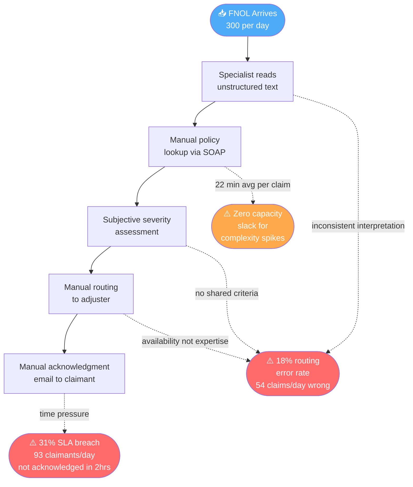
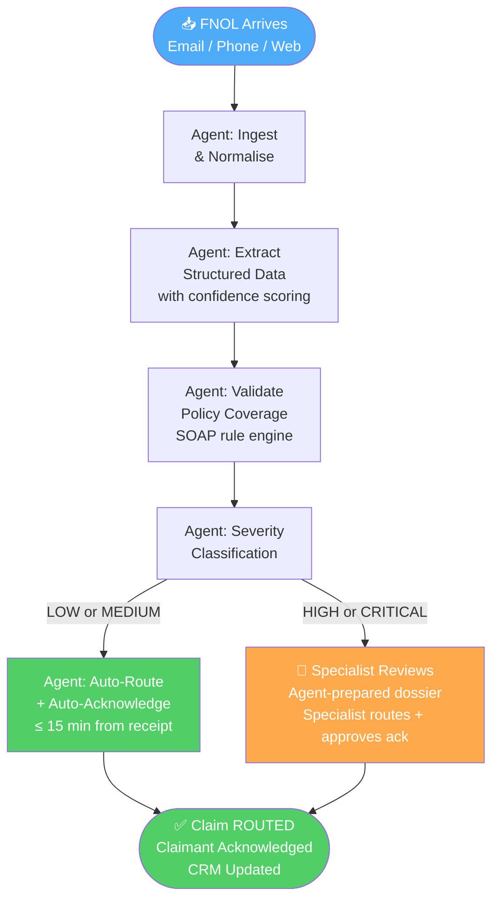
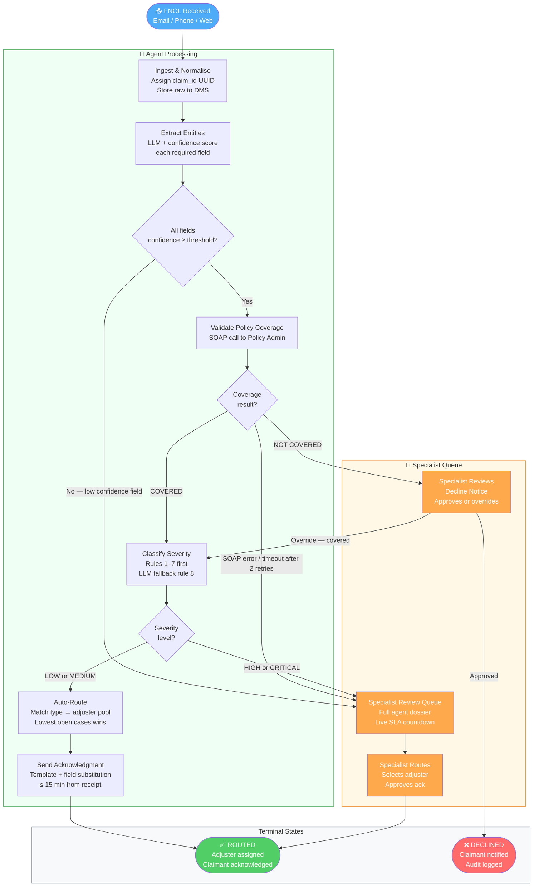
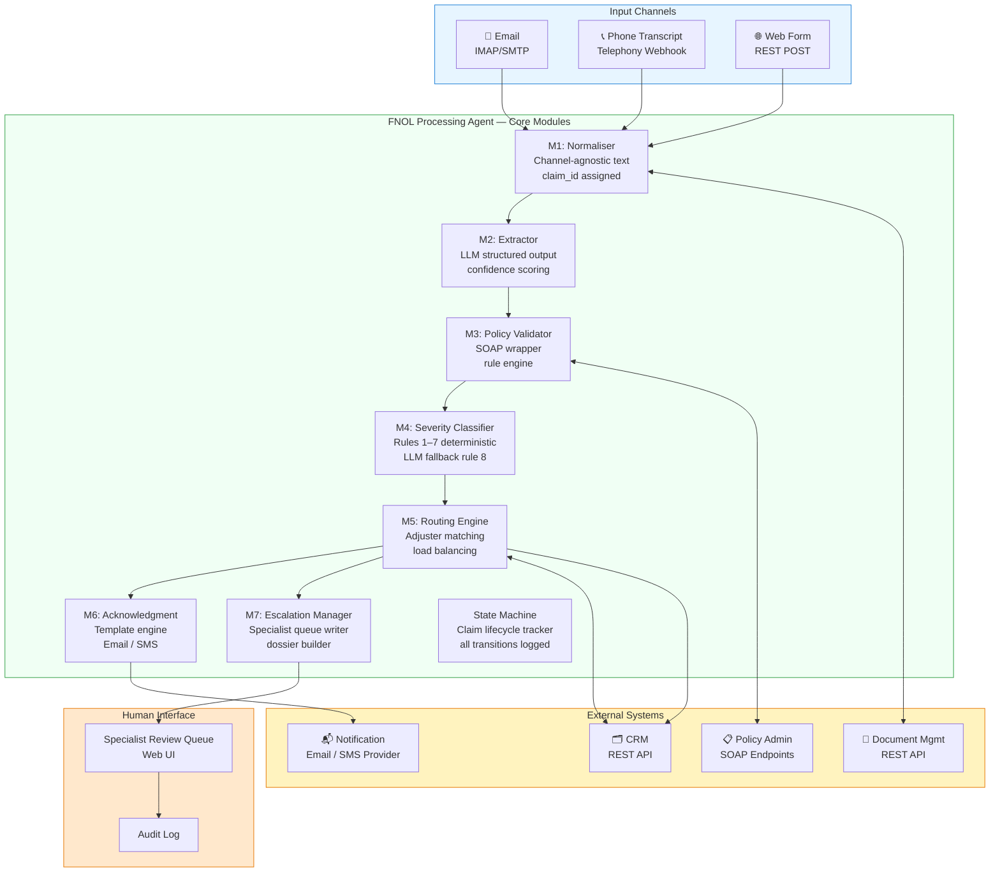
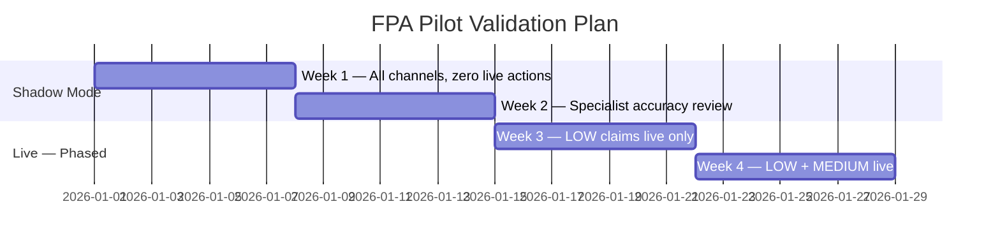

# Gate 1 — First Notice Of Loss (FNOL) Claims Processing Agent
## Nadia Rahmatulla | AI-Native Specification

**Scenario:** Mid-size insurance company. 300 FNOL reports/day. 12 specialists. 22 min/claim average. 18% routing error rate. 31% SLA breach rate. 2-hour SLA. Inputs: unstructured text (email, phone transcript, web form). Systems: CRM (REST API), legacy policy admin (SOAP), document management system (DMS). No AI infrastructure today.

---

## Table of Contents

1. [Assumptions & Unknowns](#1-assumptions--unknowns)
2. [Problem Statement & Success Metrics](#2-problem-statement--success-metrics)
3. [Delegation Analysis](#3-delegation-analysis)
4. [Agent Specification](#4-agent-specification)
5. [Validation Design](#5-validation-design)

---

## 1. Assumptions & Unknowns

### 1.1 Why This Section Comes First

Every non-trivial claim in the sections that follow rests on at least one of the assumptions below. Marking them here means a reviewer can see exactly where confidence is load-bearing and where it is not. Hidden assumptions are the primary failure mode of a spec at this stage.

---

### 1.2 Assumptions Log

---

**A.1 — FNOL inputs contain an extractable policy number in ≥ 80% of cases**

> **Assumption:** The majority of FNOL submissions include a policy number in the text, even if in varied formats.
>
> **Hypothesis:** If ≥ 80% of FNOLs contain a policy number, the extraction module can validate most claims automatically, because policy lookup is the gating step for the entire pipeline. If fewer than 50% include one, the validation pipeline stalls and most claims escalate to specialists — eliminating the throughput benefit.
>
> **How I'd test it:** Request a sample of 100 anonymised FNOLs from the client across all three channels and count how many contain an identifiable policy number in any format.
>
> **Confidence:** Medium — insurers typically require policy number on web forms, but phone transcripts and distressed claimant emails often omit it.

---

**A.2 — Policy coverage rules are fully deterministic**

> **Assumption:** Whether a given incident type is covered under a given policy can be determined by looking up the policy record and applying a rule (e.g. `incident_type IN policy.coverage_types`). No underwriter judgment is required for standard claims.
>
> **Hypothesis:** If coverage rules are deterministic, a rule engine can validate 95%+ of claims without escalation. If rules are fuzzy — e.g. "accidental damage" covers some but not all property damage types depending on context — the validation layer will over-escalate or produce incorrect declines.
>
> **How I'd test it:** Ask the client for three examples of claims declined for coverage reasons. Were those decisions rule-based or judgment-based? Review the policy admin SOAP response schema for coverage field granularity.
>
> **Confidence:** Medium — standard personal lines (motor, home) tend to have codifiable rules; commercial or specialty lines often do not.

---

**A.3 — The legacy SOAP system responds within 5 seconds under normal load**

> **Assumption:** The policy admin SOAP endpoint responds in ≤ 5 seconds, allowing the 2-retry pattern to complete within 15 seconds — well within the 2-hour SLA latency budget.
>
> **Hypothesis:** If SOAP responds in ≤ 5 seconds at p95, the validation step adds ≤ 15 seconds to processing time. If the system regularly takes 30+ seconds, the latency budget collapses and the SLA is at risk from the validation step alone — before any other processing occurs.
>
> **How I'd test it:** Run 50 test SOAP calls in a staging environment during business hours. Measure p50, p95, p99 latency. If p99 > 15 seconds, redesign retry logic or introduce a policy data cache layer.
>
> **Confidence:** Low — "legacy SOAP system" is a known indicator of unpredictable latency. No performance data is provided in the scenario.

---

**A.4 — "High-value" and "ambiguous" have client-agreed numeric definitions**

> **Assumption:** The client's requirement for human oversight on high-value or ambiguous claims can be translated into concrete thresholds. The severity rules in Section 4 operationalise this as: bodily injury, liability incident type, or estimated damage ≥ £50,000.
>
> **Hypothesis:** If the client agrees these conditions constitute "high-value or ambiguous", the severity rules correctly implement their oversight requirement. If the client means something different — e.g. any claim > £10,000 or any claimant's first-ever claim — the routing logic produces incorrect human/agent splits throughout the entire system.
>
> **How I'd test it:** Present the severity rule table to the client before sprint 1. Ask: "Which of these would you want a human to review before any action is taken?" Adjust thresholds to match their answer.
>
> **Confidence:** Low — "high-value" is undefined in the scenario. £50,000 is a placeholder. This assumption is load-bearing for the delegation design.

---

**A.5 — Claimants accept automated acknowledgment as a valid first response**

> **Assumption:** Receiving a template-driven email or SMS acknowledgment from the claims system is acceptable to claimants as first contact and satisfies the acknowledgment SLA requirement.
>
> **Hypothesis:** If automated acks are acceptable, the agent closes the acknowledgment loop for LOW/MEDIUM claims within 15 minutes of receipt with zero specialist involvement. If claimants expect a human call or a personally authored email, automated acks will generate complaints and the acknowledgment step must be redesigned.
>
> **How I'd test it:** Review any existing claimant satisfaction surveys or complaint logs for mentions of acknowledgment quality. Ask the client directly: "Have claimants complained about automated responses in other contexts?"
>
> **Confidence:** High — automated acknowledgment is industry standard in insurance at the FNOL stage. Claimant expectation is receipt confirmation, not relationship contact.

---

**A.6 — The CRM adjuster data is accurate and near-real-time**

> **Assumption:** The CRM's adjuster records — specialisation, availability, open case count — reflect real-time or near-real-time state. Routing decisions based on this data produce correct assignments.
>
> **Hypothesis:** If CRM data is stale (updated end-of-day rather than continuously), the agent will route claims to adjusters who are at capacity or absent — recreating the current routing error problem under a new system, with the appearance of automation.
>
> **How I'd test it:** Ask the client: "How often is adjuster availability updated in the CRM — is it automatic or manually entered?" If manual or daily, build a data-freshness flag into the routing logic and alert when adjuster data is > 4 hours old.
>
> **Confidence:** Medium — a CRM with REST APIs suggests some degree of integration, but adjuster availability is frequently managed manually in practice.

---

**A.7 — The 18% routing error rate is caused by extraction and classification inconsistency, not adjuster availability gaps**

> **Assumption:** Routing errors occur because specialists misread or misclassify unstructured FNOL data, not because there are too few adjusters for certain claim types or because adjuster specialisation data is wrong.
>
> **Hypothesis:** If the root cause is extraction inconsistency, automating extraction and applying deterministic routing rules will reduce errors to ≤ 5%. If the root cause is structural (wrong adjuster pool, missing specialisations), the agent will reduce errors by a much smaller margin and the residual problem will remain invisible.
>
> **How I'd test it:** Ask specialists: "When you route a claim incorrectly, what caused it — misreading the FNOL, or not knowing who to send it to?" Review 20 historical routing errors and classify root cause as extraction error vs. structural gap.
>
> **Confidence:** Medium — the scenario description implies extraction inconsistency but this is inferred, not stated.

---

**A.8 — LLM API access can be provisioned within the build timeline**

> **Assumption:** The client can provision API access to a capable LLM within the build timeline. Since they have no AI infrastructure today, this is not guaranteed.
>
> **Hypothesis:** If LLM access is provisioned within 4 weeks, the extraction module is built as specified. If procurement or security approval takes 3+ months, the extraction module must be re-scoped to regex and rules-based NLP for sprint 1, with LLM extraction as a later iteration.
>
> **How I'd test it:** Raise LLM procurement as a sprint 0 blocker. Get written confirmation of which LLM provider is approved, what data residency requirements apply, and whether PII can be sent to a third-party API before writing a single line of extraction code.
>
> **Confidence:** Low — insurance companies frequently have strict data residency and third-party processing restrictions. This could be a hard blocker that reshapes the entire extraction design.

---

**A.9 — Phone transcripts arrive as pre-transcribed text**

> **Assumption:** The telephony system transcribes phone calls to text before passing them to the agent. The agent does not perform speech-to-text conversion.
>
> **Hypothesis:** If transcription is pre-done by the telephony system, phone FNOLs arrive in the same format as email and web form inputs (unstructured text) and the normaliser handles all three channels identically. If the agent must process audio files, the ingestion architecture is fundamentally different and the normaliser module must be redesigned.
>
> **How I'd test it:** Ask: "When a claimant phones to report a loss, what does your telephony system produce — a text transcript, an audio recording, or both? Who owns the transcription step?"
>
> **Confidence:** Medium — the scenario uses the phrase "phone transcript", implying text, but this is not explicit.

---

**A.10 — The DMS supports programmatic write operations at the required volume**

> **Assumption:** The document management system can accept 300+ write operations per day via REST API without rate limiting or performance degradation.
>
> **Hypothesis:** If the DMS handles 300 writes/day (averaging 0.2 writes/second with burst to ~2/second at peak), raw FNOL storage is not a bottleneck. If the DMS has a rate limit below peak throughput or is designed for human upload rather than programmatic access, the ingestion step will back up and delay the entire pipeline.
>
> **How I'd test it:** Request DMS API documentation covering rate limits and concurrent connection limits. Run a load simulation of 10 concurrent writes before committing to the DMS as the raw storage layer.
>
> **Confidence:** Medium — DMS systems vary widely; many are not designed for high-volume programmatic write.

---

### 1.3 Critical Unknowns — Must Resolve Before Build

| # | Unknown | Why It Blocks Build | Resolution Path | Target Sprint |
|---|---|---|---|---|
| **U.1** | What does "high-value" mean numerically to this client? | Severity thresholds are placeholders. Wrong thresholds = wrong human oversight boundary = regulatory exposure | Client workshop: present draft threshold table, get written sign-off | Sprint 0 |
| **U.2** | CRM API: base URL, auth method, adjuster schema | Cannot build routing module | Client CRM admin provides API docs + sandbox credentials | Sprint 1 |
| **U.3** | Policy Admin SOAP: WSDL URL, auth, response schema, latency profile | Cannot build validation module | Client IT provides WSDL + test environment access | Sprint 1 |
| **U.4** | DMS: API endpoint, auth, content types, rate limits | Cannot confirm ingestion write path | Client IT provides DMS API docs | Sprint 1 |
| **U.5** | Notification service: existing email/SMS provider or new provisioning required? | Cannot build acknowledgment module | Client confirms existing provider or new provisioning decision | Sprint 0 |
| **U.6** | Actual distribution of FNOLs by channel (email vs phone vs web) | Channel mix drives extraction accuracy assumptions | Request channel breakdown from client operations team | Sprint 0 |
| **U.7** | Regulatory constraints (FCA or equivalent) on automated coverage validation or acknowledgment | May require human sign-off on automated declines by regulation, forcing redesign of NOT_COVERED flow | Legal/compliance review before sprint 1 begins | Sprint 0 |
| **U.8** | SOAP system availability record and known maintenance windows | If SOAP is down regularly during business hours, VALIDATION_FAILED escalations will overwhelm the specialist queue | Request SOAP uptime logs for last 90 days from client IT | Sprint 1 |

---

## 2. Problem Statement & Success Metrics

### 2.1 Current State — What Is Broken



---

### 2.2 The Problem — Business Perspective

The claims intake process is at full utilisation and failing on quality. With 300 claims/day and 12 specialists at 22 min/claim, the team consumes approximately **110 person-hours/day** — leaving zero slack for complexity spikes, absences, or rework.

| Metric | Current State | Daily Impact |
|---|---|---|
| Routing error rate | 18% | 54 claims sent to wrong adjuster → rework + delay |
| SLA breach rate | 31% | 93 claimants not acknowledged within 2 hours |
| Avg handling time | 22 min/claim | Manual lookup, copy-paste, coverage check included |
| Specialist capacity | ~110 person-hours/day | Zero headroom for volume spikes |

**Root cause:** Specialists are performing structured, repeatable work — data extraction, policy lookup, routing logic — manually, from unstructured inputs, under time pressure. The 18% error rate and 31% SLA breach are a function of the process design, not specialist capability.

---

### 2.3 The Problem — Claimant Perspective

FNOL is the highest-stakes moment in the customer relationship. A claimant reporting a house fire, car accident, or theft is distressed and expecting rapid, professional acknowledgment. Currently:

- **93 claimants per day** receive no acknowledgment within the 2-hour SLA
- **54 claimants per day** have their claim routed incorrectly, causing unexplained delays and re-contact
- There is no proactive communication when SLA is at risk

This is not an efficiency problem from the claimant's perspective — it is a **trust problem**. The insurance relationship is built on the promise of support at the moment of loss. Failing at FNOL breaks that promise at the worst possible time.

---

### 2.4 Target State



---

### 2.5 Success Metrics

Every metric is measurable against the current baseline in a 30-day pilot. Metrics without a measurement method are not accepted.

#### Primary Metrics

| Metric | Baseline | Target | Measurement Method |
|---|---|---|---|
| Routing error rate | 18% | ≤ 5% | Adjuster re-assignment events ÷ total claims, rolling 5-day window |
| SLA breach rate | 31% | ≤ 10% | % of claims where `routed_at` − `received_at` > 120 minutes |
| Avg handling time — specialist | 22 min | ≤ 8 min for human-reviewed; ≤ 3 min for fully agentic | Time-tracked per claim in CRM from RECEIVED to ROUTED |
| Claimant acknowledgment time | Unknown baseline | ≤ 15 min from receipt for LOW/MEDIUM claims | `ack_sent_at` − `received_at` per claim |

#### Secondary Metrics

| Metric | Target | Measurement Method |
|---|---|---|
| Extraction field accuracy | ≥ 95% on required fields | Weekly audit: specialist reviews 5% random sample of agentic claims |
| Triage accuracy | ≥ 92% agreement with specialist review | Specialist tags 30 randomly sampled triage decisions per week |
| Escalation rate | 15–35% of claims | Count of SPECIALIST_QUEUE entries ÷ total claims per day |
| False escalation rate | ≤ 10% of escalated claims returned as "should have auto-processed" | Specialist tagging on resolved queue items |

#### Business Case Threshold

> The system pays for itself if routing errors drop below 8% (saving ≈ 30 specialist-hours/week of rework) **and** claimant acknowledgment SLA compliance reaches ≥ 90% within 60 days of full deployment.

---

## 3. Delegation Analysis

### 3.1 Delegation Framework

A task is **fully agentic** when all four conditions hold:
1. Decision logic is fully codifiable (deterministic or rule-based with defined thresholds)
2. Errors are detectable before downstream harm occurs
3. Latency requirement favours automation (target < 2 minutes)
4. No regulatory or contractual requirement for a named human to authorise

A task is **agent-led, human oversight** when:
- Logic is partially codifiable but material edge cases require judgment
- Errors carry downstream financial, legal, or reputational consequences
- The client has explicitly required oversight (as stated for high-value and ambiguous claims)

A task is **human-led, agent support** when:
- The decision requires tacit knowledge, relationship context, or professional accountability
- The agent prepares the decision but does not execute it

---

### 3.2 Delegation Table

| FNOL Step | Level | Justification | Why This Boundary Is Defensible |
|---|---|---|---|
| **Ingestion & normalisation** | ✅ Fully Agentic | Zero judgment required. Text arrives, gets timestamped and stored. Failure is detectable. | Codifiable: input → structured record. Reversible: re-parse from raw. No regulatory risk at this step. |
| **Entity extraction** | ✅ Fully Agentic | LLM extraction with confidence scoring. Field below threshold → escalate. Agent never silently drops a field. | Rule-based escalation gate: if confidence < threshold the claim is escalated loudly, not silently processed. |
| **Policy coverage validation** | ✅ Fully Agentic (with escalation trigger) | Coverage rules are deterministic once policy is retrieved. SOAP timeout or ambiguous result → escalate. | Deterministic: policy terms are binary (covered / not covered). Ambiguity is escalated, not guessed. |
| **Severity triage — LOW/MEDIUM** | ✅ Fully Agentic | LOW and MEDIUM classification is rule-based on damage value, incident type, and injury flag. Rules are fully codifiable. | Rules 1–7 in Section 4 are deterministic. LLM is only invoked for rule 8 (unclassifiable by rule). |
| **Severity triage — HIGH/CRITICAL** | 🟡 Agent-led, Human Oversight | Client explicitly requires oversight. HIGH/CRITICAL carry financial and legal stakes. Misclassification = regulatory exposure. | Boundary is client-stated. Cannot be agent-only regardless of technical capability. Accountability requires a named human. |
| **Routing — LOW/MEDIUM claims** | ✅ Fully Agentic | Routing logic is a lookup + load-balance: match incident type to adjuster specialisation, then lowest open case count. No judgment needed. | Codifiable: claim type → adjuster pool → load-balance. Errors are detectable (wrong adjuster re-assigns) and correctable. |
| **Routing — HIGH/CRITICAL claims** | 🟡 Agent-led, Human Oversight | Agent prepares a full dossier. Specialist selects adjuster and signs off. Routing decision for high-stakes claims requires accountability. | Professional liability: a named specialist is accountable for the routing of HIGH/CRITICAL claims. Agent cannot absorb that accountability. |
| **Claimant acknowledgment — LOW/MEDIUM** | ✅ Fully Agentic | Template-driven. Content is deterministic: reference number, incident type, adjuster team, SLA timeline. No judgment in content. | Codifiable: template + field substitution. Failure (no send) = alert, not silent drop. Industry standard for automated ack. |
| **Claimant acknowledgment — HIGH/CRITICAL** | 🟡 Agent-led, Human Oversight | Agent generates the ack. Specialist approves before send. Stakes are higher; tone and promise must be reviewed. | Agent generates to remove latency; human approves to maintain accountability on high-stakes communication. |
| **Decline notice generation** | 🟡 Agent-led, Human Oversight | Agent drafts decline notice. Specialist approves before any send. Coverage decline has legal implications. | Coverage decisions that deny a claim have regulatory consequences. A named human must authorise every decline. |
| **Duplicate detection** | ✅ Fully Agentic | Deterministic matching: policy number + incident date + claim type. Match → flag, do not process. Specialist reviews flags. | False positive cost: one unnecessary specialist review. False negative cost: duplicate processed (detectable later). Net: agentic with audit. |
| **Fraud signal detection** | 🟡 Agent-led, Human Oversight | Agent flags patterns. Decision to act is human only. Fraud action without human authorisation = legal liability. | Standard in regulated financial services. Agent surfaces; specialist decides. No exception. |
| **Exception handling** | 🟡 Agent-led, Human Oversight | Agent retries (2x). On third failure creates exception record and assigns to specialist queue with full context. | Agent cannot resolve system outages. Automated retry is safe; unresolved failure requires human intervention. |

---

### 3.3 Delegation Boundary — Visual Overview

```mermaid
flowchart LR
    subgraph AGENTIC["✅ Fully Agentic"]
        direction TB
        AG1[Ingest & Normalise]
        AG2[Entity Extraction\nconfidence-gated]
        AG3[Policy Validation\nrule engine]
        AG4[Triage LOW / MEDIUM\nrules 1–7]
        AG5[Route LOW / MEDIUM\nload-balance]
        AG6[Ack LOW / MEDIUM\ntemplate send]
        AG7[Duplicate Detection\nflag only]
    end

    subgraph OVERSIGHT["🟡 Agent-led, Human Oversight"]
        direction TB
        OV1[Triage HIGH / CRITICAL\nagent classifies\nhuman reviews]
        OV2[Route HIGH / CRITICAL\nagent prepares dossier\nhuman routes]
        OV3[Ack HIGH / CRITICAL\nagent drafts\nhuman approves]
        OV4[Decline Notice\nagent drafts\nhuman approves]
        OV5[Fraud Signal\nagent flags\nhuman decides]
        OV6[Exception Handling\nagent retries\nhuman resolves]
    end

    subgraph HUMAN["🔴 Human Only"]
        direction TB
        HU1[Fraud Investigation]
        HU2[Coverage Dispute\nResolution]
        HU3[Regulatory Reporting]
    end

    AGENTIC --> OVERSIGHT
    OVERSIGHT --> HUMAN

    style AGENTIC fill:#d3f9d8,stroke:#2f9e44
    style OVERSIGHT fill:#fff3bf,stroke:#e67700
    style HUMAN fill:#ffe3e3,stroke:#c92a2a
```



---

### 3.4 Full FNOL Processing Flow



---

## 4. Agent Specification

### 4.1 System Overview

**Agent Name:** FNOL Processing Agent (FPA)
**Purpose:** Receive unstructured FNOL submissions, extract structured claim data, validate against policy, triage by severity, route to the appropriate adjuster, and acknowledge the claimant — all within a 2-hour SLA, with human escalation for HIGH/CRITICAL/ambiguous claims.
**Scope:** Intake-to-routing. FPA does not perform claims investigation, settlement calculation, or adjuster communication beyond initial assignment notification.

---

### 4.2 System Architecture



---

### 4.3 Claim State Machine

A claim must be in exactly one state at all times. All transitions are logged with: timestamp (ISO 8601 UTC), actor (`AGENT` or `specialist_id`), and reason string.

```mermaid
stateDiagram-v2
    direction LR

    [*] --> RECEIVED : FNOL ingested\nany channel

    RECEIVED --> EXTRACTING : Normalisation complete\nraw text stored in DMS

    EXTRACTING --> EXTRACTION_FAILED : Any required field\nconfidence below threshold\nafter 1 retry
    EXTRACTING --> VALIDATING : All required fields\nconfidence ≥ threshold

    EXTRACTION_FAILED --> SPECIALIST_QUEUE : Auto-assign to\nnext available specialist

    VALIDATING --> VALIDATION_FAILED : SOAP error after\n2 retries OR policy not found
    VALIDATING --> NOT_COVERED : Coverage rule\nreturns false
    VALIDATING --> TRIAGING : Coverage confirmed

    VALIDATION_FAILED --> SPECIALIST_QUEUE : System error escalation
    NOT_COVERED --> PENDING_DECLINE_REVIEW : Agent drafts\ndecline notice

    PENDING_DECLINE_REVIEW --> DECLINED : Specialist approves
    PENDING_DECLINE_REVIEW --> TRIAGING : Specialist overrides\n— covered

    TRIAGING --> AUTO_ROUTING : Severity = LOW or MEDIUM
    TRIAGING --> SPECIALIST_QUEUE : Severity = HIGH or CRITICAL

    AUTO_ROUTING --> ROUTED : Adjuster assigned\nAck sent ≤ 15 min

    SPECIALIST_QUEUE --> SPECIALIST_REVIEWED : Specialist routes\nand approves ack

    SPECIALIST_REVIEWED --> ROUTED : Ack sent

    ROUTED --> [*]
    DECLINED --> [*]
```



**State time limits:**

| State | Max Time in State | Breach Action |
|---|---|---|
| `RECEIVED` | 30 seconds | Watchdog alerts ops |
| `EXTRACTING` | 90 seconds | Watchdog moves to `SPECIALIST_QUEUE` |
| `VALIDATING` | 45 seconds (incl. 2 retries) | Auto-transition to `VALIDATION_FAILED` |
| `TRIAGING` | 30 seconds | Watchdog alerts ops |
| `AUTO_ROUTING` | 30 seconds | Watchdog moves to `SPECIALIST_QUEUE` |
| `SPECIALIST_QUEUE` | SLA clock continues from `received_at` | SLA dashboard alert at 90 min |

---

### 4.4 Module Specifications

---

#### M1 — Normaliser

**Input:** Raw text payload + channel tag (`EMAIL` | `PHONE_TRANSCRIPT` | `WEB_FORM`) + receipt timestamp (ISO 8601 UTC)

**Processing rules:**
- `EMAIL`: strip HTML; retain plain text body only; discard attachments (log discarded attachment count)
- `PHONE_TRANSCRIPT`: text arrives pre-transcribed; no audio processing; accept as-is
- `WEB_FORM`: concatenate all free-text fields in field order; prefix each with field label: `"Incident Description: [text]"`
- Assign `claim_id`: UUID v4, generated at ingestion, immutable for the life of the claim
- Write raw text to DMS before any further processing. If DMS write fails: retry once after 5 seconds; if retry fails, write to local fallback store, alert ops via monitoring webhook, and continue processing

**Output schema:**
```json
{
  "claim_id": "uuid-v4",
  "channel": "EMAIL | PHONE_TRANSCRIPT | WEB_FORM",
  "received_at": "ISO8601 UTC",
  "raw_text": "string",
  "dms_ref": "string | null (null if DMS failed)"
}
```

---

#### M2 — Extractor

**Model:** LLM with JSON-mode structured output. Model version is pinned in deployment config and not resolved at runtime.

**Fields to extract:**

| Field | Type | Extraction Rule | Confidence Threshold |
|---|---|---|---|
| `policy_number` | string | Alphanumeric 8–12 chars; if multiple found, set extraction_status = AMBIGUOUS | 0.90 |
| `claimant_name` | string | First and last name of reporting party | 0.85 |
| `claimant_contact` | string | Email preferred; phone if no email present | 0.80 |
| `incident_date` | date ISO 8601 | Date of loss event; if range given use earliest date | 0.85 |
| `incident_type` | enum | One of: `VEHICLE` / `PROPERTY` / `LIABILITY` / `HEALTH` / `OTHER` | 0.85 |
| `incident_description` | string | Verbatim extracted summary, max 500 chars | 0.75 |
| `estimated_damage_value` | number (optional) | Explicit numeric value only; null if not stated | 0.80 |
| `third_party_involved` | boolean | True if any third party is mentioned | 0.80 |
| `bodily_injury_mentioned` | boolean | True if injury to any person is mentioned | 0.85 |

**Logic:**
1. Run LLM extraction with the prompt below
2. If any required field scores below its confidence threshold: run one re-prompt with structured clarification instruction
3. If still below threshold after re-prompt: set `extraction_status = PARTIAL_FAILURE` → state = `EXTRACTION_FAILED`
4. If all required fields meet threshold: state = `VALIDATING`

**LLM prompt (must not be modified without a spec revision):**
```
You are an insurance claim data extractor. Extract the following fields from the FNOL text.
For each field provide: (1) the extracted value, (2) a confidence score 0.0–1.0,
(3) the exact text span you drew from.
Return valid JSON matching the output schema below.
If a field is not present in the text, return null with confidence 0.0.
Do not infer values not present in the text.

Text: {raw_text}
```

**Output schema:**
```json
{
  "claim_id": "uuid-v4",
  "extracted_fields": {
    "policy_number": "string | null",
    "claimant_name": "string | null",
    "claimant_contact": "string | null",
    "incident_date": "ISO8601 | null",
    "incident_type": "enum | null",
    "incident_description": "string | null",
    "estimated_damage_value": "number | null",
    "third_party_involved": "boolean | null",
    "bodily_injury_mentioned": "boolean | null"
  },
  "confidence_scores": { "field_name": 0.0 },
  "extraction_spans": { "field_name": "verbatim text" },
  "extraction_status": "COMPLETE | PARTIAL_FAILURE | AMBIGUOUS",
  "low_confidence_fields": ["field_name"]
}
```

---

#### M3 — Policy Validator

**Purpose:** Confirm the policy exists, is active, and covers the reported incident type.

**Integration:** Legacy Policy Administration System via SOAP.

> ⚠️ WSDL URL, authentication method, and exact response schema are unknown — see U.3. The interface contract below is the target; actual SOAP binding is a sprint 1 deliverable once client IT provides WSDL access.

**SOAP operation target:**
```xml
Operation: GetPolicyDetails
Input:
  <GetPolicyDetailsRequest>
    <PolicyNumber>{policy_number}</PolicyNumber>
    <RequestDate>{today ISO8601}</RequestDate>
  </GetPolicyDetailsRequest>

Minimum required response fields:
  <PolicyStatus>ACTIVE | LAPSED | CANCELLED</PolicyStatus>
  <CoverageTypes>
    <CoverageType>VEHICLE | PROPERTY | LIABILITY | HEALTH</CoverageType>
  </CoverageTypes>
  <ExpiryDate>{ISO8601}</ExpiryDate>
  <SumInsured>{decimal}</SumInsured>
  <PolicyHolderName>{string}</PolicyHolderName>
```

**Retry logic:** Timeout per call: 10 seconds. Retry: 2 times with 5-second backoff. After 2 retries with no valid response → state = `VALIDATION_FAILED`.

**Coverage rule engine (applied in order; first failing rule stops evaluation):**

```
Rule 1: IF PolicyStatus != "ACTIVE"
        → NOT_COVERED, reason: "Policy not active"

Rule 2: IF incident_type NOT IN policy.CoverageTypes
        → NOT_COVERED, reason: "Incident type not covered under this policy"

Rule 3: IF incident_date > policy.ExpiryDate
        → NOT_COVERED, reason: "Policy expired before incident date"

Rule 4: IF all above pass
        → COVERED
```

**Output schema:**
```json
{
  "claim_id": "uuid-v4",
  "policy_status": "ACTIVE | LAPSED | CANCELLED",
  "coverage_result": "COVERED | NOT_COVERED | VALIDATION_FAILED",
  "coverage_reason": "string",
  "sum_insured": 0.00,
  "policy_holder_name": "string",
  "policy_expiry": "ISO8601"
}
```

---

#### M4 — Severity Classifier

**Purpose:** Assign one of four severity levels: `LOW` | `MEDIUM` | `HIGH` | `CRITICAL`

**Classification rules (applied in priority order; first match wins):**

| Priority | Condition | Severity |
|---|---|---|
| 1 | `bodily_injury_mentioned = true` | `CRITICAL` |
| 2 | `incident_type = LIABILITY` | `HIGH` |
| 3 | `estimated_damage_value ≥ £50,000` *(threshold — confirm with client, see U.1)* | `HIGH` |
| 4 | `third_party_involved = true` AND `estimated_damage_value ≥ £10,000` | `HIGH` |
| 5 | `incident_type = VEHICLE` AND `estimated_damage_value ≥ £5,000` | `MEDIUM` |
| 6 | `incident_type = PROPERTY` AND `estimated_damage_value ≥ £10,000` | `MEDIUM` |
| 7 | `estimated_damage_value < £5,000` AND `third_party_involved = false` AND `bodily_injury_mentioned = false` | `LOW` |
| 8 | No rule above matches (including `estimated_damage_value = null`) | `MEDIUM` *(conservative default — see note)* |

> **Rule 8 default is MEDIUM, not LOW.** When damage value is absent or no rule matches, the conservative choice is MEDIUM. LOW claims are auto-routed without specialist review. An incorrect LOW classification is the highest-risk error in this system — an unreviewed HIGH claim processed as LOW. MEDIUM claims trigger the LLM fallback below before being finalised.

**LLM fallback (rule 8 cases only):**
1. Run LLM classification against `incident_description`
2. If LLM returns `HIGH` or `CRITICAL`: treat as HIGH → specialist queue
3. If LLM returns `LOW` or `MEDIUM`: keep as MEDIUM (do not downgrade without human confirmation)
4. LLM rationale logged with claim record for audit

**Output schema:**
```json
{
  "claim_id": "uuid-v4",
  "severity": "LOW | MEDIUM | HIGH | CRITICAL",
  "severity_rule_matched": "rule_1 | rule_2 | ... | rule_8_llm",
  "severity_rationale": "string"
}
```

---

#### M5 — Routing Engine

**Purpose:** Assign the claim to the correct adjuster.

**CRM call — get available adjusters:**
```
GET {CRM_BASE_URL}/adjusters
Headers: Authorization: Bearer {token}
Query params:
  specialisation={incident_type}
  status=AVAILABLE
Response:
[{
  "adjuster_id": "string",
  "name": "string",
  "open_cases": integer,
  "specialisations": ["string"],
  "last_assigned_at": "ISO8601"
}]
```

**Routing logic (applied in order):**
```
Step 1: Filter adjusters WHERE specialisation matches incident_type AND status = AVAILABLE
Step 2: If filtered list is empty → state = SPECIALIST_QUEUE (cannot auto-route)
Step 3: From filtered list, select adjuster with lowest open_cases count
Step 4: On tie: select adjuster with earliest last_assigned_at (round-robin tiebreak)
Step 5: Assign claim to selected adjuster via CRM POST (below)
```

**CRM call — assign claim:**
```
POST {CRM_BASE_URL}/claims
Headers: Authorization: Bearer {token}
Body:
{
  "claim_id": "string",
  "policy_number": "string",
  "adjuster_id": "string",
  "severity": "LOW | MEDIUM | HIGH | CRITICAL",
  "incident_type": "string",
  "received_at": "ISO8601",
  "channel": "string",
  "dms_ref": "string"
}
Response:
{
  "crm_claim_id": "string",
  "assigned_at": "ISO8601"
}
```

**Timeout:** 10 seconds per call. Retry: 1 time. On failure after retry → state = `SPECIALIST_QUEUE`.

---

#### M6 — Acknowledgment Generator

**Trigger:** Called after `AUTO_ROUTING` completes (LOW/MEDIUM) or after specialist approval (HIGH/CRITICAL).

**Channel priority:** Email if `claimant_contact` contains `@`; otherwise SMS.

**Template — LOW / MEDIUM (auto-sent without specialist review):**
```
Subject: Your claim has been received — Reference {claim_id}

Dear {claimant_name},

We have received your {incident_type} claim reported on {incident_date}.

Your reference number is: {claim_id}
Your claim has been assigned to our {incident_type} team.
We aim to contact you within {sla_contact_hours} business hours.

To provide additional information, please quote your reference number.

[Company Name] Claims Team
```
> `sla_contact_hours` = 4 for LOW, 8 for MEDIUM *(assumption A.5 — confirm with client)*

**Template — HIGH / CRITICAL (sent after specialist approval):**
```
Subject: Your claim has been received — Reference {claim_id} — Priority Handling

Dear {claimant_name},

We have received your {incident_type} claim and assigned it for priority review.

Your reference number is: {claim_id}
A specialist will contact you within {priority_sla_hours} business hours.

[Company Name] Claims Team
```
> `priority_sla_hours` = 2 for HIGH/CRITICAL *(assumption — confirm with client)*

**Failure handling:** If send fails (bounce or API error): log as `ACK_FAILED`, create specialist alert for manual contact. Do not silently drop.

---

#### M7 — Escalation Manager

**Purpose:** Route claims requiring human action to the specialist queue with complete context.

**Specialist queue record schema:**
```json
{
  "queue_item_id": "uuid-v4",
  "claim_id": "string",
  "escalation_reason": "EXTRACTION_FAILED | VALIDATION_FAILED | HIGH_SEVERITY | CRITICAL_SEVERITY | FRAUD_SIGNAL | DUPLICATE_DETECTED | COVERAGE_AMBIGUOUS | NO_ADJUSTER_AVAILABLE",
  "escalation_detail": "string (plain English explanation for specialist)",
  "agent_dossier": {
    "extracted_fields": {},
    "confidence_scores": {},
    "policy_validation_result": {},
    "severity_classification": {},
    "raw_text_dms_ref": "string"
  },
  "created_at": "ISO8601",
  "sla_deadline": "ISO8601 (received_at + 120 minutes)"
}
```

**Specialist UI — minimum required elements:**
- [ ] Claim ID and receipt timestamp
- [ ] Live SLA countdown (minutes remaining)
- [ ] Escalation reason in plain English
- [ ] Agent dossier with all pre-filled fields (specialist can accept or edit)
- [ ] Adjuster selection dropdown (filtered by claim type)
- [ ] Approve / reject button for decline notices

---

### 4.5 Integration Contracts Summary

| System | Protocol | Auth | Timeout | Retry | Fallback | Sprint |
|---|---|---|---|---|---|---|
| Policy Admin (SOAP) | SOAP | Unknown — U.3 | 10s | 2x, 5s backoff | `VALIDATION_FAILED` → queue | 🔴 Sprint 1 |
| CRM — read adjusters | REST GET | Unknown — U.2 | 10s | 1x | `SPECIALIST_QUEUE` | 🔴 Sprint 1 |
| CRM — write claim | REST POST | Unknown — U.2 | 10s | 1x | `SPECIALIST_QUEUE` | 🔴 Sprint 1 |
| DMS — store raw | REST PUT | Unknown — U.4 | 5s | 1x | Local fallback + ops alert | 🔴 Sprint 1 |
| Notification — email/SMS | Unknown — U.5 | Unknown — U.5 | 5s | 1x | `ACK_FAILED` + specialist alert | 🔴 Sprint 0 |

> All five integration scope-outs must be resolved before integration work begins. Resolution path per unknown is in Section 1.3.

---

### 4.6 Agent Rules — Never Violate

1. **Never process a claim without first writing raw text to DMS.** If DMS fails, continue but alert ops immediately.
2. **Never auto-route a HIGH or CRITICAL claim.** Always → `SPECIALIST_QUEUE`.
3. **Never send a decline notice without specialist approval.**
4. **Never downgrade severity from MEDIUM to LOW based on LLM output alone.**
5. **Never retry SOAP calls more than 2 times.** On third failure → `VALIDATION_FAILED`.
6. **`claim_id` is set at ingestion and never changes.** Never generate a new `claim_id` for an existing claim.
7. **Never send an acknowledgment before the claim record is written to CRM.**

---

## 5. Validation Design

### 5.1 What "Working" Means in Testable Terms

The agent is working if and only if all five conditions hold over any 5-day rolling window of ≥ 500 claims:

| # | Condition | Measurement |
|---|---|---|
| 1 | Routing error rate ≤ 5% | Adjuster re-assignment events ÷ total claims |
| 2 | SLA compliance ≥ 90% | % of claims: `routed_at` − `received_at` ≤ 120 min |
| 3 | Zero silent failures | Every terminal-state claim has a complete audit trail from `RECEIVED` |
| 4 | Zero unacknowledged routed claims | Every `ROUTED` claim has a notification record |
| 5 | Escalation rate 15–35% | Outside this band → investigation triggered |

---

### 5.2 Test Suite

```mermaid
flowchart TD
    SUITE([🧪 FPA Test Suite]) --> U[Unit Tests]
    SUITE --> I[Integration Tests]
    SUITE --> E[End-to-End Tests]
    SUITE --> F[Failure Mode Tests]
    SUITE --> Q[Quiet Failure Tests]

    U --> U1[Extractor:\n50 synthetic FNOLs\nknown ground truth]
    U --> U2[Severity Classifier:\n30 cases covering\nall 8 rules]
    U --> U3[Routing Logic:\nadjuster selection\nwith known caseloads]
    U --> U4[Ack Templates:\nall variable\nsubstitutions verified]

    I --> I1[SOAP mock:\nhappy path + timeout\n+ malformed response]
    I --> I2[CRM mock:\nadjuster list +\nclaim write]
    I --> I3[DMS mock:\nwrite success +\nwrite failure]

    E --> E1[LOW claim email\n→ ROUTED ≤ 3 min]
    E --> E2[HIGH claim phone\n→ SPECIALIST_QUEUE\nfull dossier]
    E --> E3[NOT_COVERED web form\n→ PENDING_DECLINE_REVIEW]
    E --> E4[Garbled input\n→ EXTRACTION_FAILED\nspecialist queue]

    F --> F1[SOAP down:\nVALIDATION_FAILED\ncorrectly triggered]
    F --> F2[CRM down:\nSPECIALIST_QUEUE\nnot silent drop]
    F --> F3[Notification fail:\nACK_FAILED alert raised]
    F --> F4[All adjusters at capacity:\nSPECIALIST_QUEUE\nnot infinite loop]

    Q --> Q1[Quiet Failure\nTests — see 5.3]

    style SUITE fill:#4dabf7,color:#fff
    style U fill:#d3f9d8,stroke:#2f9e44
    style I fill:#fff3bf,stroke:#e67700
    style E fill:#e7f5ff,stroke:#1c7ed6
    style F fill:#ffe3e3,stroke:#c92a2a
    style Q fill:#f3d9fa,stroke:#9c36b5
```



---

### 5.3 Quiet Failure Tests

> Quiet failures are the most dangerous: the agent processes the claim, no error is raised, the output is wrong, and no one notices.

| Quiet Failure | Why It's Dangerous | Detection Test |
|---|---|---|
| Extraction returns wrong policy number with high confidence | Claim validated against wrong policy; routed to wrong team | Weekly audit: specialist reviews 5% random sample of agentic claims for field accuracy. Target: ≥ 97% accuracy |
| Rule 8 defaults MEDIUM but HIGH damage is described in prose not as a number | HIGH claim auto-routed without oversight | 20 synthetic claims with high-value damage described narratively only. Verify: all reach MEDIUM + LLM flags HIGH → SPECIALIST_QUEUE |
| Routing assigns to wrong-specialisation adjuster due to stale CRM data | Claim arrives with wrong adjuster; no immediate error | CRM freshness test: verify adjuster data is ≤ 4 hours old at routing time |
| Duplicate claim processed as new (different wording, same incident) | Two claims created for one incident | Submit 10 reformulated duplicate pairs. Target: ≥ 8/10 correctly flagged |
| Acknowledgment sent with wrong SLA promise (MEDIUM template on HIGH claim) | Claimant told "8 hours" when priority handling was triggered | Template variable test: verify every HIGH/CRITICAL ack uses `priority_sla_hours` not `sla_contact_hours` |
| Claim stuck in EXTRACTING state — LLM call hangs | Claim never progresses; SLA breaches silently | Watchdog test: mock LLM to hang. Verify: watchdog detects claim in `EXTRACTING` > 90 seconds and moves to `SPECIALIST_QUEUE` |

---

### 5.4 Failure Modes Tied to Spec Decisions

| Spec Decision | Failure Mode | Test |
|---|---|---|
| `policy_number` confidence threshold = 0.90 | Too high → excess escalations; too low → wrong policies validated | Calibration test on 100 real FNOLs with known policy numbers. Measure false escalation rate vs. extraction error rate at 0.80, 0.85, 0.90 |
| Rule 8 default = MEDIUM | Genuinely LOW claim escalated unnecessarily | Acceptable — false positive on escalation preferred over false negative. Monitor: if specialist "was LOW" override rate exceeds 20%, recalibrate |
| SOAP retry: 2x, 5s backoff | During SOAP outage: 30s delay/claim × 300 claims = cascading queue backup | Load test: simulate 10-minute SOAP outage. Verify queue drains correctly on recovery; no claims lost |
| Routing by lowest `open_cases` | Adjuster gaming: manually keeping count low to avoid assignment | Monitor open_cases distribution. Alert if any adjuster is > 2 standard deviations below mean for 3+ consecutive days |

---

### 5.5 Pilot Validation Plan

**Design:** 30-day pilot, 20% of daily volume (60 claims/day), shadow mode for first two weeks.



| Week | Activity | Pass Condition |
|---|---|---|
| 1 | Shadow mode, all channels, 60 claims/day | Zero state machine errors; all claims reach terminal state |
| 2 | Shadow + specialist accuracy review | Extraction accuracy ≥ 95%; severity accuracy ≥ 92% vs. specialist |
| 3 | Live mode for LOW only; MEDIUM/HIGH shadow | LOW routing error ≤ 5%; LOW ack sent ≤ 15 min from receipt |
| 4 | Live mode for LOW + MEDIUM; HIGH/CRITICAL shadow | Combined routing error ≤ 5%; SLA breach ≤ 12% |

**Rollback trigger:** If routing error rate exceeds 10% in any 48-hour window during pilot, automatically move all claims to `SPECIALIST_QUEUE` and alert the lead. No manual intervention required to trigger rollback.

---

*Gate 1 Specification — Nadia Rahmatulla*
*Version 1.0 — All integration scope-outs named with resolution path — No silent omissions*
