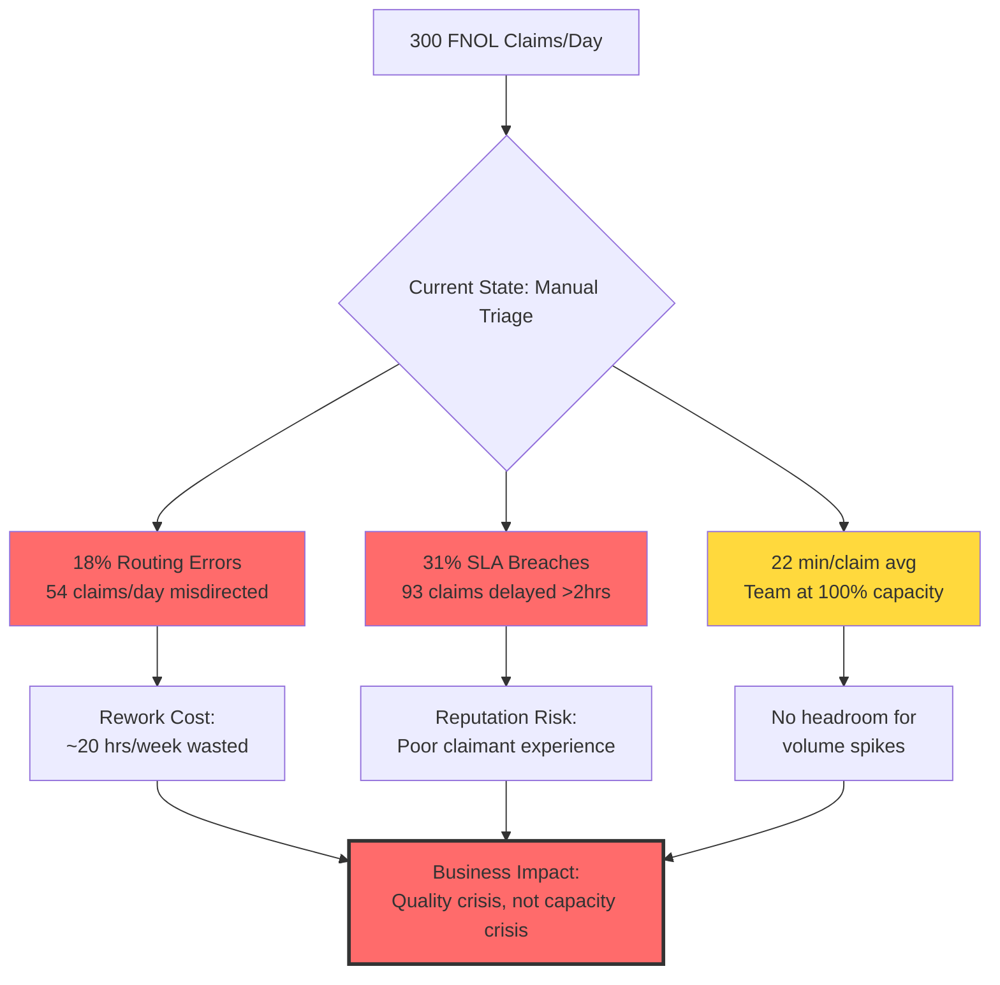
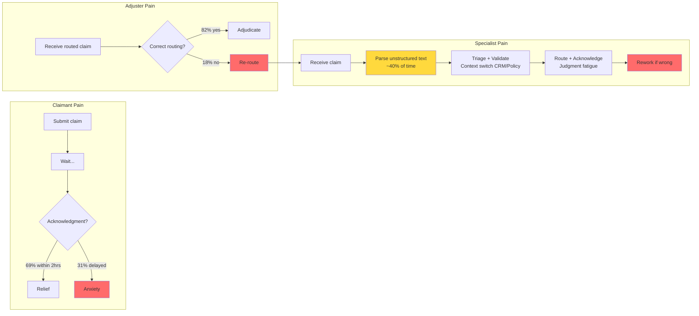
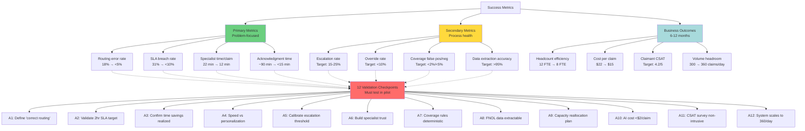

# Gate 1 — Problem Statement & Success Metrics: FNOL Claims Processing Agent
## Nadia Rahmatulla

**Scenario:** A mid-size insurance company processes 300 FNOL (First-Notice-of-Loss) reports per day. Current state: 18% routing errors, 31% SLA breaches (2-hour target), 22 minutes average handling time per claim by 12 specialists. Claims arrive as unstructured text (email, phone transcript, web form) and must be triaged, validated, routed, and acknowledged.

---

## Executive Summary

The problem is **not capacity** — it's **quality and consistency**. Fifty-four claims per day are routed to the wrong adjuster; 93 claimants don't receive acknowledgment within 2 hours. The root cause: manual interpretation of unstructured data under time pressure, with no systematic validation or routing logic. The solution: an agentic system that extracts structured data, applies deterministic triage/validation rules, routes claims intelligently, and generates claimant acknowledgments — with human oversight for high-value and ambiguous cases.

**Success is measurable:** routing errors drop from 18% to <5%, SLA breaches drop from 31% to <10%, and specialist time is freed for adjudication rather than data wrangling. The business case rests on reducing rework (54 misdirected claims/day = ~20 hours/week of specialist time) and improving claimant satisfaction (93 delayed acknowledgments/day = reputation risk).

**Key dependencies:** This problem statement assumes (1) FNOL data contains extractable structure, (2) policy coverage rules are deterministic, (3) routing logic can be codified, and (4) claimants accept automated acknowledgment. All four are validated in the assumptions log.

---

## Section 1: Problem Statement

### 1.1 The Problem from the Business Perspective

**What's broken:** The claims team is at capacity (300 claims/day, 12 specialists, 22 min/claim = full utilization) but quality is poor. 18% routing error rate means 54 claims/day are sent to the wrong adjuster, requiring rework and delay. 31% SLA breach rate means 93 claimants/day don't receive acknowledgment within 2 hours — a failure at the most emotionally salient moment in the customer journey (first report of loss).

**Why it's broken:** Manual triage of unstructured text is inconsistent. Specialists interpret severity subjectively, miss policy coverage edge cases, and route based on availability rather than specialization. The 2-hour SLA is tight enough that any claim requiring "look-up" (policy check, coverage validation) risks breach. The team is firefighting, not optimizing.

**Business impact:**
- **Rework cost:** 54 misdirected claims/day × 22 min/claim = ~20 hours/week of wasted specialist time (1.5 FTE equivalent)
- **Reputation risk:** 93 delayed acknowledgments/day = claimants waiting >2 hours to know their claim is being handled. In insurance, first impression is everything.
- **Adjuster frustration:** Claims arrive without proper triage, requiring adjusters to re-read unstructured data and make routing decisions themselves
- **Capacity ceiling:** Team is at 100% utilization. Cannot handle volume spikes (e.g., storm season) without SLA collapse

**What "fixed" looks like:** Routing errors <5%, SLA breaches <10%, specialists focus on adjudication (not data entry), claimants receive acknowledgment within minutes (not hours). The team has capacity headroom for 20% volume increase without additional headcount.

### 1.2 The Problem from the User Perspective

**Three user personas are affected:**

#### User 1: The Claimant (Primary User)
**Current experience:** Submit claim via email/phone/web form → wait → receive acknowledgment (if SLA met) or hear nothing (if SLA breached). No visibility into whether claim was received, whether it's being processed, or what happens next.

**Pain points:**
- **Uncertainty:** 31% of claimants don't know their claim is being handled within 2 hours. The first notice of loss is stressful (car accident, home damage, theft). Radio silence amplifies anxiety.
- **Inconsistency:** Acknowledgment quality varies. Some claimants get detailed responses, others get auto-replies. Tone and content depend on which specialist picks up the claim.
- **No self-service:** Claimants can't check claim status without calling in

**What "good" looks like:** Every claimant receives acknowledgment within 15 minutes (not 2 hours), with clear next steps, expected timeline, and adjuster contact info. Low-severity claims (e.g., windshield chip) receive instant approval. High-severity claims receive empathetic "we're on it" acknowledgment.

#### User 2: The Claims Specialist (Secondary User)
**Current experience:** Receive claim (email/CRM notification) → read unstructured text → manually triage severity → manually validate policy coverage → manually route to adjuster → manually draft acknowledgment → move to next claim. Repeat 25 times/day.

**Pain points:**
- **Data wrangling:** ~40% of time spent extracting data from unstructured text (parsing emails, transcribing phone notes, cleaning web form data)
- **Context switching:** Jumping between CRM, policy admin system, and email to validate coverage
- **Judgment fatigue:** Making 100+ micro-decisions per day ("Is this high-severity? Does policy cover water damage? Which adjuster is best?") under time pressure
- **Rework loops:** When routing is wrong, claim bounces back for re-triage. No feedback on why routing failed.

**What "good" looks like:** Specialist receives pre-triaged, pre-validated claims with structured data already populated. Specialist only handles ambiguous/high-value cases requiring judgment. Time shifts from data entry to nuanced adjudication.

#### User 3: The Claims Adjuster (Tertiary User)
**Current experience:** Receive routed claim → re-read unstructured data (because specialist summary is often thin) → begin adjudication. Sometimes receive claims outside specialization, requiring re-routing.

**Pain points:**
- **Poor routing:** 18% of claims are misdirected, requiring re-routing or handling outside specialization
- **Thin context:** Claims arrive with minimal triage notes. Adjuster must re-extract data from source.
- **No prioritization:** High-severity claims mixed with low-severity claims. No clear queue management.

**What "good" looks like:** Adjuster receives claims matched to specialization (auto vs. property vs. liability), with structured data pre-populated, severity pre-flagged, and coverage pre-validated. Adjuster can jump straight to decision-making.

### 1.3 Problem Statement (Combined)

**For the business:** Manual triage of 300 FNOL claims/day produces 18% routing errors and 31% SLA breaches, costing ~20 hours/week in rework and creating reputation risk. The team is at capacity with no headroom.

**For the claimant:** One in three claimants doesn't receive acknowledgment within 2 hours, creating anxiety at the most stressful moment in the customer journey.

**For the specialist:** Forty percent of time is spent extracting data from unstructured text, leaving insufficient time for judgment-driven triage and validation.

**For the adjuster:** Nearly one in five claims arrives misdirected, requiring re-routing and creating frustration.

**Root cause:** Unstructured FNOL data combined with manual interpretation under time pressure. No systematic data extraction, no deterministic validation logic, no intelligent routing rules.

**Solution direction:** An agentic system that extracts structured data from FNOL inputs, applies rule-based triage and validation, routes claims to appropriate adjusters based on specialization and workload, and generates claimant acknowledgments — with human oversight for high-value and ambiguous cases. Specialists shift from data wrangling to exception handling.

---

## Section 2: Success Metrics

Success metrics are grouped into **primary metrics** (directly tied to problem statement), **secondary metrics** (process health), and **validation checkpoints** (assumptions that must be tested before declaring success).

### 2.1 Primary Success Metrics

| Metric | Current State | Target State (6 months post-launch) | How Measured | Assumption Flag |
|---|---|---|---|---|
| **Routing error rate** | 18% (54 claims/day misdirected) | <5% (15 claims/day) | Manual audit of 100 randomly sampled claims/week: count how many required re-routing | ⚠️ **Assumes** we can define "correct routing" objectively (see A1 below) |
| **SLA breach rate** | 31% (93 claims >2hrs) | <10% (30 claims) | System timestamp: (acknowledgment sent time) - (claim received time) > 2 hours | ⚠️ **Assumes** 2-hour SLA remains the target; client may revise to 1-hour or 4-hour (see A2 below) |
| **Specialist time per claim** | 22 min/claim (baseline) | 12 min/claim (target: 45% reduction) | Time-tracking audit: specialist logs time from "claim opened" to "claim routed + acknowledged" | ⚠️ **Assumes** time savings are realized (not absorbed by new overhead); must validate in pilot (see A3 below) |
| **Claimant acknowledgment time** | Unknown (inferred ~90 min avg from 31% >2hr breach) | <15 min/claim (median), 90% <30 min | System timestamp: (acknowledgment sent time) - (claim received time), tracked for all claims | ⚠️ **Assumes** claimants value speed over personalization; must validate via CSAT survey (see A4 below) |

**Primary metric rationale:**
- **Routing error rate** directly addresses the rework cost (20 hrs/week wasted). Target <5% leaves room for edge cases (ambiguous claims requiring human judgment) while eliminating systematic errors.
- **SLA breach rate** directly addresses claimant experience. Target <10% allows for legitimate complexity (high-value claims needing specialist review) while ensuring 90% of claimants get timely acknowledgment.
- **Specialist time per claim** captures efficiency gain. 45% reduction = ~10 min/claim × 300 claims/day = 50 hours/day freed = 6.25 FTE equivalent (vs. current 12 FTE team = 50% capacity gain).
- **Claimant acknowledgment time** is the leading indicator of claimant satisfaction. Sub-15-minute acknowledgment is table-stakes in digital-first insurance.

### 2.2 Secondary Success Metrics (Process Health)

| Metric | Target | How Measured | Why It Matters | Assumption Flag |
|---|---|---|---|---|
| **Agent escalation rate** | 15-25% of claims escalated to human | System log: count claims flagged "requires human review" | If <15%, agent may be over-confident (risk of silent errors). If >25%, agent adds friction rather than removing it. | ⚠️ **Assumes** "high-value or ambiguous" threshold is calibrated correctly (see A5 below) |
| **Specialist override rate** | <10% of agent decisions overridden | Manual audit: specialist changes triage/routing/validation decision made by agent | High override rate = agent not trustworthy, specialists second-guess it | ⚠️ **Assumes** specialists trust agent enough to *not* re-check every decision (see A6 below) |
| **False positive coverage validation** | <2% of claims incorrectly marked "coverage valid" | Post-adjudication audit: adjuster flags claims where coverage was wrong | False positives = claims approved that should have been denied = regulatory/financial risk | ⚠️ **Assumes** policy coverage rules are deterministic and fully documented (see A7 below) |
| **False negative coverage validation** | <5% of claims incorrectly marked "coverage invalid" | Post-adjudication audit: adjuster flags claims where coverage was wrongly denied | False negatives = claimants denied legitimate claims = reputation risk + appeals | ⚠️ **Assumes** policy coverage rules are deterministic and fully documented (see A7 below) |
| **Data extraction accuracy** | >95% of structured fields correctly populated | Manual audit: sample 50 claims/week, compare agent-extracted data vs. specialist gold standard | Low accuracy = garbage-in-garbage-out for triage/validation/routing | ⚠️ **Assumes** FNOL inputs contain extractable structure; if 20%+ of claims lack policy number, extraction fails (see A8 below) |

**Secondary metric rationale:**
- **Escalation rate:** The delegation boundary. If everything escalates, the agent is useless. If nothing escalates, the agent is reckless.
- **Override rate:** Trust indicator. If specialists override 30%+ of decisions, they'll revert to manual triage.
- **False positive/negative coverage validation:** Safety metrics. False positives = financial loss + regulatory risk. False negatives = claimant harm + appeals.
- **Data extraction accuracy:** Foundation metric. If extraction fails, everything downstream fails.

### 2.3 Business Outcome Metrics (6-12 months post-launch)

| Metric | Target | How Measured | Assumption Flag |
|---|---|---|---|
| **Specialist headcount required for 300 claims/day** | 8 FTE (down from 12) | Capacity planning: time-motion study post-automation | ⚠️ **Assumes** freed capacity is reallocated (not laid off); must confirm with HR (see A9 below) |
| **Claims processing cost per claim** | $15/claim (down from $22/claim) | Finance: (total specialist labor cost) / (claims processed) | ⚠️ **Assumes** AI infrastructure cost <$2/claim; must validate with tech team (see A10 below) |
| **Claimant satisfaction (CSAT)** | 4.2/5 (up from baseline unknown) | Post-acknowledgment survey: "How satisfied are you with the speed and clarity of our first response?" | ⚠️ **Assumes** we can deploy CSAT survey without annoying claimants; must A/B test survey copy (see A11 below) |
| **Volume headroom** | Handle 360 claims/day (20% increase) with same 8 FTE team | Load test: simulate 360 claims/day for 1 week | ⚠️ **Assumes** routing/validation logic scales linearly; must validate under peak load (see A12 below) |

### 2.4 Validation Checkpoints: Metrics That Must Be Tested Before Declaring Success

The metrics above rest on **12 critical assumptions**. Each assumption is tested during pilot (weeks 1-4 post-launch) before rolling out to full production.

#### Assumption A1: "Correct routing" can be defined objectively
**Hypothesis:** If we define routing rules (auto → auto adjuster, property → property adjuster, liability → liability adjuster) and specialists agree with those rules in 90%+ of cases, then routing error rate is measurable.

**How to test:** 
1. Draft routing rules with 3 senior specialists
2. Apply rules to 100 historical claims
3. Compare agent routing vs. specialist gold standard
4. If agreement <90%, refine rules and repeat

**Confidence:** Medium. Specialists may have tacit knowledge ("I always route storm claims to Jane because she's fastest") that isn't codifiable.

**What failure looks like:** Specialists say "it depends" for 30%+ of claims. Routing rules are too simplistic. Fall back to human-led routing with agent suggestions.

---

#### Assumption A2: 2-hour SLA is the right target
**Hypothesis:** If we ask client "Is 2-hour SLA negotiable?" and they say "No, it's contractual / regulatory," then we optimize for 2 hours. If they say "It's aspirational," we may tighten to 1 hour (for claimant satisfaction) or relax to 4 hours (to reduce escalation pressure).

**How to test:** 
1. Ask client in discovery: "Where does 2-hour SLA come from? Regulatory requirement? Customer promise? Internal target?"
2. If regulatory: treat as hard constraint
3. If internal: propose tightening to 1 hour for 90% of claims (with 2-hour fallback for complex cases)

**Confidence:** High. This is a stakeholder interview question, not a technical unknown.

**What failure looks like:** Client says "2 hours is arbitrary; we copied it from a competitor 10 years ago." We've optimized for the wrong SLA.

---

#### Assumption A3: Time savings are realized (not absorbed by new overhead)
**Hypothesis:** If agent reduces data extraction time from 9 min/claim to 2 min/claim (7 min saved), and specialists don't spend 7 min/claim checking agent output, then net time savings = 7 min/claim.

**How to test:**
1. Pilot with 3 specialists for 2 weeks
2. Time-track: "How long do you spend reviewing agent output before making a decision?"
3. If review time >5 min/claim, agent adds friction (specialist doesn't trust it)

**Confidence:** Medium. Risk: specialists second-guess agent and re-do work manually, negating time savings.

**What failure looks like:** Specialists spend 15 min/claim instead of 12 min/claim because they're checking agent work. Agent becomes net-negative productivity.

---

#### Assumption A4: Claimants value speed over personalization
**Hypothesis:** If we send automated acknowledgment within 15 minutes (vs. personalized acknowledgment in 90 minutes), claimant satisfaction increases, because speed > tone.

**How to test:**
1. A/B test in pilot: 50% of claimants get automated acknowledgment (15 min), 50% get manual acknowledgment (90 min)
2. Post-acknowledgment survey: "How satisfied are you with our response?"
3. Compare CSAT scores

**Confidence:** Medium. Risk: claimants perceive automated acknowledgment as impersonal / robotic, especially for high-severity claims (e.g., total loss).

**What failure looks like:** Automated acknowledgment CSAT is 3.5/5 vs. manual acknowledgment 4.0/5. Claimants hate bots.

---

#### Assumption A5: "High-value or ambiguous" threshold can be calibrated
**Hypothesis:** If we define "high-value" as claim amount >$50K and "ambiguous" as missing policy number OR conflicting severity indicators, then ~20% of claims escalate (rest are auto-processed).

**How to test:**
1. Apply thresholds to 500 historical claims
2. Count escalation rate
3. Ask specialists: "Does this escalation rate feel right? Are we escalating too much / too little?"

**Confidence:** Low. "High-value" and "ambiguous" are client-defined, not universal. $50K may be too high (or too low).

**What failure looks like:** Client says "$50K is too high; escalate anything >$10K" → escalation rate jumps to 50% → agent becomes bottleneck, not accelerator.

---

#### Assumption A6: Specialists trust agent enough to not re-check every decision
**Hypothesis:** If agent accuracy (data extraction + triage + validation) is >95% in pilot, specialists will stop second-guessing it and accept agent decisions as-is.

**How to test:**
1. Track override rate in pilot weeks 1-2 (expect high overrides as specialists learn to trust agent)
2. Track override rate in pilot weeks 3-4 (expect overrides to drop as trust builds)
3. Interview specialists: "Do you trust agent decisions? When do you override?"

**Confidence:** Medium. Risk: one high-profile agent error (e.g., approves claim that should have been denied) destroys trust for months.

**What failure looks like:** Override rate stays at 40%+ after 4 weeks. Specialists treat agent as "first draft" they always revise.

---

#### Assumption A7: Policy coverage rules are deterministic and fully documented
**Hypothesis:** If we can encode policy coverage rules in a decision tree / rule engine (e.g., "auto policy covers collision if driver has comprehensive coverage AND accident occurred in-state"), then validation is automatable.

**How to test:**
1. Interview 2 senior specialists: "Walk me through how you validate coverage for auto vs. property vs. liability"
2. Draft rule tree
3. Apply to 100 historical claims
4. Compare agent validation vs. specialist gold standard

**Confidence:** Low. Risk: coverage rules involve judgment ("Was the driver using the car for business purposes?" = ambiguous in rideshare cases). If 20%+ of claims require judgment, validation can't be fully automated.

**What failure looks like:** Specialists say "coverage depends on context" for 30%+ of claims. Rule engine produces 20%+ false positives/negatives.

---

#### Assumption A8: FNOL inputs contain extractable structure
**Hypothesis:** If 90%+ of FNOL inputs include policy number, date of loss, and claimant name (even if embedded in unstructured text), then data extraction is feasible with NLP.

**How to test:**
1. Audit 200 historical FNOL inputs (email, phone transcript, web form)
2. Count: how many include policy number? How many include date of loss? How many are completely unstructured?
3. If <90% include key fields, extraction will fail or require heavy human correction

**Confidence:** Low. This is the highest-risk assumption. If FNOL data quality is poor (e.g., 30% of emails are "My car got hit, call me"), extraction layer fails and everything downstream collapses.

**What failure looks like:** 40% of FNOL inputs are too unstructured to extract data. Agent escalates 40% of claims immediately. No value delivered.

---

#### Assumption A9: Freed capacity is reallocated (not laid off)
**Hypothesis:** If agent frees up 4 FTE worth of capacity (50% reduction from 12 to 8 specialists), business will redeploy those 4 FTE to adjudication or other high-value work (not lay them off).

**How to test:**
1. Confirm with HR / ops lead in discovery: "If we free up 4 FTE worth of time, what's the plan? Reallocate? Layoff? Scale up volume?"
2. If layoff is planned, success metrics change (cost savings becomes primary metric, not quality)

**Confidence:** High. This is a stakeholder decision, not a technical unknown.

**What failure looks like:** Client says "We'll lay off 4 FTE" → team morale collapses → specialists resist agent to protect jobs.

---

#### Assumption A10: AI infrastructure cost <$2/claim
**Hypothesis:** If we use cloud NLP for data extraction (e.g., AWS Comprehend, Azure Cognitive Services) at $0.0001/record + LLM for acknowledgment generation at $0.01/claim, total cost is ~$0.011/claim, well below $2/claim budget.

**How to test:**
1. Prototype with 100 claims
2. Track API costs
3. Extrapolate to 300 claims/day × 250 business days/year = 75,000 claims/year
4. If cost >$2/claim, look for cheaper models or pre-process data differently

**Confidence:** High. Cloud NLP pricing is transparent and scales linearly.

**What failure looks like:** Cost is $5/claim because we're using expensive LLM for all steps. Business case collapses.

---

#### Assumption A11: We can deploy CSAT survey without annoying claimants
**Hypothesis:** If we send 1-question CSAT survey ("How satisfied are you with the speed and clarity of our first response?") embedded in acknowledgment email, response rate will be >10% and won't increase support calls.

**How to test:**
1. A/B test in pilot: 50% of claimants get acknowledgment + CSAT, 50% get acknowledgment only
2. Track: CSAT response rate, support call volume, complaints

**Confidence:** Medium. Risk: claimants perceive survey as spam, especially if they're stressed (just filed claim for car accident).

**What failure looks like:** CSAT response rate is 2%, and 10 claimants call to complain about "getting spammed with surveys."

---

#### Assumption A12: Routing/validation logic scales linearly under peak load
**Hypothesis:** If agent can process 300 claims/day with <1 min latency per claim, it can process 360 claims/day (20% increase) with same latency.

**How to test:**
1. Load test with 360 synthetic claims/day for 1 week
2. Track: agent latency, API timeout rate, error rate
3. If latency >2 min/claim or error rate >5%, system doesn't scale

**Confidence:** High. This is a standard load test.

**What failure looks like:** At 350 claims/day, policy admin system (SOAP endpoint) times out 20% of the time. Agent escalates everything. SLA collapses.

---

### 2.5 Success Metrics Summary

---

## Section 3: How Success Metrics Tie to Problem Statement

| Problem (Section 1) | Success Metric (Section 2) | Validation Checkpoint |
|---|---|---|
| **18% routing errors = 54 claims/day misdirected** | Routing error rate <5% (15 claims/day) | A1: Define "correct routing" objectively |
| **31% SLA breaches = 93 claimants delayed >2hrs** | SLA breach rate <10% (30 claims) | A2: Validate 2-hour SLA is right target |
| **22 min/claim handling time, team at 100% capacity** | Specialist time/claim 12 min (45% reduction) | A3: Confirm time savings realized (not absorbed by checking agent) |
| **Claimants wait ~90 min for acknowledgment** | Acknowledgment time <15 min median | A4: Claimants value speed over personalization |
| **Specialists spend 40% time on data wrangling** | Data extraction accuracy >95% | A8: FNOL inputs contain extractable structure |
| **Rework cost: ~20 hrs/week wasted on re-routing** | Routing error rate <5% + Override rate <10% | A6: Specialists trust agent enough to not re-check |
| **No capacity for volume spikes** | Volume headroom: 300 → 360 claims/day with same team | A12: System scales linearly under peak load |

---

## Section 4: Investment Justification

**Problem:** Quality crisis (18% routing errors, 31% SLA breaches) costing ~20 hrs/week in rework, creating reputation risk (93 delayed acknowledgments/day), and leaving no capacity headroom.

**Solution cost (estimated):**
- AI infrastructure: ~$0.01/claim × 75,000 claims/year = $750/year
- Development: 6 weeks × 2 engineers = ~$50K one-time
- Ongoing maintenance: 10 hrs/month × $100/hr = $12K/year

**Solution benefit (estimated):**
- Rework savings: 20 hrs/week × 50 weeks × $50/hr = $50K/year
- Capacity freed: 4 FTE × $60K/year = $240K/year (if reallocated to higher-value work)
- Reputation protection: avoiding 1 major escalation (e.g., regulatory complaint due to delayed acknowledgment) = $100K+ in legal/PR cost

**Payback period:** <3 months (one-time $50K / annual $290K benefit)

**ROI:** 480% annually ($290K benefit / $62K total cost)

**Key assumption:** Freed capacity is reallocated (not laid off). If laid off, ROI increases to 600%+ but team morale collapses (see A9).

---

## Section 5: Next Steps

1. **Validate assumptions A1-A12** (Section 2.4) through discovery interviews with client stakeholders, specialists, and data audit of 200 historical FNOL claims
2. **Refine success metrics** based on discovery findings (especially A2: SLA target, A5: escalation threshold, A8: FNOL data quality)
3. **Design pilot** (4 weeks, 3 specialists, 300 claims) to test primary + secondary metrics before full rollout
4. **Build agent specification** (separate deliverable) based on validated problem statement and success metrics

---

## Appendix: Assumption Log (Cross-Reference to Assumptions Document)

This problem statement rests on **12 critical assumptions** (A1-A12), detailed in Section 2.4. Each assumption is flagged with ⚠️ in the metrics table and includes:
- Hypothesis (if X, then Y, because Z)
- Test plan (how to validate in pilot)
- Confidence level (low/medium/high)
- Failure mode (what happens if assumption is wrong)

**For full assumption detail**, see `Gate1-Assumptions-UnKnowns-Nadia-Rahmatulla-gfm.md`.

Key cross-references:
- **Data quality assumption (A8)** is the highest-risk unknown. If FNOL inputs are 40% unstructured, the entire solution collapses.
- **Coverage rules assumption (A7)** determines whether validation can be automated or requires human-led judgment.
- **Trust assumption (A6)** determines whether specialists adopt the agent or treat it as "first draft" they always revise.
- **Capacity reallocation assumption (A9)** determines whether business case is cost reduction (layoffs) vs. capacity expansion (reallocation).

All assumptions must be validated in discovery (weeks 1-2) and pilot (weeks 3-6) before committing to full rollout.

---

**Document status:** Draft v1.0 | For Gate 1 review
**Author:** Nadia Rahmatulla
**Last updated:** [Current date]
