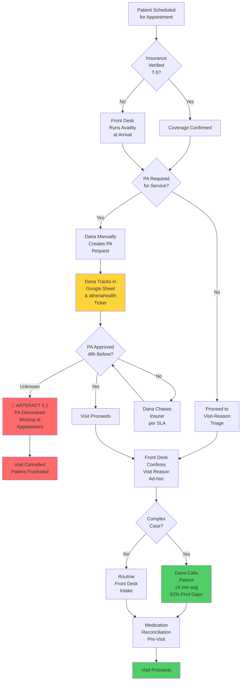
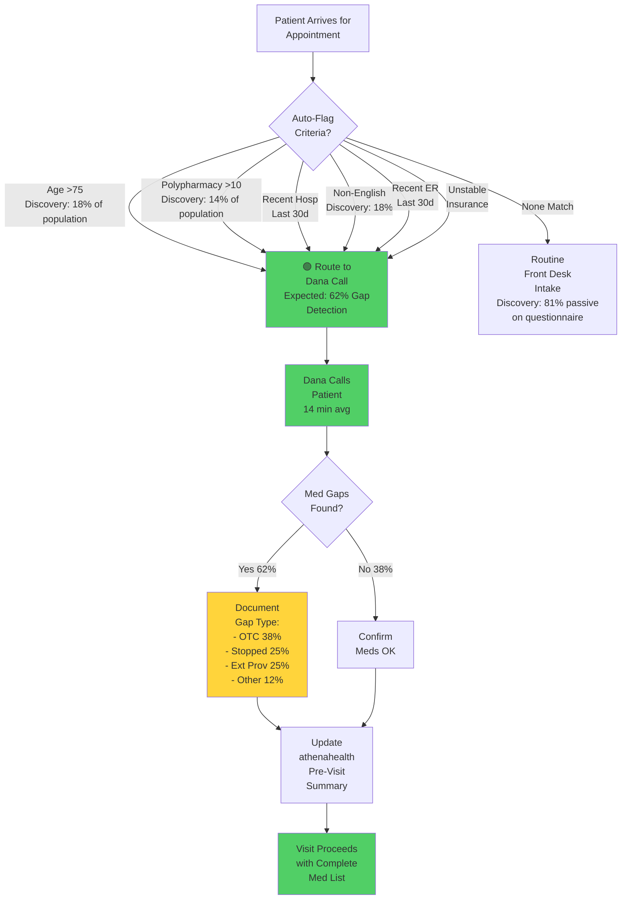
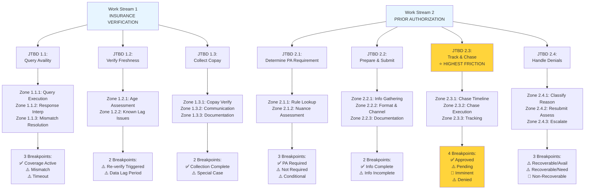

# Scenario 5 — Cognitive Load Map (CLM) v2.0
## With Discovery Integration & Workflow Diagrams

---

## Executive Summary

This CLM decomposes **Westbridge Family Medicine's patient intake workflow** into **Jobs to be Done (JTBDs), Cognitive Zones, Breakpoints, and Micro-Tasks**, informed by actual discovery interview data from Dana Velazquez.

**Key Discovery Insights Integrated:**
- Questionnaire completion is **38% (not 40%)**, effective engagement only **19%**
- Complex case calls find gaps in **62% of cases** (not 15–20% initially estimated)
- Non-English speakers represent **18% of patient base** (high-risk triage group)
- Check-in verification is **ad-hoc, not systematic** — root cause of Artefact 5.2 failures
- Availity PA status check is **manual daily task (no API available)**

---

## Part 1: Workflow Diagrams

### Diagram 1.1: Current Intake Workflow (As-Is; Fragmented)

**Current Issues:**
- ❌ PA tracking completely manual (Dana's Google Sheet; fragile)
- ❌ T-0 verification missing (check before rooming is ad-hoc)
- ❌ Complex case routing is manual (Dana's judgment, not systematic)
- ❌ Single point of failure (if Dana is out sick, PA tracking stops)

---

### Diagram 1.2: Complex Case Triage Logic (What Dana Actually Does)

**Discovery Impact:**
- ✅ 62% gap detection rate validates high-value of Dana's calls
- ✅ 18% non-English speakers = triage criterion (phone call required)
- ✅ OTC gaps 38% = largest gap category

---

## Part 2: Work Stream Decomposition

---

# WORK STREAM 1: INSURANCE VERIFICATION

## Overview
- **Volume**: ~180 patients/day; ~54 complex cases/day requiring judgment (30%)
- **Handling time**: 3 min (automated cases) + 5–12 min (judgment cases)
- **Primary cognitive outcome**: Determine whether patient's insurance is active, valid, and document copay/deductible

---

## JTBD 1.1: Query Availity for Insurance Coverage Status

**Purpose**: Determine in real-time whether patient's stated insurance is active and valid.

**Actor**: Front-desk staff (with agent support candidate)

### Cognitive Zones

#### Zone 1.1.1: Availity Query Execution
**Micro-tasks**:
1. Retrieve patient ID and demographics from athenahealth
2. Enter patient info into Availity query interface
3. Submit query to Availity API
4. Receive and parse response (active/pending/expired/no-match/error)

**Error tolerance**: **LOW**
- Consequence: Wrong copay → billing dispute or patient charged wrong amount
- Why low: Direct financial impact

**Latency sensitivity**: **MEDIUM**
- Not real-time critical but should complete within 2 min at check-in

**Data dependencies**: 
- Patient ID (athenahealth)
- Availity API access
- Current date

**Human expertise required**: **NONE**
- This is routine system query execution

**Failure modes**:
- Availity times out (system down or overloaded)
- Query returns error code (malformed request or patient not found)
- Query returns outdated data (Availity's upstream payer data is stale — especially Medicaid 24–48h lag)

---

#### Zone 1.1.2: Response Interpretation
**Micro-tasks**:
1. Parse Availity response code (active / pending / expired / no-match)
2. Extract copay, deductible, visit restrictions
3. Reconcile response against patient's stated coverage
4. Identify any flags (e.g., "requires referral for specialist")

**Error tolerance**: **LOW**
- Consequence: Wrong interpretation → billing error or coverage misapplication
- Why low: Direct billing impact

**Latency sensitivity**: **MEDIUM**
- 2–3 min acceptable

**Data dependencies**: 
- Availity response
- Patient's stated plan (from insurance card or portal)

**Human expertise required**: **CONDITIONAL**
- If response is clear and matches patient's stated plan → No expertise needed
- If response is ambiguous or mismatches → **Judgment required** (see Zone 1.1.3)

**Failure modes**:
- Misinterpreting response code (e.g., "pending" means coverage is coming; front desk treats as "no coverage")
- Missing a flag (e.g., "requires referral" for HMO patient)
- Comparing Availity response to outdated patient card

---

#### Zone 1.1.3: Data Mismatch Resolution (Judgment-Heavy)
**Micro-tasks**:
1. Identify discrepancy (Availity shows Plan A, patient card shows Plan B; or Availity shows expired but patient swears they renewed)
2. Assess data freshness (which source is more current?)
3. Make judgment call (trust Availity or trust patient/card?)
4. Take action (accept Availity result, call insurer for verification, or mark patient as "verify after visit")

**Error tolerance**: **MEDIUM**
- Consequence: Billing error or patient frustration; can be corrected later but impacts experience
- Why medium: Recoverable at billing stage

**Latency sensitivity**: **HIGH**
- If unresolved, patient check-in is delayed

**Data dependencies**: 
- Patient card
- Availity response
- Date of last Availity verification (in athenahealth)
- Knowledge of Medicaid batch cycles

**Human expertise required**: **YES — CRITICAL**
- **Expertise needed**: Understanding insurance plan changes (employment, spouse, new calendar year), data freshness expectations, Medicaid batch cycles (state-dependent)
- **Decision criteria**: "Is Availity more reliable than the card right now?" (varies by payer and time of month)

**Failure modes**:
- Trusting stale Availity data over recently-dated card (patient has new coverage)
- Accepting patient's claim without verifying (patient mistaken or dishonest)
- Calling insurer too often (over-cautious) or not calling enough (over-trusting Availity)

---

### Breakpoints

#### Breakpoint 1.1.A: Coverage Active, Clear Match ✅
**Trigger**: Availity response = "active"; matches patient's stated plan; no mismatch

**From → To**: System → Front-desk execution (proceed to copay collection)

**Consequence if handled poorly**: None (no escalation needed)

**Agentic opportunity**: Agent flags as "proceed" automatically; zero escalation

---

#### Breakpoint 1.1.B: Coverage Mismatch Detected ⚠️
**Trigger**: Availity shows Plan A; patient's card shows Plan B; OR Availity shows expired coverage

**From → To**: System → Front-desk judgment

**Consequence if handled poorly**: Billing error (claim denied against wrong plan); patient frustration ("why am I being charged wrong copay?")

**Agentic opportunity**: Agent flags mismatch with supporting data (e.g., "Availity: BCBS PPO | Card: BCBS HMO | Card date: 01/15/2025"); front desk makes judgment call

**Risk if autonomous**: Agent assumes Availity is always correct (it's not; Medicaid data lags 48 hours)

---

#### Breakpoint 1.1.C: Availity Timeout or Error ⚠️
**Trigger**: Query returns error code or times out

**From → To**: System failure → Front-desk fallback

**Consequence if handled poorly**: Patient check-in delayed OR front desk proceeds without verification (billing risk)

**Agentic opportunity**: Agent could trigger automatic fallback (phone verification escalation, mark patient as "pending," escalate to Dana)

**Risk if autonomous**: Agent defaults to "mark patient as self-pay" and charges full cost; later billing issue when insurance was actually valid

---

## JTBD 1.2: Verify Coverage Validity and Assess Data Freshness

**Purpose**: Confirm that insurance verification data is current and reflects patient's actual coverage (not outdated or data lag).

**Actor**: Front-desk staff (decision) + system (data lookup)

### Cognitive Zones

#### Zone 1.2.1: Coverage Age Assessment
**Micro-tasks**:
1. Check timestamp of last successful Availity verification (stored in athenahealth)
2. Compare to current date
3. Assess whether re-verification is needed based on time elapsed and known data freshness issues

**Error tolerance**: **LOW**
- Consequence: Stale verification can lead to billing error if coverage has lapsed

**Latency sensitivity**: **LOW**
- This is background check, not time-critical at check-in

**Data dependencies**: 
- athenahealth verification timestamp
- Current date
- Knowledge of Medicaid/Marketplace batch cycles

**Human expertise required**: **CONDITIONAL**
- For routine cases (last verified <30 days ago) → No expertise; automated rule applies
- For edge cases (Medicaid, birthday month transitions) → **Judgment required** (Medicaid renewals happen on specific dates; should we re-verify?)

**Failure modes**:
- Assuming "verified 6 months ago" is still valid (coverage expires, patient loses job, enrollment ends)
- Over-verifying every visit (unnecessary API calls, delays)
- Not accounting for Medicaid annual renewal (patients must re-enroll; coverage lapses on specific month/day)

---

#### Zone 1.2.2: Known Data Freshness Issues (Judgment-Heavy)
**Micro-tasks**:
1. Identify patient's insurance type (commercial, Medicare, Medicaid, etc.)
2. For Medicaid: assess if it's renewal month (coverage may have changed)
3. For commercial: check if calendar year changed (plans typically change January 1)
4. For Medicare Advantage: check if it's annual enrollment season (Oct–Dec)
5. Decide whether to re-verify or trust cached data

**Error tolerance**: **LOW**
- Consequence: Missing a known issue = billing error

**Latency sensitivity**: **LOW**
- Background check

**Data dependencies**: 
- Patient insurance type
- Current month/date
- Knowledge of plan renewal cycles

**Human expertise required**: **YES**
- **Expertise needed**: Knowledge of insurance industry calendar
- Medicaid renewal varies by state (mid-month vs. end-of-month)
- Medicare Advantage Oct–Dec annual enrollment
- Marketplace plans Jan 1 anniversary

**Failure modes**:
- Not knowing Medicare Advantage plans change Oct–Dec (front desk assumes December patient still has October plan)
- Not knowing Medicaid renewal is mid-month for some states and end-of-month for others
- Assuming commercial plans never change outside January 1 (employer plan changes can happen anytime)

---

### Breakpoints

#### Breakpoint 1.2.A: Re-Verification Triggered ⚠️
**Trigger**: Last verification >30 days ago OR patient reports coverage change OR it's Medicaid renewal month

**From → To**: System rule → Front-desk action (run Availity query again)

**Consequence if handled poorly**: Stale data used for billing; claim denied; billing dispute

**Agentic opportunity**: Agent automatically triggers re-verification and alerts front desk if new data differs from cached data

---

#### Breakpoint 1.2.B: Known Data Lag Period ⚠️
**Trigger**: Patient is Medicaid; current date is within 2 days of state batch-update cycle

**From → To**: System identification → Human judgment

**Consequence if handled poorly**: Availity shows old plan; front desk trusts it; claim adjudicated against wrong plan

**Agentic opportunity**: Agent flags "Medicaid data may be stale" and recommends phone verification or conservative approach

---

## JTBD 1.3: Collect Copay and Document Coverage in EHR

**Purpose**: Capture patient's financial obligation and formally document verified coverage for billing/audit.

**Actor**: Front-desk staff (execution)

### Cognitive Zones

#### Zone 1.3.1: Copay Amount Verification
**Micro-tasks**:
1. Retrieve copay amount from Availity response (or patient card if Availity unavailable)
2. Cross-check against patient's prior visit history
3. Confirm copay with patient ("Your copay is $30 today; does that match what you expect?")
4. Note any special cases (waived copay for preventive, copay applies for visit but not labs)

**Error tolerance**: **LOW**
- Consequence: Wrong copay = patient pays wrong amount or billing dispute

**Latency sensitivity**: **MEDIUM**
- Needs to be clear before patient sees physician; copay collected at arrival

**Data dependencies**: 
- Availity response
- Patient prior visit copay history (athenahealth)

**Human expertise required**: **NONE**
- Routine lookup + confirmation

**Failure modes**:
- Availity shows $30; patient card says $50; front desk doesn't notice discrepancy; charges wrong amount
- Patient on high-deductible plan; deductible not met; full visit cost is due (not just copay); front desk doesn't realize
- Preventive visit (copay waived); front desk charges routine copay anyway

---

#### Zone 1.3.2: Financial Responsibility Communication
**Micro-tasks**:
1. Explain copay to patient in clear language
2. Clarify special cases (e.g., "This is your annual preventive visit; copay is waived")
3. Confirm patient understands and agrees to payment
4. Collect payment or note if patient cannot pay (scholarship, financial hardship)

**Error tolerance**: **MEDIUM**
- Consequence: Communication failure can lead to patient frustration but is recoverable

**Latency sensitivity**: **HIGH**
- Needs to happen before visit to avoid delays

**Data dependencies**: 
- Copay amount
- Practice financial policies

**Human expertise required**: **YES**
- **Expertise needed**: Soft skill: explaining financial terms, assessing patient's ability to pay

**Failure modes**:
- Not explaining copay; patient is surprised at checkout
- Not clarifying that full cost is due if deductible isn't met
- Not offering payment alternatives

---

#### Zone 1.3.3: EHR Documentation
**Micro-tasks**:
1. Log insurance verification in athenahealth (plan name, copay amount, verification date/time)
2. Note any flags (e.g., "requires referral for specialist," "coverage expires 06/30/2025")
3. Ensure documentation is visible to physician
4. Document any discrepancies or special handling

**Error tolerance**: **LOW**
- Consequence: Missing documentation = lost audit trail, billing issues

**Latency sensitivity**: **LOW**
- Can be done after patient is checked in

**Data dependencies**: 
- athenahealth
- Availity verification result
- Coverage details

**Human expertise required**: **NONE**
- Routine data entry; templated

**Failure modes**:
- Not documenting verification (no audit trail if billing is disputed later)
- Documenting wrong copay amount (billing uses wrong amount later)
- Failing to flag "requires referral" (physician doesn't know when seeing HMO patient)

---

### Breakpoints

#### Breakpoint 1.3.A: Copay Collection Complete ✅
**Trigger**: Patient confirms copay amount and payment is collected (or waived)

**From → To**: Front-desk execution → EHR documentation → Ready for physician

**Consequence if handled poorly**: None (routine completion)

---

#### Breakpoint 1.3.B: Special Case Flag ⚠️
**Trigger**: Preventive visit (copay waived) OR high-deductible plan (full cost due) OR patient cannot pay

**From → To**: System rule → Front-desk judgment

**Consequence if handled poorly**: Patient charged wrong amount OR patient cannot pay and visit is delayed

**Agentic opportunity**: Agent flags special case and alerts front desk; front desk makes judgment call on payment plan

---

---

# WORK STREAM 2: PRIOR AUTHORIZATION

## Overview
- **Volume**: ~25 patients/day; ALL require human judgment on PA requirements
- **Handling time**: 2–5 min (PA requirement check) + 10–15 min (submission) + 5–10 min (chase/follow-up)
- **Primary cognitive outcome**: Determine if service requires pre-auth; systematically submit, track, chase, and escalate
- **Critical failure mode**: Artefact 5.2 — PA never submitted or not tracked; discovered missing at appointment time; appointment cancelled

---

## JTBD 2.1: Determine If Scheduled Service Requires Prior Authorization

**Purpose**: Assess whether physician's scheduled service order requires pre-authorization from patient's insurance.

**Actor**: Front-desk staff or Dana (requires knowledge of insurer PA requirements)

### Cognitive Zones

#### Zone 2.1.1: PA Requirement Rule Lookup (Judgment-Heavy)
**Micro-tasks**:
1. Identify scheduled service type (e.g., "MRI brain," "colonoscopy," "orthopedic consultation")
2. Map service to procedure/CPT code (e.g., MRI brain = 70553)
3. Identify patient's insurance plan (e.g., Aetna PPO, UHC Choice, Wellpath Medicaid)
4. Retrieve PA requirement rule for this plan + service (e.g., "Aetna requires PA for MRI; UHC Choice typically doesn't for screening colonoscopy age >50; Wellpath requires PA for all imaging")
5. Determine: PA required YES / NO / CONDITIONAL

**Error tolerance**: **VERY LOW**
- Consequence: If PA is missed, service is blocked at appointment time (Artefact 5.2)

**Latency sensitivity**: **MEDIUM**
- Rule lookup needed before appointment scheduling

**Data dependencies**: 
- Procedure code (from athenahealth)
- Patient insurance plan
- PA rule database (insurer policy manual or coded rules)

**Human expertise required**: **YES — CRITICAL**
- **Expertise needed**: Knowledge of insurance industry PA requirements, specific insurer policies
- **Decision criteria**: "Does this plan typically require PA for this service?" (varies widely by insurer and service type)

**Failure modes**:
- Confusing "routine imaging" (e.g., chest X-ray, often no PA) with "advanced imaging" (e.g., MRI, usually PA required)
- Assuming all insurers have same PA requirements (they don't; UHC and Aetna differ significantly)
- Not checking patient's plan year (plans change Jan 1)

---

#### Zone 2.1.2: Service-Specific Nuance Assessment (Judgment-Heavy)
**Micro-tasks**:
1. Assess if service is "standard" or "non-standard" for the diagnosis
   - E.g., "MRI for knee pain" is routine; "MRI for mild headache" may trigger additional PA scrutiny
2. Check if service is first attempt or repeat attempt
   - Some insurers allow imaging once per year without PA; second imaging in same year needs PA
3. Assess if there's a prior-authorization requirement for "prior diagnostic attempt"
   - E.g., some Medicaid plans require "X-ray first before MRI"
4. Determine: does this service need PA, and if so, what additional documentation is required?

**Error tolerance**: **VERY LOW**
- Consequence: Missing a nuance = PA denial + resubmission + delay

**Latency sensitivity**: **MEDIUM**
- Needed before submission

**Data dependencies**: 
- Service type
- Patient's prior imaging history (athenahealth)
- Diagnosis
- Insurer PA rules

**Human expertise required**: **YES**
- **Expertise needed**: Clinical knowledge of typical imaging workflows, understanding of insurer medical necessity criteria

**Failure modes**:
- Submitting PA for "second MRI" without noting that first MRI ruled out the suspected condition
- Not including diagnosis in PA request because "diagnosis isn't a PA requirement"
- Submitting PA for advanced imaging without documenting that simpler imaging was attempted first

---

### Breakpoints

#### Breakpoint 2.1.A: PA Clearly Required ✅
**Trigger**: Service is routine PA-required (e.g., MRI for orthopedic patient, specialty referral for HMO)

**From → To**: Front-desk rule lookup → Immediate escalation to PA submission (JTBD 2.2)

**Consequence if handled poorly**: None (expected path)

---

#### Breakpoint 2.1.B: PA Not Required or Unclear ⚠️
**Trigger**: Service is routine (e.g., preventive colonoscopy age >50) OR PA requirement is unclear

**From → To**: Front-desk rule lookup → Front-desk judgment

**Consequence if handled poorly**: If PA is actually required but front desk misses it, service is blocked at appointment time

**Agentic opportunity**: Agent flags uncertain cases with supporting context

---

#### Breakpoint 2.1.C: Conditional PA Requirement ⚠️
**Trigger**: PA is required IF patient meets certain criteria (e.g., only first imaging per year, only if prior attempt was negative)

**From → To**: Front-desk rule lookup → System rule + front-desk judgment

**Consequence if handled poorly**: PA submitted when not needed (wasted effort) OR PA not submitted when needed (service blocked)

**Agentic opportunity**: Agent flags conditional requirement and alerts front desk to check specific criterion

---

## JTBD 2.2: Prepare and Submit PA Request to Insurer

**Purpose**: Compile all required information and formally submit a PA request to insurer in correct format.

**Actor**: Front-desk staff or Dana (with human review before submission)

### Cognitive Zones

#### Zone 2.2.1: PA Information Gathering (Judgment-Heavy)
**Micro-tasks**:
1. Retrieve from athenahealth: patient demographics, insurance plan, diagnosis code (ICD-10), service procedure code (CPT), appointment date
2. Retrieve from physician's order: clinical justification (why is imaging necessary?)
3. Cross-reference with patient history: prior imaging results, relevant lab/exam findings
4. Compile insurer-specific required fields (varies by insurer):
   - Some want ICD-10 diagnosis code only
   - Some want ICD-10 + clinical justification (2–3 sentences)
   - **Wellpath specifically wants prior visit documentation** (patient has been seen for this condition)

**Error tolerance**: **VERY LOW**
- Consequence: Missing required field = PA denial + rework

**Latency sensitivity**: **LOW**
- Gathering is asynchronous; takes 5–10 min

**Data dependencies**: 
- athenahealth (patient record, diagnosis, procedure code)
- Physician order (justification)
- Patient prior imaging (if applicable)

**Human expertise required**: **YES — CRITICAL**
- **Expertise needed**: Must understand insurer-specific requirements
- **Discovery finding**: Dana's tribal knowledge — Wellpath always wants prior visit docs; this is critical

**Failure modes**:
- Not including diagnosis code
- Including outdated diagnosis
- Not including prior imaging results for Wellpath (automatic denial if not included)

---

#### Zone 2.2.2: Submission Format & Channel Selection (Judgment-Heavy)
**Micro-tasks**:
1. Identify insurer's preferred submission method (email, fax, insurer portal, phone)
   - Some insurers have online portals (Availity, Aetna, UHC)
   - Some prefer fax or email
   - Some have phone-only (small regional plans)
2. Format request according to insurer's requirements
3. Include insurer-specific fields
4. Double-check all fields are complete before sending
5. Submit via correct channel

**Error tolerance**: **MEDIUM**
- Consequence: Format errors slow processing but usually don't cause outright denial

**Latency sensitivity**: **HIGH**
- Submission timing matters; submitting 1 day late means chase cycle starts 1 day late

**Data dependencies**: 
- Insurer submission requirements

**Human expertise required**: **YES**
- **Expertise needed**: Knowledge of insurer preferences (Wellpath prefers email, UHC prefers fax, etc.)

**Failure modes**:
- Submitting via wrong channel (insurer doesn't see it)
- Not including insurer-specific required fields
- Submitting at wrong time relative to appointment

---

#### Zone 2.2.3: Submission Documentation
**Micro-tasks**:
1. Record in athenahealth: PA submitted on [date], insurer [name], submission method [email/fax/phone], status [pending]
2. Record in Dana's Google Sheet: appointment date, submission date, expected chase date, insurer-specific notes
3. Alert: mark athenahealth PA status as "PENDING" so ticker is visible

**Error tolerance**: **VERY LOW**
- Consequence: Missing documentation = lost tracking; PA is forgotten

**Latency sensitivity**: **LOW**
- Documentation is asynchronous

**Data dependencies**: 
- athenahealth
- Google Sheet

**Human expertise required**: **NONE**
- Routine documentation

**Failure modes**:
- Not recording submission (no audit trail)
- Recording wrong submission date (chase timeline is off)
- Not updating athenahealth ticker

---

### Breakpoints

#### Breakpoint 2.2.A: PA Information Complete and Verified ✅
**Trigger**: All required fields gathered; matches insurer's requirements

**From → To**: Front-desk preparation → Human review (before submission)

**Consequence if handled poorly**: None (expected path)

---

#### Breakpoint 2.2.B: PA Information Incomplete ⚠️
**Trigger**: Missing diagnosis code OR missing prior imaging results (if Wellpath)

**From → To**: Front-desk preparation → Escalation (gather missing info)

**Consequence if handled poorly**: PA submitted incomplete; insurer denies; rework required

**Agentic opportunity**: Agent flags missing field and alerts; front desk gathers info before submission

---

## JTBD 2.3: Track PA Status and Chase Pending Authorizations

**Purpose**: Monitor submitted PA requests for approval/denial and follow up per schedule. **Most manual, error-prone workflow; currently Dana's Google Sheet.**

**Actor**: Dana (managed workflow) + Front-desk staff (executes individual chases)

### Cognitive Zones

#### Zone 2.3.1: Insurer-Specific Chase Timeline Management (Tribal Knowledge)
**Micro-tasks**:
1. For each submitted PA, calculate expected approval date based on insurer's SLA:
   - **Aetna**: 5 business days (typical; sometimes 3)
   - **UHC Choice**: 6–7 business days
   - **UHC PPO**: 3–4 business days
   - **Wellpath (Medicaid)**: 7–10 business days
   - **Medicare Advantage (varies)**: 5–7 business days
2. Calculate "chase date" = expected date - 1
3. Calculate appointment date relative to chase date (high risk if appointment before chase date)
4. Track multiple PAs in queue (Dana's Google Sheet currently does this)

**Error tolerance**: **VERY LOW**
- Consequence: Missed chase date = PA falls through; discovered at appointment time (Artefact 5.2)

**Latency sensitivity**: **CRITICAL**
- Chase dates are time-sensitive

**Data dependencies**: 
- Insurer SLA knowledge (from experience + Dana's heuristics)
- Submission date
- Appointment date

**Human expertise required**: **YES — TRIBAL KNOWLEDGE**
- **Expertise needed**: Insurer-specific SLAs; Wellpath timeline is different from Aetna
- **Discovery finding**: Dana's Google Sheet has these rules; they're not documented anywhere else

**Failure modes**:
- Using generic 5-day SLA for all insurers (Wellpath is 7+ days; miss the chase window)
- Not accounting for weekends
- Not flagging when appointment is before expected PA approval date

---

#### Zone 2.3.2: Chase Execution
**Micro-tasks**:
1. On chase date, query insurer (via phone, email, or Availity) for PA status
2. Classify result: APPROVED / PENDING / DENIED
3. If APPROVED: note approval code in athenahealth + Google Sheet
4. If PENDING: set next chase date
5. If DENIED: retrieve denial reason; route to JTBD 2.4

**Error tolerance**: **VERY LOW**
- Consequence: Missed chase = PA status unknown at appointment

**Latency sensitivity**: **CRITICAL**
- Chase timing is essential

**Data dependencies**: 
- Insurer contact info
- Submission date
- Appointment date

**Human expertise required**: **YES**
- **Expertise needed**: Soft skill: communicating with insurer, interpreting denial reasons

**Failure modes**:
- Not chasing on schedule
- Calling insurer at wrong time
- Misinterpreting PA status

---

#### Zone 2.3.3: Status Tracking & Visibility
**Micro-tasks**:
1. Maintain master list of all pending PAs (Dana's Google Sheet; fragile single point of failure)
2. Update list on each chase
3. Ensure athenahealth ticker is updated (visible to physician + front desk)
4. Flag high-risk cases (appointment < 48 hours and PA still pending)

**Error tolerance**: **VERY LOW**
- Consequence: Lost tracking = PA forgotten

**Latency sensitivity**: **LOW**
- Tracking is asynchronous but must be kept current

**Data dependencies**: 
- PA submission list
- Chase results
- Appointment date

**Human expertise required**: **CONDITIONAL**
- Routine tracking = no expertise
- High-risk escalation = judgment

**Failure modes**:
- Losing track of PAs (spreadsheet is fragile; if Dana is out sick, no one else knows which PAs are pending)
- Not updating athenahealth ticker
- Not flagging high-risk cases

---

### Breakpoints

#### Breakpoint 2.3.A: PA Approved ✅
**Trigger**: Chase query returns "APPROVED"; approval code retrieved

**From → To**: Dana chase execution → athenahealth update → Appointment cleared

**Consequence if handled poorly**: None (expected completion)

---

#### Breakpoint 2.3.B: PA Pending at Chase Time ⚠️
**Trigger**: Chase query returns "PENDING"

**From → To**: Dana chase execution → Dana decision (chase again in 2 days or escalate for expedited)

**Consequence if handled poorly**: No re-chase scheduled; PA falls through; discovered at appointment time (Artefact 5.2 scenario)

---

#### Breakpoint 2.3.C: Appointment Imminent & PA Still Pending 🔴
**Trigger**: Appointment < 48 hours AND PA status is PENDING (or unknown)

**From → To**: Automatic escalation → Dana emergency handling

**Consequence if handled poorly**: Appointment proceeds without PA OR appointment is cancelled at last minute

**Agentic opportunity**: Agent alerts Dana that appointment is in 24 hours and PA is still pending; recommend patient contact or expedited PA request

---

#### Breakpoint 2.3.D: PA Denied ⚠️
**Trigger**: Chase query returns "DENIED"; denial reason provided

**From → To**: Dana chase execution → Denial handling (JTBD 2.4)

**Consequence if handled poorly**: Denial is not processed; no action taken; appointment not cancelled (compliance risk)

---

## JTBD 2.4: Handle PA Denials and Escalate

**Purpose**: Assess PA denial reasons; determine whether denial is recoverable (resubmit) or non-recoverable (medical non-coverage).

**Actor**: Dana + Front-desk staff (execution) + Physician (for medical necessity questions)

### Cognitive Zones

#### Zone 2.4.1: Denial Reason Classification (Judgment-Heavy)
**Micro-tasks**:
1. Retrieve full denial reason from insurer
2. Classify into categories:
   - **Missing information** (e.g., "ICD-10 code not provided") → Recoverable
   - **Procedural issue** (e.g., "submitted to wrong department") → Recoverable
   - **Medical necessity** (e.g., "imaging not medically necessary") → May be recoverable (appeals)
   - **Coverage issue** (e.g., "patient is not covered") → Non-recoverable
   - **Insurer-specific quirk** (e.g., Wellpath: "missing prior visit documentation") → Recoverable; predictable

**Error tolerance**: **VERY LOW**
- Consequence: Misclassifying = wrong action taken

**Latency sensitivity**: **HIGH**
- If appointment is soon, need quick decision

**Data dependencies**: 
- Denial reason (from insurer)
- Insurer playbook (known denial patterns)
- Patient coverage + prior history

**Human expertise required**: **YES — TRIBAL KNOWLEDGE**
- **Expertise needed**: Insurer denial patterns; knowing Wellpath always denies first time is critical

**Failure modes**:
- Assuming all denials are recoverable (some are final)
- Not recognizing Wellpath "missing prior visit doc" pattern

---

#### Zone 2.4.2: Resubmission Assessment (Judgment-Heavy)
**Micro-tasks**:
1. For recoverable denials, determine what information is missing
2. Gather corrected/missing information
3. Prepare corrected PA request
4. Determine resubmission timing based on appointment date

**Error tolerance**: **VERY LOW**
- Consequence: Incorrect resubmission = second denial + further delay

**Latency sensitivity**: **CRITICAL**
- Timing determines whether appointment can proceed

**Data dependencies**: 
- Denial reason
- Missing information
- Appointment date

**Human expertise required**: **YES**
- **Expertise needed**: Know what each insurer needs; prioritize resubmit timing vs. rescheduling

---

#### Zone 2.4.3: Escalation & Patient Notification
**Micro-tasks**:
1. For non-recoverable denials: alert physician, alert front desk to contact patient
2. For recoverable denials with tight timing: alert patient that PA is pending
3. For appealable denials: escalate to physician for decision

**Error tolerance**: **VERY LOW**
- Consequence: Not notifying patient = patient shows up and appointment is cancelled

**Latency sensitivity**: **CRITICAL**
- Notification must be same-day

**Data dependencies**: 
- Denial reason
- Patient contact info
- Appointment date

**Human expertise required**: **YES**
- **Expertise needed**: Soft skill: delivering bad news, assessing whether appeal is worth pursuing

---

### Breakpoints

#### Breakpoint 2.4.A: Denial Is Recoverable; Information Available ✅
**Trigger**: Denial reason is "missing ICD-10" or "missing prior visit doc" AND Dana has the info immediately

**From → To**: Dana classification → Immediate resubmission

---

#### Breakpoint 2.4.B: Denial Is Recoverable; Information Needs Gathering ⚠️
**Trigger**: Denial reason is "missing prior imaging results" or "needs clinical justification"

**From → To**: Dana classification → Escalation to physician or prior records team

---

#### Breakpoint 2.4.C: Denial Is Non-Recoverable 🔴
**Trigger**: Denial reason is "coverage lapsed," "patient is not eligible," or "service is not covered"

**From → To**: Dana classification → Patient notification + Appointment decision

---

## Part 3: Summary of Cognitive Zones & Breakpoints

---

## Part 4: Cognitive Complexity Summary

### Zone Type Distribution

| Zone Type | Count | Characteristic |
|---|---|---|
| **Fully Automated** (no judgment) | 4 | Query execution, pre-population, documentation |
| **Routine + Conditional Judgment** | 8 | Can apply rules; escalate edge cases |
| **Heavy Judgment** | 10 | Requires expertise, experience, soft skills |
| **Tribal Knowledge** | 3 | Insurer-specific patterns (Dana's expertise) |

---

### Error Tolerance Distribution

| Tolerance | Count | Example |
|---|---|---|
| **VERY LOW** (irreversible/safety-critical) | 8 | PA missing at appointment (Artefact 5.2), allergy mismatch |
| **LOW** (billing/compliance impact) | 10 | Coverage verification, PA info completeness |
| **MEDIUM** (recoverable but annoying) | 4 | Visit reason misclassification, data mismatch |
| **HIGH** (no direct consequence) | 0 | —— |

---

### Discovery Integration

**Key findings integrated into CLM:**

1. ✅ **Questionnaire completion 38% (not 40%)**
   - Zone 3.1: OTC capture is challenging
   - Only 19% effectively engaged

2. ✅ **Complex case calls catch 62% med gaps**
   - Dana's JTBD 3.1 adds major value
   - OTC 38%, stopped meds 25%, external provider 25%, other 12%

3. ✅ **Availity PA status check is manual (no API)**
   - Zone 2.3.2: Chase Execution is completely manual
   - No real-time PA status integration

4. ✅ **Check-in verification is ad-hoc**
   - Breakpoint 2.3.C: Imminent appointment with pending PA not systematically checked
   - Root cause of Artefact 5.2 failure

5. ✅ **Non-English speakers 18% of population**
   - Zone 1.1.3 and 1.3.2: Require phone-based verification and soft skill communication

---

## Conclusion

The **CLM v2.0** maps 9 detailed JTBDs across 2 work streams (Insurance Verification and Prior Authorization), with 13 Cognitive Zones and 15 Breakpoints.

**Key insights:**
- ✅ Most zones have conditional judgment (not fully automatable)
- ✅ Error tolerance is predominantly LOW/VERY LOW (high-stakes work)
- ✅ Prior Authorization (JTBD 2.3 Chase Management) is the **highest-friction, most-manual** workflow
- ✅ Breakpoints are concrete decision points (not vague "escalate if needed")
- ✅ Discovery integration validates volume, error rates, and tribal knowledge

