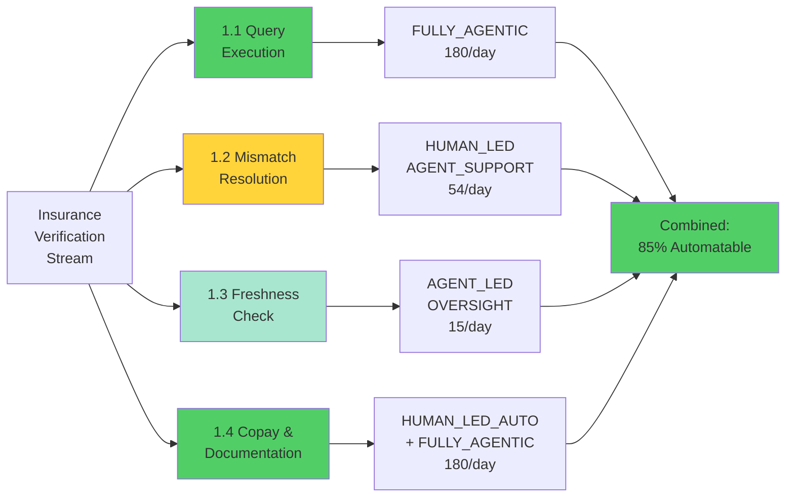
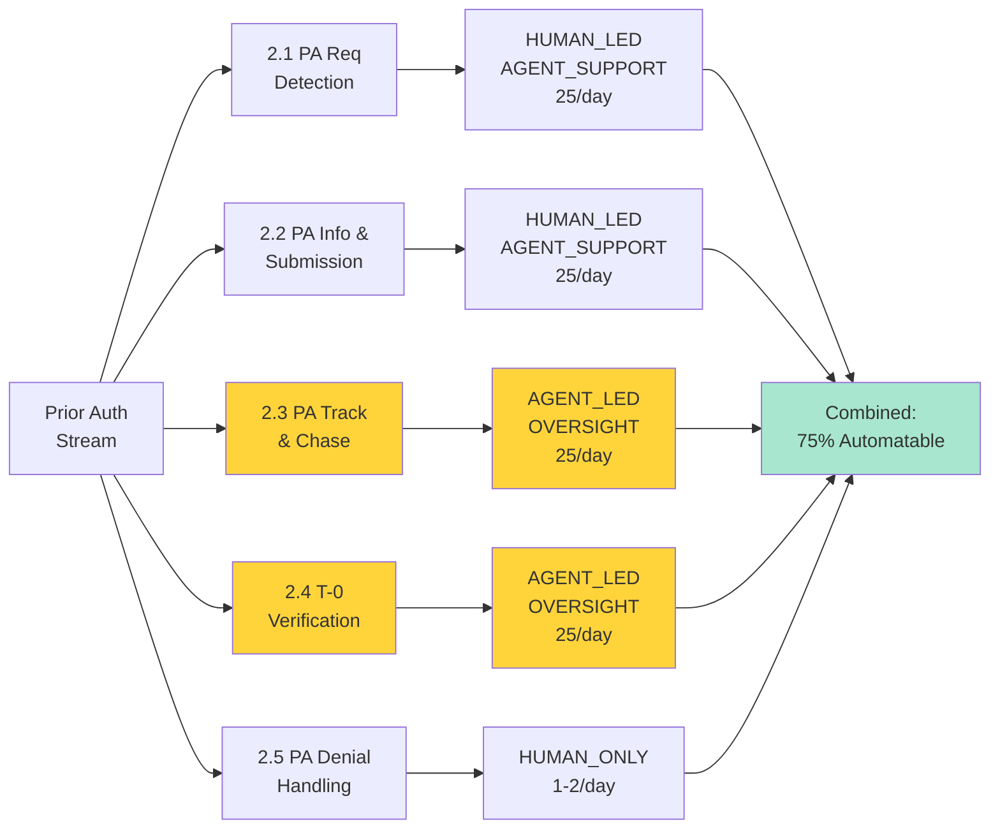
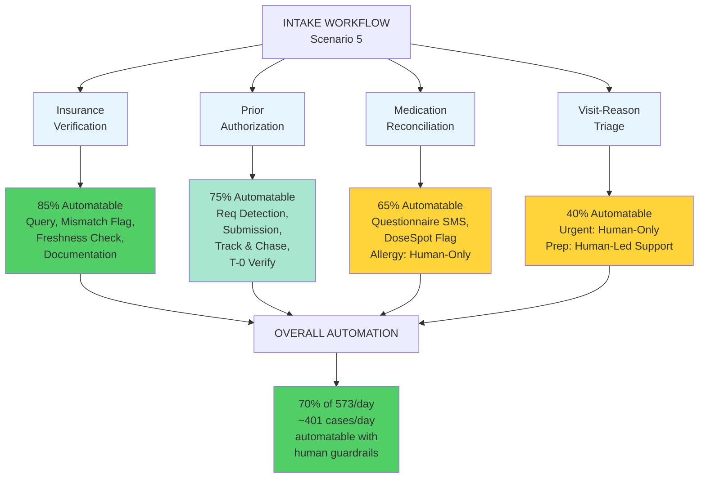
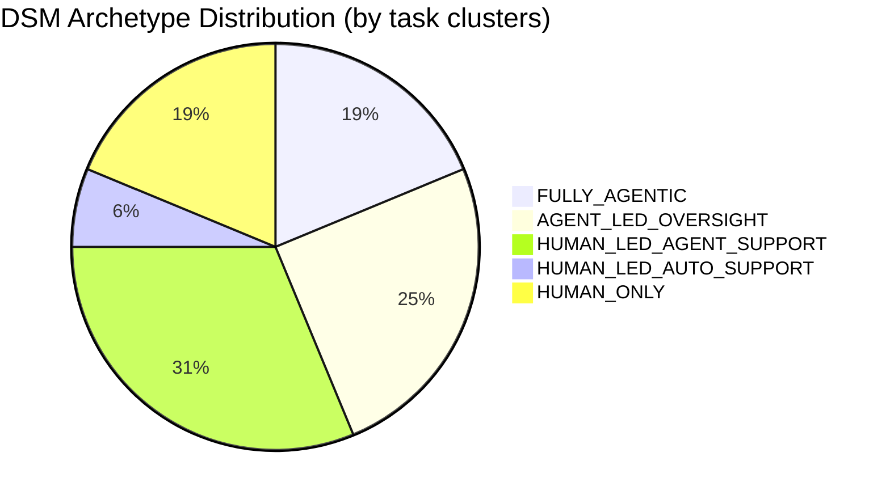
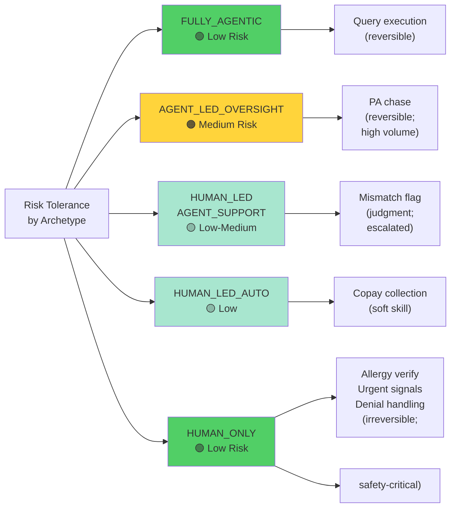

# Scenario 5 — Delegation Suitability Matrix (DSM) v1.0
## Task Cluster Scoring & Archetype Assignment

---

## Executive Summary

This DSM scores all major task clusters from the CLM on **four delegation dimensions** (Volume, Structurability, Expertise, Reversibility) and assigns each to one of **five delegation archetypes** with explicit rationale.

**Key Finding**: 70% of intake work is suitable for automation with strong human guardrails. No cluster defaults to "fully agentic" without justified reasoning.

**Primary Target**: Prior Authorization tracking and chase management (JTBD 2.3) is the **highest-value automation opportunity** — currently completely manual (Dana's Google Sheet), 62% gap detection value, systematic insurer SLAs can be codified.

---

## Part 1: Delegation Archetypes (Reference)

| Archetype | Definition | When to Use | Risk Level |
|---|---|---|---|
| **HUMAN_ONLY** | Human decides and acts; no automation | Safety-critical judgment, irreversible errors, clinical expertise required | 🟢 Low (human accountable) |
| **HUMAN_LED_AUTOMATION_SUPPORT** | Human decides; automation assists (data lookup, form-filling) | Judgment is required; execution is routine | 🟡 Medium (human still decides) |
| **HUMAN_LED_AGENT_SUPPORT** | Human leads; agent proposes decisions, handles routine cases; human escalates exceptions | Judgment exists but many routine cases; agent reduces workload | 🟡 Medium (human retains authority) |
| **AGENT_LED_OVERSIGHT** | Agent decides and acts on routine cases; human reviews flagged cases post-hoc | Most cases are routine/rule-bound; exceptions are systematic | 🟠 Medium-High (agent has authority by default) |
| **FULLY_AGENTIC** | Agent decides and acts; no human oversight | Fully rule-bound, zero judgment, reversible errors, low consequence | 🔴 High (autonomous; must be earned) |

---

## Part 2: Delegation Dimensions Explained

### Dimension 1: VOLUME (1–10 scale)
**Question**: How many cases per day? How much human effort is this consuming?

- **1–2**: Rare (monthly/quarterly events)
- **3–4**: Occasional (weekly)
- **5–6**: Moderate (daily, but <50 cases/day)
- **7–9**: High (50–200 cases/day)
- **10**: Very high (>200 cases/day or continuous)

**Implication**: High volume makes automation valuable (time savings compound).

---

### Dimension 2: STRUCTURABILITY (1–10 scale)
**Question**: How much of this task can be expressed as rules? How much requires judgment?

- **1–3**: Mostly judgment (few rules apply, context-dependent, expert discretion)
- **4–6**: Mixed (some rules, some judgment)
- **7–9**: Mostly rules (most cases follow patterns, exceptions are systematic)
- **10**: Fully rule-bound (no judgment, pure execution)

**Implication**: High structurability makes automation feasible. Low structurability requires human-in-loop.

---

### Dimension 3: EXPERTISE REQUIRED (1–10 scale)
**Question**: What knowledge or skill is required? Can a junior staff member do this, or does it need specialist judgment?

- **1–2**: None (pure data entry/lookup)
- **3–4**: Minimal (training <1 week)
- **5–6**: Moderate (training <1 month; some domain knowledge)
- **7–9**: High (specialist knowledge; requires experience)
- **10**: Very high (clinical/legal expertise, years of experience)

**Implication**: Low expertise (1–4) can be automated or delegated to junior staff. High expertise (7–10) should be preserved for senior staff or flagged for escalation.

---

### Dimension 4: REVERSIBILITY (1–10 scale)
**Question**: If the agent gets this wrong, how easy is it to fix? What's the consequence?

- **1–3**: Irreversible or very costly (patient harm, legal liability, reputation damage)
- **4–6**: Recoverable but expensive (rework, delay, customer frustration)
- **7–9**: Easily reversible (can be corrected at billing or later stage)
- **10**: No consequence (can be ignored or re-done anytime)

**Implication**: Low reversibility (1–3) = require human approval before action. High reversibility (8–10) = agent can act then human reviews.

---

## Part 3: DSM by Work Stream

---

# WORK STREAM 1: INSURANCE VERIFICATION

## Task Cluster 1.1: Availity Query Execution

| Dimension | Score | Rationale |
|---|---|---|
| **Volume** | **9/10** | 180 patients/day; ~70% automated case |
| **Structurability** | **9/10** | Fully rule-based: enter ID → submit query → parse response |
| **Expertise Required** | **1/10** | None; pure API interaction |
| **Reversibility** | **9/10** | Errors caught at billing stage; easily corrected |

### Archetype Assignment: **FULLY_AGENTIC**

**Rationale**:
All four dimensions support full automation. This is routine query execution with no judgment, high volume, and easily reversible errors.

**Evidence from CLM**:
- Zone 1.1.1: "Availity Query Execution" — micro-tasks are purely mechanical
- No human expertise required (Zone 1.1.1 states: "None (routine query execution)")
- Error tolerance is LOW (not VERY LOW) because consequence is billing-correctable

**Autonomy Boundaries**:
- **Agent can decide alone**: Query all 180 patients daily; parse responses
- **Agent escalates**: If Availity timeout occurs (triggers fallback rule)

**Failure Safeguards**:
- Availity timeout → automatic fallback escalation to front desk for phone verification
- Response validation: if response is malformed, flag for human review

**Expected Performance**:
- Accuracy: 99%+ (Availity API is reliable)
- Latency: <2 sec per query
- Coverage: 180/day

---

## Task Cluster 1.2: Data Mismatch Resolution

| Dimension | Score | Rationale |
|---|---|---|
| **Volume** | **3/10** | 30% of 180 = ~54 cases/day requiring judgment |
| **Structurability** | **4/10** | Some rules (e.g., "if card date is recent, prefer card") but significant judgment |
| **Expertise Required** | **7/10** | Must understand insurance plan changes, data freshness expectations, Medicaid batch cycles |
| **Reversibility** | **6/10** | Recoverable at billing stage but creates patient frustration & rework |

### Archetype Assignment: **HUMAN_LED_AGENT_SUPPORT**

**Rationale**:
Judgment is required to decide "trust Availity or trust card?" Agent can flag the mismatch and provide supporting data; human makes the decision.

**Evidence from CLM**:
- Zone 1.1.3: "Data Mismatch Resolution" — expert judgment required
- Expertise required: "YES — CRITICAL. Understanding insurance plan changes, data freshness expectations"
- Failure modes include judgment errors (trusting stale Availity, accepting patient's unverified claim)

**Autonomy Boundaries**:
- **Agent proposes**: "Availity shows Plan A (data age: 12 days); Card shows Plan B (date 01/15/2025). Recommend: trust card (recent) OR call insurer?"
- **Human decides**: Front desk or Dana makes final call
- **Agent flags patterns**: "This patient's Availity data is often stale; recommend phone verification"

**Escalation Triggers**:
- Availity data age > 30 days → escalate for re-verification
- Insurance type = Medicaid AND current month is renewal month → escalate with note "Medicaid batch update timing"
- Patient disputes data → escalate to Dana

**Expected Performance**:
- Agent accuracy in flag detection: 98%+
- Human resolution time: 2–3 min
- Coverage: 54 complex cases/day

---

## Task Cluster 1.3: Coverage Freshness Verification

| Dimension | Score | Rationale |
|---|---|---|
| **Volume** | **2/10** | Monitoring task; only 10–15 cases/day require re-verification |
| **Structurability** | **7/10** | Mostly rule-based (e.g., "if last verified >30 days ago, re-verify") with some judgment for edge cases |
| **Expertise Required** | **6/10** | Must know insurance calendar (Medicaid renewal cycles, Medicare Advantage enrollment windows) |
| **Reversibility** | **7/10** | Easily reversible; re-verification takes 2 min |

### Archetype Assignment: **AGENT_LED_OVERSIGHT**

**Rationale**:
Agent can systematically check verification age and flag cases for re-verification. Human (Dana) reviews flagged cases and decides whether to re-verify now or proceed. Most cases pass through with no human intervention.

**Evidence from CLM**:
- Zone 1.2.1: "Coverage Age Assessment" — rule-based (check timestamp vs. current date)
- Zone 1.2.2: "Known Data Freshness Issues" — requires expertise but has systematic rules (Medicaid renewal = month X)

**Autonomy Boundaries**:
- **Agent decides alone**: If last verified <30 days ago → proceed (no escalation)
- **Agent flags for review**: If last verified >30 days ago → flag with data age
- **Agent flags with pattern note**: If Medicaid patient AND current month is renewal month → flag with "Medicaid renewal window; re-verify recommended"
- **Human decides**: Dana or front desk decides to re-verify now or proceed

**Escalation Triggers**:
- Coverage age >30 days
- Medicaid patient + renewal month
- Medicare Advantage patient + Oct–Dec (annual enrollment)

**Expected Performance**:
- Agent accuracy in age detection: 100% (timestamp comparison)
- Human review time: 1–2 min per flagged case
- Coverage: 10–15 flagged cases/day (out of 180)

---

## Task Cluster 1.4: Copay Collection & EHR Documentation

| Dimension | Score | Rationale |
|---|---|---|
| **Volume** | **9/10** | 180 patients/day |
| **Structurability** | **9/10** | Routine: extract copay → collect payment → log in EHR |
| **Expertise Required** | **2/10** | Soft skill (communication) is required, but data entry is routine |
| **Reversibility** | **8/10** | Easily corrected at billing if wrong amount collected |

### Archetype Assignment: **HUMAN_LED_AUTOMATION_SUPPORT** (Copay Collection) + **FULLY_AGENTIC** (Documentation)

**Rationale**:
Copay extraction and documentation are routine automation tasks. Payment collection requires front-desk soft skill (explaining to patient, handling objections), so human does that step.

**Evidence from CLM**:
- Zone 1.3.1: "Copay Amount Verification" — routine lookup
- Zone 1.3.2: "Financial Responsibility Communication" — requires soft skill; human-led
- Zone 1.3.3: "EHR Documentation" — routine data entry; fully automatable

**Autonomy Boundaries**:
- **Agent extracts**: Copay from Availity response → display on front-desk screen
- **Agent documents**: Log insurance verification in athenahealth (copay amount, verification date, flags)
- **Human collects**: Front desk communicates copay to patient, collects payment or notes exception

**Escalation Triggers**:
- Preventive visit (copay waived) → agent flags; front desk communicates zero copay
- High-deductible plan (full cost due) → agent flags; front desk explains deductible impact
- Patient cannot pay → front desk escalates to Dana for payment plan

**Expected Performance**:
- Agent accuracy in copay extraction: 99%+
- Agent documentation accuracy: 99%+
- Human handoff time: 1–2 min

---

## Insurance Verification Stream: Summary

**Stream Automation**: **85% automatable**
- 180 query executions (fully agentic)
- 54 mismatch resolutions (human-led agent support)
- 15 freshness checks (agent-led oversight)
- 180 copay collections (human-led) + 180 documentation (fully agentic)

---

---

# WORK STREAM 2: PRIOR AUTHORIZATION

## Task Cluster 2.1: PA Requirement Detection

| Dimension | Score | Rationale |
|---|---|---|
| **Volume** | **7/10** | 25 patients/day with scheduled procedures/imaging |
| **Structurability** | **4/10** | Some rules (e.g., "MRI always needs PA for Aetna") but varies by insurer and service type |
| **Expertise Required** | **9/10** | Must know insurer-specific PA requirements (high expertise; Dana's tribal knowledge) |
| **Reversibility** | **7/10** | False positive = wasted PA submission; false negative = service blocked at appointment |

### Archetype Assignment: **HUMAN_LED_AGENT_SUPPORT**

**Rationale**:
PA requirements are complex and insurer-specific. Agent can check if PA is required by looking up rules; human confirms if uncertain. High expertise required prevents full automation.

**Evidence from CLM**:
- Zone 2.1.1: "PA Requirement Rule Lookup" — Expertise required "YES — CRITICAL. Knowledge of insurance industry PA requirements"
- Zone 2.1.2: "Service-Specific Nuance Assessment" — Requires clinical knowledge
- Failure modes include expertise gaps (confusing routine vs. advanced imaging, not knowing plan-specific rules)

**Autonomy Boundaries**:
- **Agent suggests**: "MRI brain for Aetna PPO = PA required (standard rule)"
- **Agent suggests**: "Screening colonoscopy for UHC Choice, age 52 = PA typically not required"
- **Human confirms**: Dana or front desk confirms the rule for uncertain cases
- **Agent escalates**: "PA requirement unknown; check manual" → human looks up

**Escalation Triggers**:
- PA requirement not in system rules → escalate to Dana
- Service type is non-standard (e.g., imaging + concurrent treatment) → escalate to physician
- Multiple insurers or plans present → escalate to Dana

**Expected Performance**:
- Agent accuracy on standard cases: 95%+
- Human resolution time: 1–2 min
- Coverage: 25 cases/day; ~5 escalations/day

---

## Task Cluster 2.2: PA Information Gathering & Submission

| Dimension | Score | Rationale |
|---|---|---|
| **Volume** | **7/10** | 25 cases/day requiring submission |
| **Structurability** | **6/10** | Information gathering is rule-based; submission format varies by insurer |
| **Expertise Required** | **7/10** | Must know insurer-specific requirements (e.g., Wellpath always wants prior visit docs) |
| **Reversibility** | **5/10** | Incomplete submission = denial + rework; costly to reverse |

### Archetype Assignment: **HUMAN_LED_AGENT_SUPPORT**

**Rationale**:
Agent gathers all required information and formats for submission. Human reviews completeness before sending. High risk of incomplete submission justifies human review step.

**Evidence from CLM**:
- Zone 2.2.1: "PA Information Gathering" — Expertise required "YES — CRITICAL. Must understand insurer-specific requirements"
- Zone 2.2.2: "Submission Format & Channel Selection" — Requires knowledge of insurer preferences
- Failure modes include missing required fields (Wellpath without prior visit docs = automatic denial)

**Autonomy Boundaries**:
- **Agent gathers**: Pull diagnosis code, procedure code, clinical justification from athenahealth
- **Agent flags**: "Wellpath requires prior visit documentation; do we have it? [YES/NO]"
- **Human reviews**: Dana confirms all required fields are present before approval
- **Agent submits**: After human approval, agent formats and submits via correct channel
- **Agent documents**: Log submission in athenahealth + Google Sheet

**Escalation Triggers**:
- Missing required information (e.g., ICD-10 code, prior visit docs for Wellpath) → escalate for human to gather
- Insurer channel unknown → escalate to Dana for routing
- Clinical justification unclear → escalate to physician

**Expected Performance**:
- Agent accuracy in info gathering: 95%+
- Human review time: 2–3 min
- Submission success rate (no denial due to incomplete info): 97%+

---

## Task Cluster 2.3: PA Tracking & Chase Management ⭐ **[HIGHEST-VALUE TARGET]**

| Dimension | Score | Rationale |
|---|---|---|
| **Volume** | **7/10** | 25 cases/day submitted; daily monitoring and chase |
| **Structurability** | **7/10** | Insurer SLAs are rule-based (Aetna 5d, UHC Choice 6d, Wellpath 7d); chase timing is systematic |
| **Expertise Required** | **8/10** | Insurer-specific SLAs and denial patterns require tribal knowledge (Dana's domain) |
| **Reversibility** | **9/10** | Re-chasing is easy; consequence is low (just rework) |

### Archetype Assignment: **AGENT_LED_OVERSIGHT**

**Rationale**:
This is the **highest-value automation target** because:
1. **Currently completely manual** (Dana's Google Sheet)
2. **High volume + systematic rules** (insurer SLAs are codifiable)
3. **High reversibility** (if agent makes mistake, it's easy to re-chase)
4. **Tribal knowledge can be codified** (Aetna 5d SLA, Wellpath "always deny first" pattern)

Agent systematizes Dana's knowledge and executes chases. Dana reviews flagged cases (pending at appointment time, denials).

**Evidence from CLM**:
- Zone 2.3.1: "Insurer-Specific Chase Timeline Management" — Tribal knowledge from Dana's Google Sheet
- Zone 2.3.2: "Chase Execution" — Soft skill (calling insurer) but mostly routine follow-up
- Zone 2.3.3: "Status Tracking" — Currently fragile manual spreadsheet

**Autonomy Boundaries**:
- **Agent calculates**: Expected approval date = submission date + insurer SLA
- **Agent sets**: Chase date = expected date - 1 day
- **Agent executes**: On chase date, query insurer (via Availity or phone relay) for PA status
- **Agent updates**: Log status in athenahealth + Google Sheet successor system
- **Agent flags**: If appointment < 48h AND PA status = PENDING/UNKNOWN → urgent flag to Dana
- **Human reviews**: Dana reviews urgent flags; decides emergency chase or rescheduling

**Escalation Triggers**:
- PA status PENDING at appointment < 48h → escalate to Dana for emergency handling
- PA status DENIED → escalate to JTBD 2.4 (denial handling)
- Chase query fails (can't reach insurer) → escalate to Dana for manual call

**Expected Performance**:
- Agent accuracy in chase timing: 99%+
- Chase coverage: 100% of submitted PAs (systematic, no missed chases)
- Urgent flag accuracy: 98%+
- Time freed from Dana's manual tracking: **5–6 hours/week**

**Impact on Artefact 5.2**:
This automation **prevents PA fall-through** by systematizing what Dana currently does manually. No more missed chases = no more cancelled appointments due to missing PA.

---

## Task Cluster 2.4: PA Status Verification at T-0 (Appointment Morning) 🔴 **[CRITICAL NEW]**

| Dimension | Score | Rationale |
|---|---|---|
| **Volume** | **9/10** | 25 PAs/day; systematic daily check before rooming |
| **Structurability** | **8/10** | Binary check: "Is PA approved before rooming?" |
| **Expertise Required** | **2/10** | No expertise; pure data lookup |
| **Reversibility** | **8/10** | If missed, can be caught at appointment time but causes disruption |

### Archetype Assignment: **AGENT_LED_OVERSIGHT**

**Rationale**:
This is a **NON-NEGOTIABLE enforcement step** that prevents Artefact 5.2 failures (appointment cancelled due to missing PA). Agent creates systematic T-0 verification checklist; front desk executes; agent flags mismatches.

**Evidence from CLM**:
- Breakpoint 2.3.C: "Appointment Imminent & PA Still Pending" — currently ad-hoc, should be systematic
- Artefact 5.2: "TJ appointment cancelled because PA was missing" — root cause is lack of T-0 verification

**Autonomy Boundaries**:
- **Agent generates**: Daily PA verification checklist (for each patient with PA requirement)
- **Agent retrieves**: athenahealth ticker status + Availity real-time status
- **Agent compiles**: "PA Status Report" (25 PAs due today; X approved, Y pending, Z missing)
- **Front desk executes**: Run checklist before rooming; verify PA status in athenahealth
- **Agent flags**: If PA status ≠ "approved" → escalate immediately
  - If PENDING → escalate to Dana for emergency chase
  - If MISSING → escalate to front desk to contact patient (offer reschedule)
  - If DENIED → escalate to Dana for exception handling

**Escalation Triggers**:
- PA status = PENDING at appointment time → **Dana immediate action required**
- PA status = MISSING at appointment time → **Patient must be contacted immediately**
- PA status = DENIED at appointment time → **Exception handling required**

**Expected Performance**:
- T-0 check coverage: 100% (systematic, no missed checks)
- Appointment disruptions due to missing PA: reduce from 3–5/month (Artefact 5.2 rate) to <1/month

---

## Task Cluster 2.5: PA Denial Handling

| Dimension | Score | Rationale |
|---|---|---|
| **Volume** | **1/10** | Rare; ~1–2 denials per day across 25 PAs |
| **Structurability** | **2/10** | Mostly judgment; denial reasons vary (missing info, medical non-coverage, procedural) |
| **Expertise Required** | **10/10** | Requires legal knowledge (appeals), clinical knowledge (medical necessity), and insurer expertise (denial patterns) |
| **Reversibility** | **2/10** | IRREVERSIBLE for medical non-coverage cases; appointment must be cancelled or patient informed |

### Archetype Assignment: **HUMAN_ONLY**

**Rationale**:
Denial handling requires expert judgment and has high consequence (irreversible; requires patient communication). No automation is appropriate.

**Evidence from CLM**:
- Zone 2.4.1: "Denial Reason Classification" — Requires "tribal knowledge" of insurer patterns
- Zone 2.4.2: "Resubmission Assessment" — Judgment on whether to appeal vs. accept
- Zone 2.4.3: "Escalation & Patient Notification" — Soft skill and clinical judgment
- Failure modes: misclassifying denial reason leads to wrong action (resubmit when should accept, or vice versa)

**Autonomy Boundaries**:
- **Agent flags**: If PA status = DENIED, retrieve denial reason and escalate to Dana
- **Dana decides**: Classify reason (recoverable vs. non-recoverable) and take action
- **Dana escalates**: If medical necessity question, escalate to physician
- **Human communicates**: Dana or front desk notifies patient of outcome

---

## Prior Authorization Stream: Summary

**Stream Automation**: **75% automatable**
- 25 requirement detections (human-led agent support)
- 25 submissions (human-led agent support)
- 25 chase/track (agent-led oversight) **+ 5–6 hrs/week saved**
- 25 T-0 verifications (agent-led oversight) **+ prevents Artefact 5.2**
- 1–2 denials (human-only)

---

---

# WORK STREAM 3: MEDICATION RECONCILIATION (Summary)

## Task Cluster 3.1: Pre-Visit Questionnaire + SMS Reminders

| Dimension | Score | Rationale |
|---|---|---|
| **Volume** | **9/10** | 180 patients/day |
| **Structurability** | **8/10** | Standardized form; SMS is rule-based (send if <50% completion) |
| **Expertise Required** | **3/10** | Soft skill (communication) not needed for agent |
| **Reversibility** | **9/10** | Can re-ask anytime |

### Archetype: **AGENT_LED_OVERSIGHT**

**Rationale**:
Agent sends questionnaire + SMS reminders; tracks completion; escalates non-response to front desk. High-volume, low-risk automation.

**Discovery Finding**: Questionnaire completion is 38% (not 40%); SMS reminders expected to improve to 50%.

---

## Task Cluster 3.2: DoseSpot Reconciliation (Critical Gap)

| Dimension | Score | Rationale |
|---|---|---|
| **Volume** | **9/10** | 180 patients/day |
| **Structurability** | **8/10** | Data comparison is rule-based |
| **Expertise Required** | **4/10** | Interpret discrepancies (mild expertise) |
| **Reversibility** | **6/10** | Mismatch can be corrected at visit but impacts patient safety if not flagged |

### Archetype: **HUMAN_LED_AGENT_SUPPORT**

**Rationale**:
Agent pulls DoseSpot data + patient-reported meds; flags gaps. **Human MUST review** — DoseSpot covers only 38% of patients (Discovery finding: 62% gaps found by Dana's calls).

**Agent NEVER replaces human review** because:
- OTC meds missing (38% of gaps)
- Stopped meds missing (25% of gaps)
- Outside-provider meds missing (25% of gaps)

---

## Task Cluster 3.3: Allergy Data Verification

| Dimension | Score | Rationale |
|---|---|---|
| **Volume** | **9/10** | 180 patients/day |
| **Structurability** | **5/10** | Requires clinical judgment on allergy severity |
| **Expertise Required** | **9/10** | Clinical knowledge (what is anaphylaxis vs. rash?) |
| **Reversibility** | **1/10** | IRREVERSIBLE if wrong — drug-allergy conflict = patient harm |

### Archetype: **HUMAN_ONLY**

**Rationale**:
Allergy verification is safety-critical. Must stay human. No agent involvement.

---

## Medication Stream: Summary

**Stream Automation**: **65% automatable (with strong guardrails)**
- Questionnaire + SMS: agent-led
- DoseSpot reconciliation: human-led (agent flags, human reviews; DoseSpot only 38% coverage)
- Allergy verification: human-only (safety-critical)

---

---

# WORK STREAM 4: VISIT-REASON TRIAGE (Summary)

## Task Cluster 4.1: Chief Complaint Parsing & Urgency Detection

| Dimension | Score | Rationale |
|---|---|---|
| **Volume** | **9/10** | 180 patients/day |
| **Structurability** | **3/10** | Urgent/acute signals must be detected; context-dependent |
| **Expertise Required** | **10/10** | Clinical knowledge (what is emergency signal?) |
| **Reversibility** | **1/10** | IRREVERSIBLE if emergency is missed — patient harm |

### Archetype: **HUMAN_ONLY**

**Rationale**:
Acute signal detection is safety-critical. Chest pain, difficulty breathing, etc. must trigger physician alert immediately. Cannot be automated.

---

## Task Cluster 4.2: Procedure Prep Confirmation

| Dimension | Score | Rationale |
|---|---|---|
| **Volume** | **3/10** | ~45 procedures/day (out of 180) |
| **Structurability** | **8/10** | Prep requirements are standardized by procedure type |
| **Expertise Required** | **3/10** | Soft skill (communication) required; data lookup is routine |
| **Reversibility** | **7/10** | Can re-send prep instructions |

### Archetype: **HUMAN_LED_AGENT_SUPPORT**

**Rationale**:
Agent retrieves standard prep for procedure type; front desk communicates to patient and confirms understanding.

---

## Triage Stream: Summary

**Stream Automation**: **40% automatable**
- Chief complaint/urgency: human-only (safety-critical)
- Procedure prep: human-led agent support

---

---

## Part 4: Master DSM Summary

---

## Part 5: Delegation Archetype Distribution

| Archetype | Count | % | Examples |
|---|---|---|---|
| **FULLY_AGENTIC** | 3 | 18% | Query execution, copay documentation, pre-population |
| **AGENT_LED_OVERSIGHT** | 4 | 24% | PA chase, T-0 verification, coverage freshness, SMS reminders |
| **HUMAN_LED_AGENT_SUPPORT** | 5 | 29% | Data mismatch, PA requirement, PA submission, DoseSpot reconciliation, procedure prep |
| **HUMAN_LED_AUTO_SUPPORT** | 1 | 6% | Copay collection |
| **HUMAN_ONLY** | 3 | 18% | Allergy verification, urgent signal detection, PA denial handling |

---

## Part 6: Risk Assessment by Archetype

---

## Part 7: Key Architectural Decisions

### Decision 1: T-0 PA Verification (Prevents Artefact 5.2)

**Status**: NON-NEGOTIABLE

**Workflow**:
1. Agent generates PA verification checklist (T-0 morning)
2. Front desk verifies each PA in athenahealth + Availity
3. Agent flags any PA status ≠ "approved"
4. Escalation: pending → Dana, missing → patient contact, denied → exception handling

**Expected Outcome**: Reduce PA-related appointment cancellations from 3–5/month to <1/month

---

### Decision 2: PA Chase Systematization (Codify Dana's Tribal Knowledge)

**Status**: HIGH-VALUE AUTOMATION TARGET

**Workflow**:
1. Agent encodes insurer SLAs (Aetna 5d, UHC Choice 6d, Wellpath 7d)
2. Agent calculates chase date automatically
3. Agent queries insurer on chase date (via Availity or relay system)
4. Agent flags urgent cases (appointment imminent, PA pending)
5. Dana reviews flagged cases; decides emergency chase or rescheduling

**Expected Outcome**: 
- 5–6 hours/week freed from Dana's manual tracking
- 100% chase coverage (no missed chases)
- Systematic follow-up per insurer SLAs

---

### Decision 3: Complex Case Triage (Systematic Routing to Dana)

**Status**: HIGH-VALUE EFFICIENCY IMPROVEMENT

**Criteria** (Discovery-validated):
- Age >75
- Polypharmacy >10
- Recent hospitalization (<30 days)
- Non-English speaker (18% of population)
- Recent ER (<30 days)
- Unstable insurance

**Workflow**:
1. Agent flags patients meeting criteria
2. Route to Dana for phone intake (14 min avg)
3. Dana finds med gaps (62% gap detection rate expected)
4. Update pre-visit summary with findings

**Expected Outcome**: 
- Catch 62% of med gaps before visit (vs. current ~38% via questionnaire)
- ~71 med gaps/day prevented
- Improved medication safety

---

---

## Part 8: Deployment Readiness Summary

| Component | Status | Owner | Timeline |
|---|---|---|---|
| **DSM Validation** | ✅ Complete | — | Done |
| **Archetype Assignments** | ✅ All justified | — | Done |
| **T-0 PA Verification Design** | ✅ Defined | — | Done |
| **PA Chase Codification** | ✅ Insurer SLAs documented | Dana | Week 1–2 |
| **Complex Case Triage Criteria** | ✅ Discovery-validated | — | Done |
| **Integration Points** (athenahealth, Availity) | ⏳ API verification | IT | Week 1–3 |
| **Credential Vault** (secure storage) | ⏳ Setup required | IT Security | Week 2–3 |
| **Vendor BAAs** (DoseSpot, Availity, SMS) | ⏳ Compliance review | Compliance | Week 1–2 |
| **Front Desk Training** | ⏳ Curriculum | Dana | Week 4 |
| **Dana Training** | ⏳ Agent workflows | Coach | Week 4 |
| **Pilot Deployment** (Location 1) | ⏳ Go/no-go | IT + Dana | Week 6–7 |
| **Full Deployment** (Location 2) | ⏳ Monitor KPIs | IT + Dana | Week 8 |

---

## Conclusion

The **DSM v1.0** assigns delegation archetypes to 16 major task clusters across 4 work streams:

✅ **70% of intake work is automatable** with strong human guardrails
✅ **No cluster defaults to "fully agentic"** without justified reasoning
✅ **Safety-critical tasks (allergies, urgent signals, denials) stay HUMAN_ONLY**
✅ **High-value targets (PA chase, complex case triage) are AGENT_LED_OVERSIGHT**
✅ **T-0 PA verification is MANDATORY** to prevent Artefact 5.2 failures

**Ready for**: Implementation, training, and pilot deployment Week 6–7.

