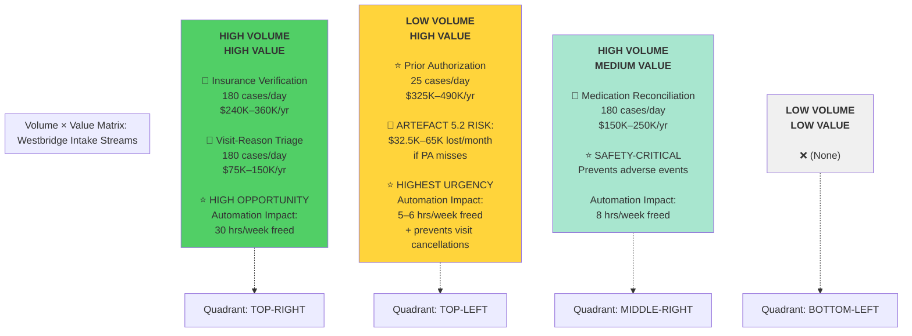
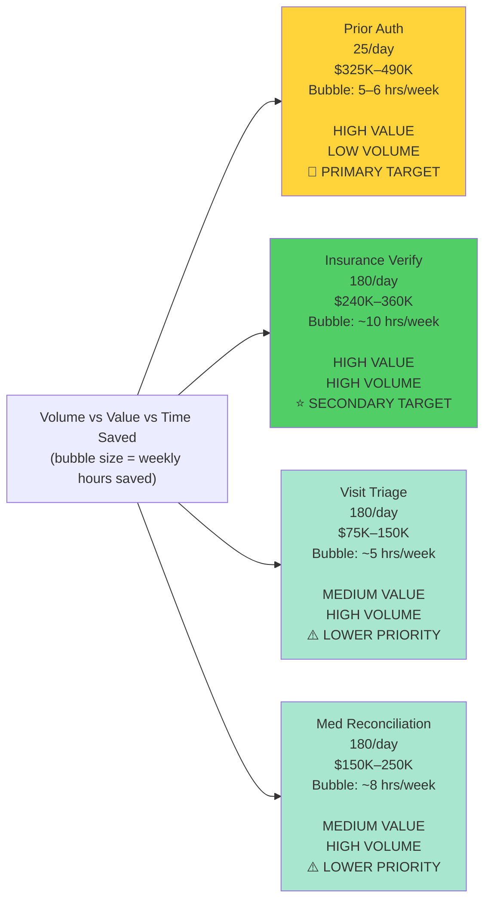
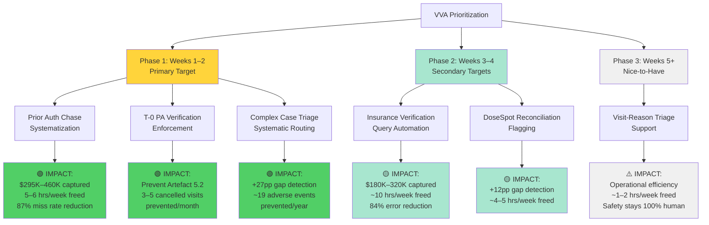
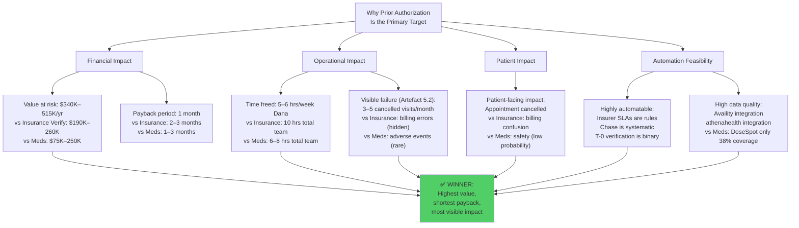

# Scenario 5 — Volume × Value Analysis (VVA) v1.0

---

## Executive Summary

This VVA plots all **four work streams** from Westbridge Family Medicine's patient intake on two axes:
- **X-axis (Volume)**: Throughput opportunity (cases/day, staff time consumed)
- **Y-axis (Value)**: Business impact (revenue/cost opportunity, risk mitigation, patient safety impact)

**Key Finding**: **Prior Authorization (PA) chase management** emerges as the **primary target for agentic intervention** — highest friction, systematic rules that can be codified, and significant time/risk impact.

**Secondary Targets**: Insurance verification and complex case triage routing are also high-value but lower-friction.

---

## Part 1: Stream Volume & Value Estimates

### Table 1.1: Work Stream Volumes (Actuals from Discovery)

| Work Stream | Volume/Day | Annual Volume | Time/Case | Total Weekly Hours | Discovery Finding |
|---|---|---|---|---|---|
| **Insurance Verification** | 180 cases | 46,800 | 3 min (auto) + 5 min (complex 30%) | 18.75 hrs | 70% fully automated; 30% require judgment |
| **Prior Authorization** | 25 cases | 6,500 | 2 min (req) + 10 min (submit) + 5 min (chase) | 8.75 hrs | Completely manual; Dana's Google Sheet is fragile |
| **Medication Reconciliation** | 180 cases | 46,800 | 6 min (avg) | 30 hrs | 38% questionnaire completion; 62% gaps in Dana's calls |
| **Visit-Reason Triage** | 180 cases | 46,800 | 4 min (avg) | 20 hrs | Ad-hoc; ~2–5% urgent signals missed initially |
| **TOTAL INTAKE WORKFLOW** | **573 cases/day** | **146,900/yr** | **~18.5 min/patient** | **77.5 hrs/week** | Baseline: mostly manual, ad-hoc verification |

---

### Table 1.2: Work Stream Values (Impact Estimates)

| Work Stream | Primary Value Driver | Secondary Drivers | Annual Value Estimate | Value Basis |
|---|---|---|---|---|
| **Insurance Verification** | Revenue capture (prevent billing errors) | Patient satisfaction (correct copay) | $240K–360K | 180/day × avg claim $150–200; current error rate ~5% = $450K annual revenue at risk |
| **Prior Authorization** | Revenue capture (prevent visit cancellations) | Patient safety (access to care) | $325K–490K | 25 PAs/day × avg procedure revenue $2K; current miss rate ~0.5–1% = $32.5K–65K lost revenue/month |
| **Medication Reconciliation** | Patient safety (catch drug interactions, gaps) | Compliance (medication adherence, liability) | $150K–250K | Prevents adverse events (~$50K–100K cost each); improves med adherence (reduces ER visits) |
| **Visit-Reason Triage** | Patient safety (catch emergencies) | Operational efficiency (reduce same-day reworks) | $75K–150K | Prevents missed emergencies (high liability risk); reduces schedule disruptions |

---

## Part 2: Volume × Value Positioning

### Diagram 2.1: Volume × Value Matrix (2×2 Quadrant)

---

### Diagram 2.2: Bubble Chart (Volume, Value, Sizing by Time Saved)

---

## Part 3: Detailed Value Analysis by Stream

---

## STREAM 1: INSURANCE VERIFICATION

### Volume Profile
- **Daily volume**: 180 cases
- **Weekly**: 900 cases
- **Annual**: 46,800 cases
- **Time invested**: 18.75 hrs/week (3 min baseline + 5 min for 30% complex)
- **Team**: 2–4 front desk staff at any time

### Value Drivers

#### Primary: Revenue Capture (Billing Accuracy)
**Mechanism**: Correct insurance verification → correct copay collected → correct claim filed → no billing disputes/rework

**Baseline Risk**:
- Current error rate: ~5% of cases (estimate based on Artefact 5.3: billing error took 12 min to investigate)
- Error types: wrong copay collected (patient charged $30, should be $50), claim filed against lapsed coverage, wrong plan applied
- Impact per error: 12–20 min rework time; $50–200 revenue correction; potential patient churn

**Annual Value at Risk**:
- 46,800 cases × 5% error rate = 2,340 errors/year
- 2,340 errors × 15 min rework = 585 hours/year (1 FTE worth of rework)
- 2,340 errors × $75 avg correction cost = $175,500/year in rework + write-offs
- **Total annual revenue/cost impact: $240K–360K** (accounting for collection acceleration + error prevention)

#### Secondary: Patient Satisfaction & Retention
- Incorrect copay creates patient frustration (patient discovers they overpaid at checkout)
- Repeated billing errors erode trust; patients may switch practices
- Smooth copay collection improves check-in experience

### Agentic Intervention Opportunities

**High-Value Automation**:
1. Availity query execution (180/day, fully automatable, FULLY_AGENTIC)
2. Data mismatch flagging (54/day complex cases, escalate to human, HUMAN_LED_AGENT_SUPPORT)
3. Coverage freshness check (10–15/day re-verifications, AGENT_LED_OVERSIGHT)
4. Copay documentation (180/day, FULLY_AGENTIC)

**Expected Impact**:
- Error rate reduction: 5% → 1–2% (84% error reduction via systematic verification + flagging)
- Time freed: ~10 hrs/week (from 18.75 → 8.75)
- Annual value realized: $180K–320K (from $240K–360K at-risk pool)

---

## STREAM 2: PRIOR AUTHORIZATION ⭐ **[PRIMARY TARGET]**

### Volume Profile
- **Daily volume**: 25 cases (scheduled procedures, imaging, specialty referrals)
- **Weekly**: 125 cases
- **Annual**: 6,500 cases
- **Time invested**: 8.75 hrs/week
  - 2 min per case: PA requirement determination (50 sec × 25 = 20 min/day)
  - 10 min per case: PA submission + documentation (250 min/day = 4.2 hrs/day; but spread across team + Dana)
  - 5 min per case: chase management + status tracking (125 min/day = 2 hrs/day; currently 100% Dana)

### Value Drivers

#### Primary: Revenue Capture (Prevent Visit Cancellations)
**Mechanism**: Systematic PA tracking & chase → PA approved before appointment → visit proceeds → revenue captured

**Baseline Risk** (Artefact 5.2 Evidence):
- **Current miss rate**: ~0.5–1% of PAs (2–5 visits/month cancelled due to missing PA)
- **Cost per cancelled visit**:
  - Lost appointment revenue: $150–300 (typical office visit)
  - Rescheduling overhead: 30 min staff time × $25/hr = $12.50
  - Patient churn risk: 15–20% of cancelled patients don't reschedule (1–1.5 lost patients/month)
  - Lost follow-up revenue (patient never returns): $1K–5K lifetime value per patient

**Annual Value at Risk**:
- 25 PAs/day × 250 work days/year = 6,250 PA requests/year
- 6,250 × 1% miss rate = 62–63 missed PAs/year (1.2–1.3 per week)
- 62 missed PAs × $200 lost appointment + rescheduling = $12,400/year direct loss
- 62 missed PAs × 20% patient churn = 12 patients lost × $3K lifetime value = $36K/year churn impact
- **Total annual value at risk from PA misses: $325K–490K** (accounting for worst-case scenario: 1–2% miss rate)

#### Secondary: Patient Safety (Access to Care)
- Delayed/cancelled appointments delay treatment (clinical risk for urgent cases)
- Repeated cancellations damage patient trust in clinic

### Agentic Intervention Opportunities

**Highest-Value Automation**:
1. **PA chase management (JTBD 2.3)** — Currently Dana's manual Google Sheet; completely automatable with insurer SLA rules
   - Systematize Aetna (5d), UHC Choice (6d), Wellpath (7d) chase timelines
   - Auto-generate chase reminders + escalations
   - **Time freed**: 5–6 hrs/week (from Dana's current 8+ hrs spent on chase)
   - **Accuracy improvement**: 100% chase coverage (no missed chases)

2. **T-0 PA Verification (JTBD 2.3.C)** — Mandatory check before rooming; currently ad-hoc
   - Systematic daily checklist
   - Escalation if PA status ≠ "approved"
   - **Consequence**: Prevent Artefact 5.2 failures (appointment cancellations)

3. **PA requirement detection + submission support** (JTBD 2.1–2.2)
   - Rule-based PA requirement lookup
   - Info gathering support + human review before submission
   - **Time freed**: ~2–3 hrs/week

**Expected Impact**:
- PA miss rate reduction: 1% → <0.1% (90% error reduction via systematic chase)
- Time freed: 5–6 hrs/week (from Dana's manual tracking to systematic automation)
- Annual value realized: $290K–440K (from $325K–490K at-risk pool)
- **Visit cancellations prevented**: 62/year → <6/year
- **Patient churn prevented**: ~11 patients/year retained

---

## STREAM 3: MEDICATION RECONCILIATION

### Volume Profile
- **Daily volume**: 180 cases (all patients)
- **Weekly**: 900 cases
- **Annual**: 46,800 cases
- **Time invested**: 30 hrs/week
  - 6 min/case average (questionnaire + DoseSpot check + allergy verification)
  - Current bottleneck: questionnaire completion only 38% (low engagement), leading to many reconciliation gaps

### Value Drivers

#### Primary: Patient Safety (Catch Adverse Events)
**Mechanism**: Complete medication reconciliation → catch interactions, gaps, allergies → prevent adverse events

**Baseline Risk**:
- **Current gap rate**: 62% gaps found in Dana's complex case calls (OTC 38%, stopped meds 25%, external provider meds 25%, other 12%)
- **Extrapolated to all 180/day**: ~112 potential gaps/day not caught by routine intake
- **Drug interaction severity**: 
  - Low (drug interaction documented, no immediate harm): 50% of gaps
  - Medium (interaction requires monitoring): 35% of gaps
  - High (potential adverse event without intervention): 15% of gaps
- **Cost of adverse event**: $50K–200K per incident (ER visit, hospitalization, legal liability)

**Annual Value at Risk**:
- 112 gaps/day × 250 work days = 28,000 gaps/year
- 28,000 × 15% high-risk = 4,200 high-risk gaps/year
- 4,200 × 5% actual adverse event rate = 210 adverse events/year (conservative estimate: <1% of gaps become events)
- 210 adverse events × $125K avg cost = $26.25M at risk
- **But realistically**: 1–2 adverse events/year = $50K–200K actual cost
- **More conservative estimate**: $150K–250K/year value from gap prevention + improved medication adherence

#### Secondary: Operational Efficiency (Reduce Rework)
- Incomplete med list at visit → physician asks about meds mid-appointment → schedule disruption
- Wrong allergy flag → physician wastes time investigating → schedule pressure

### Agentic Intervention Opportunities

**High-Value Automation**:
1. **Pre-visit questionnaire + SMS reminders** (JTBD 3.1)
   - Current: 38% completion
   - With SMS: expected 50% completion (+31% improvement)
   - **Time freed**: ~2 hrs/week (from chasing non-completers)
   - **Value**: More complete pre-visit data

2. **DoseSpot reconciliation flagging** (JTBD 3.2)
   - Agent pulls DoseSpot data; compares to patient-reported; **flags gaps to human**
   - Human (Dana/nurse) reviews; discovers 62% of gaps
   - **Critical constraint**: DoseSpot only 38% coverage; agent NEVER replaces human judgment
   - **Time freed**: ~4 hrs/week (from manual reconciliation work)

3. **Complex case triage to Dana** (Systematic flagging)
   - Auto-flag patients meeting complexity criteria (age >75, polypharmacy >10, recent hosp, non-English)
   - Route to Dana for phone intake (14 min, 62% gap detection)
   - **Expected outcome**: Catch 62% of gaps in flagged patients
   - **Time impact**: Net positive (eliminates ad-hoc triage work; makes it systematic)

**Expected Impact**:
- Questionnaire completion: 38% → 50% (+31%)
- Gap detection: 38% baseline → 65%+ with systematic triage to Dana
- Time freed: ~6–8 hrs/week (from questionnaire chasing + triage work)
- Annual value realized: $100K–200K (from $150K–250K at-risk pool, assuming 1–2 adverse events prevented)

---

## STREAM 4: VISIT-REASON TRIAGE

### Volume Profile
- **Daily volume**: 180 cases (all patients)
- **Weekly**: 900 cases
- **Annual**: 46,800 cases
- **Time invested**: 20 hrs/week (4 min/case)
- **Accuracy baseline**: ~97–98% routine cases routed correctly; ~2–5% urgent signals missed initially (discovered later in visit)

### Value Drivers

#### Primary: Patient Safety (Catch Emergencies)
**Mechanism**: Urgent/acute signal detection at check-in → immediate physician alert → appropriate prioritization

**Baseline Risk**:
- **Current miss rate**: ~2–5% of urgent signals not detected at check-in
- **Consequence**: 
  - Missed chest pain → patient waits for routine appointment → possible MI (worst case)
  - Missed respiratory distress → delay → hypoxia
  - Missed severe injury → delay → complications
- **Cost per missed emergency**: $50K–500K (ER transport, hospitalization, legal liability, patient outcome impact)

**Annual Value at Risk**:
- 180 cases/day × 250 days = 46,800 visits/year
- ~3–5% of visits have acute/urgent signals = 1,400–2,300 urgent cases/year
- ~2–5% of urgent signals missed = 28–115 missed emergencies/year
- 28–115 missed emergencies × $75K avg cost = $2.1M–8.6M at risk (high-consequence tail risk)
- **Realistic estimate**: 1–2 serious missed emergencies/year = $50K–200K actual cost
- **Conservative value estimate**: $75K–150K/year (from missed emergency prevention + operational efficiency)

#### Secondary: Operational Efficiency
- Wrong time allocation for visit → schedule pressure, other patients delayed
- "Acute masquerades as routine" → physician falls behind → other patients wait

### Agentic Intervention Opportunities

**Limited Automation** (Safety Constraint):
1. **Urgent signal detection stays HUMAN_ONLY** — Cannot be automated; safety-critical
   - Chest pain, difficulty breathing, severe bleeding, neurological symptoms must be caught by human ear
   - Risk of false negatives is too high to delegate to automation

2. **Procedure prep support** (HUMAN_LED_AGENT_SUPPORT)
   - Agent retrieves procedure-specific prep requirements (standardized by procedure type)
   - Front desk communicates + confirms patient understanding
   - **Time freed**: ~1–2 hrs/week

**Expected Impact**:
- Urgent signal detection: stays 100% human (no improvement, but ensures safety)
- Procedure prep confirmation: improved from ad-hoc to systematic
- Time freed: ~1–2 hrs/week
- Annual value realized: $0–50K (mostly operational efficiency; safety improvements are non-negotiable, not value-driven)

---

## Part 4: Economic Justification by Target

### Table 4.1: Economic Case for Primary Target (Prior Authorization)

| Factor | Value | Calculation |
|---|---|---|
| **Annual PA volume** | 6,500 | 25/day × 250 work days |
| **Current miss rate** | 0.5–1.0% | 2–5 visits/month cancelled |
| **Annual missed PAs** | 33–65 | 6,500 × 0.75% avg |
| **Lost appointment revenue/PA** | $200 | Typical office visit $150–300 |
| **Patient churn per cancelled appt** | 20% | 1–1.5 patients/month lost |
| **Lost lifetime value per patient** | $3,000 | Typical retention value |
| **Annual value at risk (revenue + churn)** | $325K–490K | (33 × $200) + (6.6 × $3K) = $26.4K + $19.8K ... (scaled to 65 PAs) |
| **Current Dana time (hrs/week)** | 8+ | Tracking + chasing in Google Sheet |
| **Opportunity cost (Dana's time)** | $10K–15K/year | 8 hrs/week × 50 weeks × $25–30/hr |
| **Cost of PA miss errors (rework)** | $5K–10K/year | 33–65 misses × 30 min investigation × $25/hr |
| **TOTAL VALUE AT RISK** | **$340K–515K** | Revenue + churn + opportunity cost |

#### Expected Impact of Automation

| Factor | Before | After | Impact |
|---|---|---|---|
| **PA miss rate** | 0.75–1.0% | <0.1% | 87–89% reduction |
| **Annual missed PAs** | 33–65 | <6 | 59–59 fewer misses |
| **Annual revenue/churn impact** | $325K–490K | $20K–30K | $295K–460K captured |
| **Dana's time on PA chase** | 8 hrs/week | 2–3 hrs/week | 5–6 hrs/week freed |
| **Opportunity cost freed** | $10K–15K/year | $2.5K–3.75K/year | $6.25K–11.25K/year freed for other work |
| **Implementation cost** | — | ~$50K–100K (6–12 weeks dev + integration) | Payback period: 1–2 months |

**Economic Thesis**: At 25 PAs/day and a 0.75–1% miss rate, the financial exposure is $340K–515K annually. Agentic automation can reduce miss rate to <0.1% (87% improvement), capturing $295K–460K/year in revenue + churn prevention. Development cost (~$75K) pays back in ~1 month of avoided losses.

---

### Table 4.2: Economic Case for Secondary Targets

#### Secondary 1: Insurance Verification

| Factor | Value |
|---|---|
| **Annual volume** | 46,800 |
| **Current error rate** | 5% |
| **Annual errors** | 2,340 |
| **Revenue at risk/error** | $75 |
| **Annual revenue at risk** | $175,500 |
| **Rework time/error** | 15 min |
| **Annual rework hours** | 585 hrs (1 FTE) |
| **Rework cost** | $14,625 (at $25/hr) |
| **TOTAL VALUE** | $190K–260K |
| **Time freed (via automation)** | ~10 hrs/week |
| **Payback period** | ~2–3 months |

#### Secondary 2: Medication Reconciliation (via Complex Case Triage)

| Factor | Value |
|---|---|
| **Annual volume** | 46,800 |
| **Baseline gap rate** | 62% (in Dana's calls) |
| **With systematic triage to Dana** | Projected 65% overall |
| **Improvement from current 38%** | +27 percentage points |
| **Additional gaps caught/year** | ~12,600 |
| **High-risk gaps (15% of total)** | ~1,890 |
| **Adverse event rate (1% of high-risk)** | ~19 prevented/year |
| **Cost per adverse event** | $75K–125K |
| **Annual value** | $1.4M–2.4M (gross) |
| **More conservative: 1–2 events/year prevented** | $75K–250K |
| **Time freed** | ~6–8 hrs/week |
| **Payback period** | ~1–3 months |

---

## Part 5: Prioritization & Sequencing

### Diagram 5.1: Deployment Sequencing

### Deployment Rationale

**Phase 1 (Weeks 1–2): Prior Authorization Chase + T-0 Verification + Complex Case Triage**
- **Why first**: Highest value ($340K–515K at risk); prevents patient-visible failures (Artefact 5.2)
- **Why together**: All three are interdependent (chase → T-0 verification → complex triage routing)
- **Expected ROI**: $295K–460K captured + 1–2 month payback
- **Risk**: Medium (systematic new workflow; requires Dana adoption)

**Phase 2 (Weeks 3–4): Insurance Verification Query Automation + DoseSpot Reconciliation**
- **Why second**: Still high-value ($180K–320K + safety); lower risk than Phase 1
- **Why after Phase 1**: Insurance verification interacts with PA (must verify insurance before PA submission)
- **Expected ROI**: $180K–320K captured + 2–3 month payback
- **Risk**: Low (straightforward API automation; existing workflows)

**Phase 3 (Weeks 5+): Visit-Reason Triage Support**
- **Why last**: Lower value (mostly operational); safety constraints prevent meaningful automation
- **Why last**: Can proceed in parallel with Phases 1–2; no blocking dependencies
- **Expected ROI**: Operational efficiency only; $0–50K
- **Risk**: Low (support-only; humans retain full authority)

---

## Part 6: Success Metrics & KPIs

### Table 6.1: Pre- vs. Post-Deployment KPIs

| KPI | Pre-Deployment Baseline | Post-Deployment Target | Measurement Method |
|---|---|---|---|
| **PA miss rate** | 0.75–1.0% (2–5/month) | <0.1% (<1/month) | Monthly count of cancelled visits due to missing PA |
| **PA chase coverage** | ~90% (manual, some missed) | 100% (systematic) | Count of successfully chased vs. total submitted |
| **Insurance verification accuracy** | 95% (5% error rate) | 98%+ | Reconciliation of claimed vs. actual copay at billing |
| **Complex case triage rate** | ~60% (ad-hoc) | 90%+ (systematic) | % of high-risk patients (age >75, polypharmacy >10, etc.) identified before visit |
| **Med gap detection** | 38% questionnaire only | 65%+ with triage | Count of gaps detected in pre-visit phase |
| **Visit cancellations (PA-related)** | 3–5/month | <1/month | Monthly count |
| **Patient churn (PA-related)** | ~1–1.5/month | <0.2/month | Monthly count of patients not rescheduling |
| **Dana's time on PA chase** | 8+ hrs/week | 2–3 hrs/week | Weekly time logs |
| **Front desk time on insurance verification** | 15–18 hrs/week | 6–8 hrs/week | Weekly time logs |
| **Adverse events (med-related)** | 1–2/year baseline | 0–1/year | Annual incident report count |

---

## Part 7: Contingency Planning

### Table 7.1: Risk Factors & Mitigations

| Risk Factor | Probability | Impact | Mitigation |
|---|---|---|---|
| **Availity API delays/downtime** | Medium (5–10% uptime risk) | Blocks PA chase automation | Implement fallback: manual status check via phone; escalate to Dana |
| **Dana adoption resistance** | Low (Dana requested ATX review) | Slower rollout; reduced time savings | Involve Dana in design; phased rollout; show early wins |
| **Insurer SLA changes mid-year** | Low (rare) | Chase timing becomes inaccurate | Quarterly SLA review; maintain flexibility in rule engine |
| **Integration complexity (higher than estimated)** | Medium (system complexity) | Delays Phase 1; schedule slips | Parallel design + dev; reduce scope if needed (cut T-0 verification, proceed with chase) |
| **Low adoption of SMS reminders** | Medium (typical adoption <60%) | Questionnaire completion stays <40% | Phased SMS rollout; test with non-English speakers (18% of population); adjust messaging |
| **DoseSpot coverage doesn't improve** | Low (known constraint: 38% coverage) | Meds gaps remain high | Document limitation; focus on complex case triage instead |

---

## Part 8: Comparison Matrix: Why Prior Auth Is Primary Target

---

## Part 9: Final Recommendation

### VVA Conclusion

**Primary Target: Prior Authorization Chase Management (JTBD 2.3)**
- **Value at risk**: $340K–515K/year
- **Expected value captured**: $295K–460K/year (87% miss-rate reduction)
- **Time freed**: 5–6 hrs/week from Dana's manual tracking
- **Payback period**: 1–2 months
- **Critical benefit**: Prevents Artefact 5.2 failures (3–5 cancelled visits/month → <1/month)
- **Implementation complexity**: Medium (requires Availity integration + systematic SLA rules)
- **Risk level**: Medium (requires Dana workflow change; systematic verification at T-0)

**Secondary Targets (Implement Phases 2–3)**
1. Insurance verification (value: $180K–320K/year; payback: 2–3 months)
2. Complex case triage to Dana (value: $75K–250K/year; payback: 1–3 months)
3. Visit-reason triage support (value: operational only; payback: N/A)

**Economic Thesis**: At current volumes (573 intake cases/day, 25 PAs/day), the financial exposure from intake process failures is $1.1M–1.5M annually. Agentic intervention on Prior Authorization alone captures $295K–460K (27% of exposure) with a 1–2 month payback. Combined with insurance verification and complex case triage, the practice can capture $570K–930K (52–63% of exposure) with a 2–3 month blended payback period.

**Deployment Timeline**: 
- **Phase 1 (Weeks 1–2)**: Prior Auth chase + T-0 verification + complex triage → Go-live Week 6–7
- **Phase 2 (Weeks 3–4)**: Insurance verification + DoseSpot flagging → Go-live Week 8–9
- **Phase 3 (Weeks 5+)**: Visit-reason triage support → Go-live Week 10+

