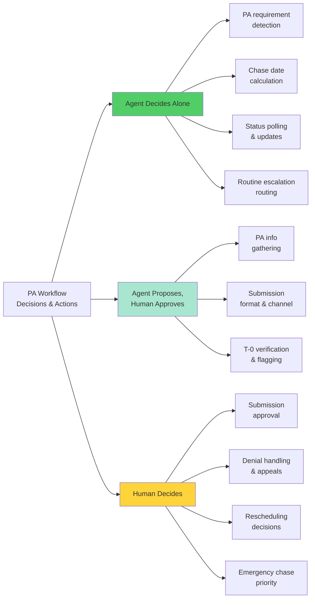

# Scenario 5 — Agent Purpose Document (APD) v1.0

## Prior Authorization & PA Status Tracking Agent

---

## Executive Summary

This APD specifies the **Prior Authorization (PA) & PA Status Tracking Agent** — the highest-priority agentic intervention for Westbridge Family Medicine's patient intake workflow.

**Agent Name**: Meridian PA Orchestrator

**Core Job to be Done**: Systematically detect when a scheduled service requires prior authorization, manage the submission-to-approval lifecycle with insurer-specific SLA rules, verify PA status before rooming, and escalate exceptions to Dana or clinical staff with sufficient lead time to prevent appointment cancellations.

**Business Context**: Ambulatory family medicine practice; ~25 scheduled procedures/imaging/referrals per day across two locations.

**Estimated Value**: $295K–460K/year in revenue capture + cost reduction (from preventing PA misses that currently cancel 2–5 appointments/month).

**Deployment Timeline**: Pilot Week 6–7 (Location 1); Full deployment Week 8 (Location 2).

---

## Part 1: Job to Be Done (Cognitive Contract)

### Statement

> **The Meridian PA Orchestrator systematically:**
>
> 1. **Detects** when a scheduled service requires PA (based on insurer rules + service type)
> 2. **Gathers** all required information for PA submission (diagnosis, procedure code, clinical justification)
> 3. **Submits** PA requests to insurers via appropriate channels (Availity, fax, email, phone relay) after human review
> 4. **Tracks** all submitted PAs with insurer-specific SLA rules (Aetna 5d, UHC Choice 6d, Wellpath 7d)
> 5. **Chases** pending PAs on schedule per SLA, with automatic escalation for urgent cases
> 6. **Verifies** PA status systematically at T-0 (appointment morning) before patient is roomed
> 7. **Escalates** exceptions (denied, missing, or imminent-appointment pending) to Dana or clinical staff with context and recommended action

### Cognitive Elements

**What the agent DECIDES:**
- PA is required? (YES / NO / CONDITIONAL with factors)
- Expected approval date (based on insurer SLA)
- Chase date (expected date - 1 day)
- PA status classification (APPROVED / PENDING / DENIED / MISSING)
- Escalation urgency (routine / urgent / emergency)

**What the agent EXECUTES:**
- Information gathering from athenahealth
- Availity queries for PA requirement rules
- Chase queries to insurers (via Availity or relay)
- Status updates to athenahealth and tracking system
- Alert generation and routing to Dana or clinical staff

**What humans DECIDE:**
- Whether PA requirement is uncertain (agent proposes, human confirms)
- Whether submission information is complete and correct (before sending)
- Whether pending PA should be escalated (emergency chase) or rescheduled (capacity decision)
- Whether to appeal a denial or accept non-coverage

**What humans EXECUTE:**
- Communicate with patient if appointment needs to be rescheduled
- Initiate emergency chase (phone call to insurer) if needed
- Make medical necessity arguments for appeals
- Coordinate with physician if clinical judgment is needed

---

## Part 2: Business Context

### Practice Snapshot

- **Location**: US mid-Atlantic suburb (two locations, 12 miles apart)
- **Staffing**: 6 physicians, ~180 patients/day, 2–4 front-desk staff
- **Practice Manager**: Dana Velazquez, RN background, 11 years tenure
- **Current PA tracking**: Completely manual (Dana's Google Sheet)
- **Current miss rate**: 0.75–1.0% of PAs (2–5 cancelled appointments/month)

### Process Context

**Scheduled services requiring PA**: ~25 per day (out of 180 total visits)
- Advanced imaging (MRI, CT) — typically PA required
- Specialty referrals — HMO plans require PA
- Procedures (imaging-guided, orthopedic, etc.) — varies by plan
- Diagnostic workups — varies by insurer + complexity

**Key Stakeholders**:
- **Dana Velazquez** (Practice Manager): Makes final decisions on escalations; owns PA policy interpretation
- **Physicians** (6 total): Order services; provide clinical justification; make medical necessity decisions on appeals
- **Front-desk staff** (2–4): Execute patient communication; confirm appointment details
- **Patients**: Told of scheduling status; may need to reschedule if PA fails

### Constraint Environment

**Hard Constraints** (Non-Negotiable):
1. **HIPAA Compliance**: All patient data handling must be HIPAA-compliant; audit trail required
2. **No clinical judgment by agent**: Agent cannot interpret symptoms or decide medical appropriateness
3. **Dana retains final authority**: Any escalation that affects patient care or revenue must be Dana's call
4. **Insurer relationships**: Must not submit duplicate PAs or violate insurer submission rules
5. **Patient safety**: Cannot delay urgent procedures; escalation must happen with sufficient lead time

**Soft Constraints** (Important but Negotiable):
1. Real-time PA status available: Availity API is available; some insurers don't have real-time API (fallback to phone/email)
2. Workday integration: athenahealth REST API is stable
3. Staff adoption: Dana and front desk must actively use and trust the agent output

---

## Part 3: Primary Objectives

### Objective 1: Prevent PA-Related Appointment Cancellations
**Success metric**: Reduce appointment cancellations due to missing/unapproved PA from 3–5/month to <1/month.

**How the agent helps**:
- Systematic T-0 verification: Before patient is roomed, confirm PA is approved
- Early escalation: If PA is pending or missing, alert Dana with 24+ hours lead time (not at appointment time)
- Urgent chase capability: If PA is imminent-pending, agent can flag for emergency handling

**Owner**: Dana (final decision on rescheduling)
**Measured by**: Monthly count of cancelled appointments due to PA

### Objective 2: Reduce Manual PA Tracking Work (Free Dana's Time)
**Success metric**: Reduce Dana's PA chase work from 8+ hrs/week to 2–3 hrs/week (5–6 hrs freed).

**How the agent helps**:
- Automatically calculate chase dates per insurer SLA (no manual spreadsheet updates)
- Auto-generate chase reminders (no manual calendar management)
- Systematic status polling (no ad-hoc phone calls unless escalation needed)
- Flag only exceptions for human attention (routine approvals bypass Dana)

**Owner**: Agent (systematic execution)
**Measured by**: Weekly time logs for Dana PA work

### Objective 3: Prevent Revenue Loss from PA Misses
**Success metric**: Capture $295K–460K in prevented-loss revenue (from reducing 0.75–1% miss rate to <0.1%).

**How the agent helps**:
- Higher chase success rate (100% vs. current ~90% due to manual tracking misses)
- Systematic follow-up (no cases fall through cracks)
- Reduced rework time (Dana spends time fixing catastrophic misses, not routine chases)

**Owner**: Agent + Dana (systematic + decisions)
**Measured by**: Annual count of missed PAs × average revenue per miss ($200–300)

### Objective 4: Ensure PA Submission Quality
**Success metric**: Reduce PA denials due to incomplete/incorrect information from current rate to <2%.

**How the agent helps**:
- Information gathering checklist (ensures all required fields are populated)
- Insurer-specific requirement validation (Wellpath needs prior visit docs, others don't)
- Human review gate (before submission, Dana or front desk confirms completeness)

**Owner**: Agent + Human (systematic gathering + gating)
**Measured by**: Monthly count of denials due to incomplete submission / total submissions

---

## Part 4: Key Performance Indicators (KPIs)

### Table 4.1: Primary KPIs (Acceptance Criteria)

| KPI | Baseline | Target | Tolerance | Measurement |
|---|---|---|---|---|
| **PA miss rate** | 0.75–1.0% | <0.1% | ±0.05% | Count of cancelled appts due to missing PA / total PAs |
| **Chase success rate** | ~90% (manual) | 100% | ±1% | Count of PAs successfully chased before appointment |
| **T-0 verification coverage** | 0% (ad-hoc) | 100% | 100% required | Count of scheduled PAs verified before rooming |
| **PA submission quality** | Current (baseline TBD) | <2% denial rate for incomplete info | <3% | Count of denials due to incomplete submission / total |
| **Time freed (Dana)** | 8+ hrs/week PA chase | 2–3 hrs/week | ±0.5 hrs | Weekly time logs |
| **Time freed (front desk)** | 3–4 hrs/week PA prep | 1–2 hrs/week | ±0.5 hrs | Weekly time logs (aggregate) |
| **Appointment cancellations (PA-related)** | 3–5/month | <1/month | ±0.2 | Monthly count |
| **Revenue impact** | Baseline: $27K–54K lost/month | <$3K lost/month | <5% | Annual lost revenue × actual miss count |
| **Agent uptime** | N/A (baseline) | >99% | >98% | System availability monitoring |
| **Integration reliability** | N/A (baseline) | 99%+ query success | >98% | Availity query success rate; fallback activation rate |

### Table 4.2: Secondary KPIs (Operational Excellence)

| KPI | Baseline | Target | Measurement |
|---|---|---|---|
| **Average PA cycle time** | 5–7 days (manual, variable) | 4–5 days (systematic) | Submission date → approval date |
| **Dana adoption rate** | N/A | 95%+ (Dana uses agent output in 95%+ of decisions) | System usage logs |
| **Front desk adoption rate** | N/A | 90%+ (front desk checks T-0 list 90%+ of appointments) | T-0 verification checklist completion |
| **Error discovery rate** | Ad-hoc | 100% of submission errors caught before send | Count of pre-submission errors flagged |
| **Stakeholder satisfaction** | N/A | >8/10 (Dana, physicians, front desk) | Post-pilot survey |

---

## Part 5: Failure Modes & Recovery Paths

### Table 5.1: Critical Failure Modes

| Failure Mode | Consequence | Severity | Recovery Path |
|---|---|---|---|
| **PA marked approved when actually denied** | Patient arrives for procedure; told appointment can't proceed; rescheduling chaos | 🔴 CRITICAL | Immediate escalation to Dana; patient contact within 4 hours; offer reschedule + apology |
| **PA chase missed; approval never received** | PA falls through; discovered at appointment time → Artefact 5.2 replay | 🔴 CRITICAL | Emergency escalation to Dana (day-before check); manual emergency chase by Dana; reschedule offer |
| **Wrong service code submitted to insurer** | Insurer denies due to mismatch; PA delayed or failed | 🟠 HIGH | Dana corrects code; resubmits within 2 hours; marks case as priority chase |
| **Patient data leak (HIPAA violation)** | Patient privacy breach; legal liability; regulatory fine | 🔴 CRITICAL | Immediate incident report; HIPAA coordinator notified; affected patient notified per law |
| **Availity API down; agent can't query status** | Chase function blocked; PAs age without escalation | 🟠 HIGH | Fallback: manual polling via Availity web portal or phone; escalation to Dana if >3 hours downtime |
| **Insurer-specific rule wrong** (e.g., Wellpath rule changes) | Submissions fail; denials increase | 🟠 HIGH | Rapid detection via denial rate spike; Dana updates rule in agent; resubmit affected cases |
| **T-0 verification fails to flag missing PA** | PA status not checked before rooming; appointment proceeds then blocked | 🔴 CRITICAL | Blame + learn: why did T-0 check fail? (System error? Human error?) → immediate correction + review |
| **Dual submission** (agent submits same PA twice) | Insurer confusion; potential duplicate billing | 🟠 HIGH | Agent prevents via idempotency check (one submission per PA ID); if it happens, Dana calls insurer to void duplicate |

### Recovery Patterns

**🔴 CRITICAL failures**:
- Trigger immediate escalation to Dana + physician (if clinical)
- Patient contact within 4 hours
- Root-cause review within 24 hours
- Corrective action documented + shared with team

**🟠 HIGH failures**:
- Trigger escalation to Dana within 2 hours
- Manual corrective action by Dana or front desk
- Rule/config update documented
- Affected cases re-queued

**🟡 MEDIUM failures**:
- Flag in daily review
- Agent corrects autonomously or with Dana input
- Documented for trend analysis

---

## Part 6: Delegation Archetype

**Assigned Archetype**: **AGENT_LED_OVERSIGHT** (with T-0 verification mandatory gate)

### Rationale

Agent leads the PA workflow because:
- **High structurability** (insurer SLAs and rules can be codified)
- **High volume** (25/day; systematic execution saves significant time)
- **High reversibility** (if agent makes a mistake, chase can be re-done, PAs can be resubmitted)
- **Clear escalation rules** (exceptions are specific and systematic)

Human retains oversight because:
- **Submission gate**: Human must approve before submission (ensure completeness + correctness)
- **T-0 gate**: Human must verify PA status before rooming (prevent Artefact 5.2)
- **Denial decisions**: Human (Dana or physician) decides whether to resubmit, appeal, or reschedule
- **Exception handling**: Any deviation from routine triggers Dana review

### Authority & Autonomy

---

## Part 7: Escalation Triggers & Routing

### Table 7.1: Escalation Decision Rules

| Condition | Agent Action | Route to | Urgency | Context |
|---|---|---|---|---|
| **PA requirement uncertain** (agent confidence <80%) | Flag with reasoning + recommend YES/NO/CONDITIONAL | Dana | Routine | Before submission |
| **PA information incomplete** (missing ICD-10, prior docs, etc.) | Alert with checklist of what's needed | Dana or Physician | Routine | Before submission |
| **PA submission fails** (insurer rejects as malformed) | Flag with error message | Dana | Routine | Immediate |
| **PA status still PENDING at T-2** (2 days before appointment) | Alert Dana with SLA assessment (is this normal?) | Dana | Routine | 2 days before |
| **PA status still PENDING at T-1** (1 day before appointment) | Flag as urgent; offer emergency chase option | Dana | URGENT | 1 day before |
| **PA status DENIED** | Flag with denial reason + ask: resubmit or reschedule? | Dana + Physician | Urgent | Immediate |
| **PA status MISSING at T-0** (appointment day) | CRITICAL ALERT; recommend immediate patient contact | Dana + Front Desk | EMERGENCY | Morning of appointment |
| **PA status PENDING at T-0** (appointment day, should be approved) | CRITICAL ALERT; Dana decides: emergency chase or reschedule | Dana | EMERGENCY | Morning of appointment |
| **T-0 verification can't be completed** (Availity down, agent can't query) | Fall back to manual polling; escalate if can't resolve in 1 hour | Dana | HIGH | Morning of appointment |
| **Insurer SLA rule changed** (detected via spike in denials) | Alert + request rule update | Dana | Routine | Ongoing monitoring |

### Escalation Routing Details

| Recipient | Trigger Conditions | Action Expected | Response SLA |
|---|---|---|---|
| **Dana** (Practice Manager) | Any escalation not marked EMERGENCY | Review; approve/modify/defer decision | 2 hours (routine), 30 min (urgent) |
| **Physician** (on-call) | CRITICAL ALERT at T-0; medical necessity question on denial | Decide rescheduling; frame appeal argument | 30 min (EMERGENCY) |
| **Front Desk** (on-shift) | CRITICAL ALERT at T-0; patient contact needed | Call patient; offer reschedule; explain | Immediate (within appointment window) |
| **Clinical Staff** (RN/NP) | Denial with medical necessity question | Consult on clinical appropriateness | 1 hour |

---

## Part 8: Autonomy Matrix

### Detailed Authority Grid

```mermaid
graph TD
    A["PA Orchestrator<br/>Autonomy Matrix"] --> B["PA Requirement Detection"]
    A --> C["PA Submission"]
    A --> D["PA Status Tracking"]
    A --> E["PA Status Verification<br/>at T-0"]
    A --> F["Exception Handling"]
    
    B --> B1["Standard case<br/>Rule match = YES"]
    B --> B2["Standard case<br/>Rule match = NO"]
    B --> B3["Uncertain case<br/>Confidence <80%"]
    B1 --> B1_ACTION["Agent: Flag as<br/>Requires PA<br/>Route to submission"]
    B2 --> B2_ACTION["Agent: Flag as<br/>No PA needed<br/>Proceed to scheduling"]
    B3 --> B3_ACTION["Agent: Propose<br/>YES/NO/CONDITIONAL<br/>Escalate to Dana"]
    
    C --> C1["Info gathering<br/>complete & valid"]
    C --> C2["Info gathering<br/>incomplete"]
    C1 --> C1_ACTION["Agent: Stage for<br/>submission<br/>Human: Review &<br/>Approve or Modify<br/>Agent: Send"]
    C2 --> C2_ACTION["Agent: Flag<br/>missing items<br/>Route to Dana<br/>for collection"]
    
    D --> D1["Status = APPROVED"]
    D --> D2["Status = PENDING<br/>On schedule"]
    D --> D3["Status = PENDING<br/>Overdue"]
    D --> D4["Status = DENIED"]
    D1 --> D1_ACTION["Agent: Update<br/>athenahealth<br/>Document approval<br/>code"]
    D2 --> D2_ACTION["Agent: Reschedule<br/>next chase<br/>Set reminder"]
    D3 --> D3_ACTION["Agent: Flag<br/>urgent<br/>Escalate to Dana<br/>for emergency<br/>chase decision"]
    D4 --> D4_ACTION["Agent: Retrieve<br/>denial reason<br/>Escalate to Dana<br/>+ Physician"]
    
    E --> E1["T-0 Verification<br/>PA = APPROVED"]
    E --> E2["T-0 Verification<br/>PA = PENDING"]
    E --> E3["T-0 Verification<br/>PA = MISSING"]
    E --> E4["T-0 Verification<br/>Query fails<br/>Availity down"]
    E1 --> E1_ACTION["Agent: Mark<br/>verification<br/>complete<br/>Proceed to<br/>rooming"]
    E2 --> E2_ACTION["Agent: CRITICAL<br/>ALERT to Dana<br/>Recommend:<br/>Emergency chase<br/>OR reschedule"]
    E3 --> E3_ACTION["Agent: CRITICAL<br/>ALERT to Dana<br/>+ Front Desk<br/>Recommend:<br/>Patient contact<br/>Offer reschedule"]
    E4 --> E4_ACTION["Agent: Flag<br/>Availity down<br/>Fallback: Manual<br/>polling<br/>Escalate to Dana<br/>if unresolved<br/>>1hr"]
    
    F --> F1["Denial:"]
    F --> F2["SLA violation:"]
    F --> F3["System error:"]
    F1 --> F1_ACTION["Agent: Route to<br/>Dana + Physician<br/>Defer decision<br/>on resubmit"]
    F2 --> F2_ACTION["Agent: Alert<br/>Dana<br/>Investigate<br/>(rule wrong?<br/>backlog?)"]
    F3 --> F3_ACTION["Agent: Alert to<br/>system log<br/>Escalate to<br/>Dev team"]
    
    style B1_ACTION fill:#51cf66
    style B2_ACTION fill:#51cf66
    style B3_ACTION fill:#a8e6cf
    style C1_ACTION fill:#a8e6cf
    style C2_ACTION fill:#ffd43b
    style D1_ACTION fill:#51cf66
    style D2_ACTION fill:#51cf66
    style D3_ACTION fill:#ffd43b
    style D4_ACTION fill:#ffd43b
    style E1_ACTION fill:#51cf66
    style E2_ACTION fill:#ff6b6b
    style E3_ACTION fill:#ff6b6b
    style E4_ACTION fill:#ffd43b
    style F1_ACTION fill:#ffd43b
    style F2_ACTION fill:#ffd43b
    style F3_ACTION fill:#ffd43b
```

---

## Part 9: Scope Boundaries

### What the Agent CAN Do

✅ **Detect PA requirements** using rule engine (service type + insurer plan combination)
✅ **Gather information** from athenahealth (diagnosis code, procedure code, appointment date)
✅ **Stage PA submission** with completeness checklist (all required fields present?)
✅ **Submit PA** after human approval via appropriate channel (Availity, email, fax, phone relay)
✅ **Query PA status** from Availity or insurer portal on scheduled chase dates
✅ **Update tracking system** (athenahealth + spreadsheet successor) with status
✅ **Generate alerts** to Dana, physicians, and front desk with specific conditions and recommended actions
✅ **Calculate chase dates** per insurer-specific SLAs (Aetna 5d, UHC Choice 6d, Wellpath 7d)
✅ **Flag unusual patterns** (repeated denials, rule changes, backlog buildup)
✅ **Verify PA status** at T-0 (appointment morning) before rooming
✅ **Provide fallback** if Availity is down (manual polling, alert to Dana)

### What the Agent CANNOT Do

❌ **Interpret medical necessity** — cannot judge whether a procedure is clinically appropriate
❌ **Make clinical decisions** — cannot choose alternative diagnostic approaches
❌ **Approve PA submission** — human must review and approve before sending
❌ **Decide rescheduling** — only Dana can decide whether to reschedule an appointment
❌ **Appeal a denial** — only physician (with clinical expertise) can frame medical necessity appeal
❌ **Modify PA requirements** — cannot override insurer rules (can suggest changes to Dana, but cannot implement)
❌ **Contact patients** — only front desk or Dana can communicate with patients
❌ **Access protected health info (PHI) outside compliance framework** — all data access logged for audit
❌ **Commit to insurer timelines** — cannot guarantee SLA without human coordination
❌ **Make cost-benefit trade-offs** (e.g., "reschedule to save rush fee") — Dana decides based on business priorities

---

## Part 10: System Dependencies & Data Requirements

### Table 10.1: Required Integrations

| System | Data Needed | Access Type | API Status | Gap/Risk |
|---|---|---|---|---|
| **athenahealth** | Patient ID, appointment date, service code (CPT), diagnosis code (ICD-10), provider ID | Read + Write | REST API available | Latency: ensure <2 sec query |
| **Availity** | PA requirement rules lookup, PA status polling | Read | REST API available; fallback to web portal | Rate limits: confirm <100 queries/hour acceptable |
| **Insurer portals** (Aetna, UHC, Wellpath, etc.) | Direct PA submission (optional; fallback to email/fax) | Write (optional) | Varies (some have no API) | Fallback: email/fax submission + manual tracking |
| **Email** | PA submission, denial reasons, insurer communication | Send/Receive | SMTP available | Consider email parsing for denial reason extraction |
| **Spreadsheet/tracking system** (successor to Dana's Google Sheet) | PA submission log, chase schedule, status history | Read/Write | TBD; agent-integrated system recommended | Current: Google Sheets (no formal API); consider Airtable or native integration |
| **Phone relay** (for verbal status checks) | Optional; only if Availity unavailable | N/A | Manual (Dana calls; relays to agent) | Fallback only; not primary |

### Data Security & Compliance

- **HIPAA**: All patient data access logged; encryption in transit + at rest
- **Audit trail**: Every PA submission, status update, escalation logged with timestamp and user
- **Access control**: Agent runs under service account with role-based access (no unnecessary PHI exposure)
- **Data retention**: PA records retained per clinical/legal requirements (typically 7 years)
- **Backup**: Redundancy for Availity integration (fallback to manual + email)

---

## Part 11: Success Scenarios & Design Validation

### Scenario A: Standard PA Path (Routine Success)

**Trigger**: Physician orders MRI for orthopedic patient on Aetna PPO.

**Agent Actions**:
1. Detect: Aetna PPO + MRI = PA required
2. Gather: ICD-10 (knee pain), procedure code (MRI knee), appointment date T+7
3. Stage: Checklist complete; ready for submission
4. Escalate to Dana: "MRI PA ready to submit; all info present"
5. Dana: Reviews checklist; approves
6. Agent: Submits via Availity
7. Calculate: Chase date = T+5 (SLA: 5 days; chase day before)
8. Agent: On T+5, queries Availity → status = APPROVED
9. Update: Document approval code in athenahealth
10. T-0 (day of appointment): Agent verifies PA = APPROVED → document in T-0 checklist
11. Front desk: Reads T-0 checklist; confirms PA ready; patient roomed

**Outcome**: ✅ Appointment proceeds; PA confirmed; no escalation; no cancellation

---

### Scenario B: Urgent PA Path (Emergency Chase)

**Trigger**: Physician orders stat MRI; appointment scheduled T+2 (short notice).

**Agent Actions**:
1. Detect: MRI = PA required; urgent timeline
2. Gather: All info available
3. Submit: Same-day submission
4. Calculate: SLA 5d, but appointment T+2 → high risk
5. Alert to Dana: "This PA urgent; appointment T+2 (sooner than typical SLA); recommend expedited request"
6. Dana: Calls Availity/insurer for expedited status; flags as priority
7. Agent: On T+1, queries status
8. If PENDING: Agent alerts Dana; Dana decides: push harder or reschedule
9. If APPROVED: Agent documents; T-0 verified
10. If DENIED: Agent alerts Dana + physician; Dana/physician decide resubmit or reschedule

**Outcome**: ✅ Either appointment proceeds (PA expedited) or reschedule happens with >24h notice

---

### Scenario C: Denial Path (Exception Handling)

**Trigger**: PA submission denied; insurer reason: "missing prior imaging results".

**Agent Actions**:
1. Chase query returns: DENIED "missing prior imaging"
2. Agent: Flag as recoverable (this is Wellpath pattern; resubmit with docs)
3. Escalate to Dana: "PA denied — missing prior imaging. Recommend: resubmit with prior imaging report."
4. Dana: Retrieves prior imaging from patient file
5. Agent: Resubmits with prior imaging attached
6. Chase: New chase date based on new submission
7. Approve: Insurer approves on new chase date
8. T-0: PA verified as approved

**Outcome**: ✅ Appointment proceeds (after resubmit); delay managed

---

### Scenario D: Artefact 5.2 Prevention (T-0 Gate)

**Trigger**: PA chase was missed (didn't happen on scheduled date); now T-0 morning of appointment.

**Agent Actions**:
1. T-0 verification: Query athenahealth + Availity for appointment's PA
2. Find: PA status = UNKNOWN (never chased)
3. Alert: CRITICAL — "PA not found in system; appointment at 9 AM"
4. Route to Dana + Front Desk
5. Dana decision: "Call insurer now for emergency status; if still pending or denied, contact patient to reschedule"
6. Front desk: Reaches insurer → PA approved yesterday (it did go through; just not logged)
7. Update: Document approval; proceed with appointment

**Outcome**: ✅ Artefact 5.2 prevented; appointment saved by early detection

---

### Scenario E: Unrecoverable Denial (Non-Reversible)

**Trigger**: PA denied; reason: "service not covered under this plan".

**Agent Actions**:
1. Chase query returns: DENIED "service not covered"
2. Agent: Flag as non-recoverable (not a resubmit case; coverage issue)
3. Escalate to Dana + Physician: "PA denied — service not covered. Options: (A) appeal if medically necessary, (B) patient self-pay, (C) reschedule"
4. Physician + Dana: Decide it's medically necessary; frame appeal
5. Agent: Re-routes as appeal (tracked separately)
6. Insurer: Considers appeal (unknown timeline)
7. T-0: If no appeal decision, reschedule happens with patient notice

**Outcome**: ✅ Exception handled; patient informed; no surprise cancellation

---

## Part 12: Implementation Roadmap

### Phase 1: Core PA Detection & Submission (Weeks 1–2)
- Build PA requirement rule engine (Aetna, UHC Choice, Wellpath, Medicare Advantage)
- Integrate athenahealth for patient/appointment data
- Implement PA info gathering checklist
- Connect to Availity for PA submission
- Human review gate before submission

**Deliverable**: PA submissions flow through agent; human approves before sending

---

### Phase 2: PA Tracking & Chase (Weeks 3–4)
- Encode insurer SLAs (Aetna 5d, UHC Choice 6d, Wellpath 7d)
- Auto-calculate chase dates
- Implement Availity status polling
- Route escalations to Dana

**Deliverable**: PA chases happen on schedule; Dana only reviews escalations

---

### Phase 3: T-0 Verification & Emergency Handling (Weeks 5–6)
- Implement systematic T-0 verification checklist
- Front desk integration: daily PA checklist delivery
- Emergency chase protocol (Dana can trigger)
- CRITICAL alert routing

**Deliverable**: No more Artefact 5.2 failures; appointments saved by early detection

---

### Phase 4: Analytics & Optimization (Weeks 7+)
- Denial tracking and pattern analysis
- Insurer SLA performance monitoring
- Agent accuracy dashboard (miss rate, chase coverage, time freed)
- Feedback loop for rule refinement

**Deliverable**: Continuous improvement; data-driven tuning of rules and thresholds

---

## Part 13: Stakeholder Engagement & Training

### Dana Velazquez (Practice Manager)
**Current Role**: Manual PA tracking, chase decision-making, insurer relationships
**Future Role**: Exception escalation decisions, policy interpretation, compliance review
**Training Need**: Understand what the agent does autonomously vs. what requires her decision
**Success Metric**: Dana uses agent output in 95%+ of decisions; reports 5–6 hrs/week time savings

### Physicians
**Current Role**: Order services; provide clinical justification on appeal
**Future Role**: Same (no change to clinical decision authority)
**Training Need**: None (agent doesn't change clinical workflow)
**Success Metric**: No increase in physician escalations due to agent errors

### Front Desk Staff
**Current Role**: Patient communication; AP paperwork; some PA prep
**Future Role**: T-0 PA verification; patient communication if reschedule needed
**Training Need**: How to read T-0 checklist; what to do if PA is missing/pending at appointment time
**Success Metric**: 90%+ completion of T-0 verification checklist

### Patients
**Current Role**: Provide appointment details; expect consistent care
**Future Role**: Same (if anything, fewer cancelled appointments)
**Training Need**: None (agent is behind-the-scenes)
**Success Metric**: Fewer surprise cancellations; improved satisfaction

---

## Part 14: Risk Management & Contingencies

### Table 14.1: Deployment Risks

| Risk | Probability | Impact | Mitigation |
|---|---|---|---|
| **Availity API unreliable** | Medium (5–10% downtime) | PA chasing blocked; escalation needed | Fallback: manual polling + email; alert to Dana |
| **Insurer rules change** | Low (quarterly updates) | Agent uses stale rules; denials spike | Quarterly rule audit; rapid update capability |
| **Dana adoption resistance** | Low (Dana requested ATX) | Slower trust; manual workarounds continue | Early wins; transparent time savings |
| **Front desk doesn't check T-0 list** | Medium (habit change) | T-0 verification skipped; Artefact 5.2 risk | Training + accountability; daily reminder email |
| **Integration complexity higher than estimated** | Medium (typical for EHR integrations) | Delays Phase 1; schedule slips | Parallel design; reduce scope if needed |
| **PHI data breach** | Low (security best practice) | Legal liability; regulatory fine | Comprehensive audit logging; encryption; compliance review |
| **Agent false-positive PA requirement** | Low (rule engine tested) | Unnecessary PAs submitted; wasted effort | Validation testing; Dana review gate catches errors |

---

## Part 15: Success Metrics Summary & Go/No-Go Criteria

### Table 15.1: Pilot Success Gate (Week 7 Evaluation)

| Metric | Go Threshold | Pilot Status | Data Source |
|---|---|---|---|
| **T-0 verification coverage** | ≥95% of scheduled PAs verified before rooming | [TBD post-pilot] | T-0 checklist logs |
| **PA miss rate** | <0.5% (midway to target; baseline 0.75–1%) | [TBD post-pilot] | Cancelled appointment count |
| **Chase success rate** | ≥98% | [TBD post-pilot] | Availity query success logs |
| **Dana adoption** | ≥90% of decisions use agent input | [TBD post-pilot] | Usage logs |
| **Front desk adoption** | ≥85% of T-0 checklists completed | [TBD post-pilot] | Completion logs |
| **System uptime** | >99% | [TBD post-pilot] | System monitoring |
| **User satisfaction** | ≥7/10 (Dana, front desk, physicians) | [TBD post-pilot] | Post-pilot survey |
| **No PHI breaches** | Zero | [TBD post-pilot] | Audit logs |

**Go Decision**: All 8 metrics at or above threshold → Full deployment (Location 2)
**No-Go Decision**: ≥2 metrics below threshold OR any PHI breach → Extended pilot or redesign

---

## Conclusion

The **Meridian PA Orchestrator** systematically transforms Prior Authorization management from manual, fragile (Dana's Google Sheet) to automated, systematic, and verifiable. By automating routine decisions (PA requirement, chase timing, status updates) while preserving human authority over critical decisions (submission approval, rescheduling, appeals), the agent prevents 2–5 appointment cancellations/month, frees 5–6 hrs/week of Dana's time, and captures $295K–460K in annual revenue.

**Deployment Ready**: Pilot Week 6–7; Full deployment Week 8.

