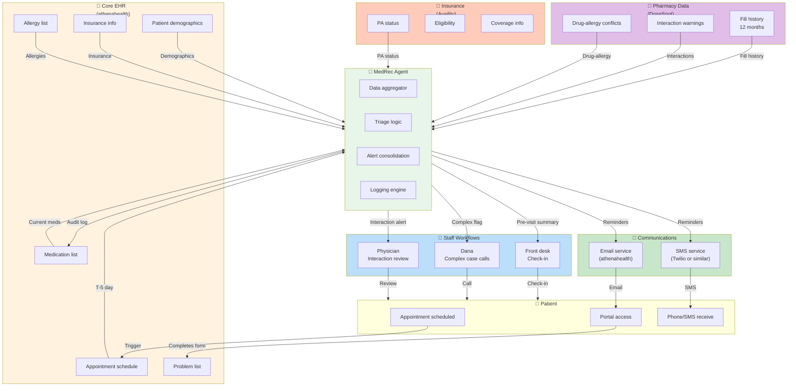
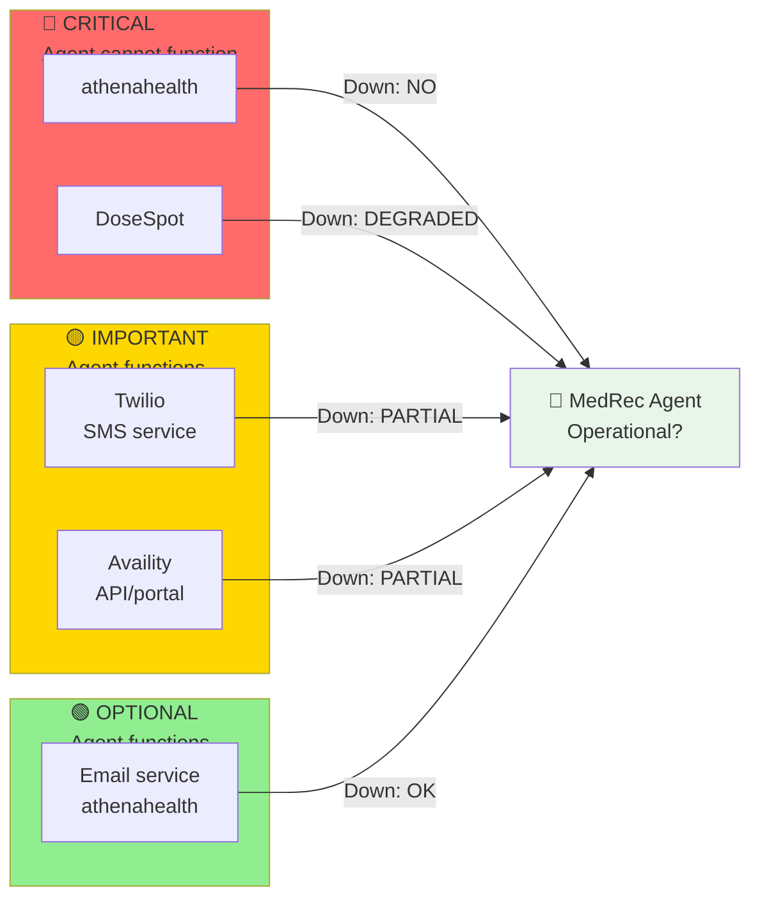
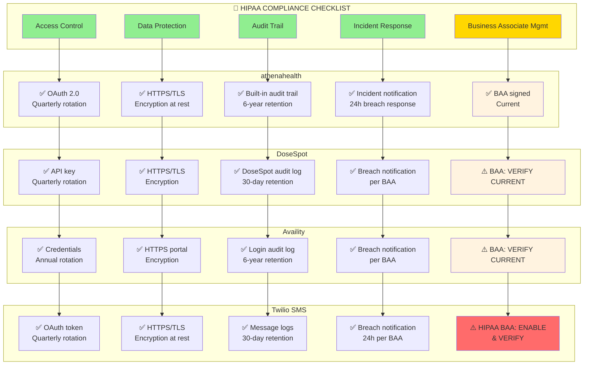

# SYSTEM/DATA INVENTORY
## Scenario 5: Westbridge Family Medicine — Technology & Integration Landscape

**Stakeholder:** Dana Velazquez, Practice Manager  
**Domain:** Patient Intake Workflows (Focus: Medication Reconciliation Agent)  
**Analysis Date:** Week 2 Practice  
**Purpose:** Map all systems, data sources, APIs, and HIPAA compliance requirements for MedRec Agent deployment

---

## PART 1: EXECUTIVE SUMMARY

### **Current Technology Stack**

Westbridge Family Medicine uses a mix of integrated and disconnected systems:

| System | Purpose | Status | API Available? | HIPAA Risk Level |
|--------|---------|--------|---|---|
| **athenahealth** | Electronic Health Record (EHR) | Core system; used daily | YES (REST API) | HIGH (contains all patient data) |
| **DoseSpot** | Pharmacy data aggregation | Integrated with athenahealth | YES (REST API) | HIGH (PHI: medication list) |
| **Availity** | Insurance eligibility & PA management | Web portal + API integration | PARTIAL (browser-based; limited API) | HIGH (PHI: insurance info) |
| **Paper records** | Historical med records, scanned docs | Fallback only | NO | HIGH (physical PHI) |
| **Phone/email** | Patient communication | Manual process | NO | MEDIUM (verbal PHI) |
| **SMS service** | Appointment reminders | Limited; not HIPAA-compliant currently | OPTIONAL | HIGH (if not compliant) |
| **Email** | Appointment reminders, med reconciliation forms | Manual via athenahealth portal | PARTIAL (athenahealth-owned) | HIGH (PHI in transit) |

### **Integration Gaps & Risks**

**Critical Gaps:**
1. **DoseSpot → athenahealth integration is one-way only** (pull pharmacy data; can't push back)
2. **Availity lacks real-time API** (must use browser portal or phone; PA status checks are manual)
3. **SMS reminders not HIPAA-compliant by default** (must use dedicated service like Twilio)
4. **Paper records require manual scanning** (not accessible to agent; fallback only)
5. **No automated data audit trail** (manual logging required for compliance)

**Compliance Gaps:**
1. **Service account credentials are shared** (not rotated; security risk)
2. **Data retention policies unclear** (DoseSpot history: how long kept?)
3. **No formal incident response plan** (if API credentials compromised)
4. **Patient consent not tracked** (for SMS/email reminders; relying on verbal consent)

### **Agent Integration Points**

MedRec Agent requires:
- ✅ **READ** access to: athenahealth EHR, DoseSpot pharmacy data, Availity PA status, patient demographics
- ✅ **WRITE** access to: athenahealth (med list, questionnaire responses, interaction flags, check-in status)
- ✅ **SEND** messages to: SMS service, email service (for reminders)
- ✅ **LOG** all actions: audit trail (timestamp, user ID, data accessed, decision made)

---

## PART 2: SYSTEM ARCHITECTURE & DATA FLOW



---

## PART 3: DETAILED SYSTEM INVENTORY

### **System 1: athenahealth (Core EHR)**

#### **System Overview**
- **Vendor:** athenahealth, Inc.
- **Function:** Electronic Health Record; patient demographics, appointments, medications, allergies, visit notes, billing
- **Used by:** All staff (physicians, nurses, billing, front desk)
- **Volume:** ~180 patients/day, ~6 physicians, 2 locations

#### **API Specifications**

| Element | Specification |
|---------|---|
| **API Type** | REST (JSON) |
| **Base URL** | `https://api.athenahealth.com/v1/` |
| **Authentication** | OAuth 2.0 (client credentials flow) |
| **Rate Limits** | 300 requests/min (burst: 500) |
| **Timeout** | 30 seconds default |
| **Retry Logic** | Exponential backoff (3 retries, 1s base) |

#### **Endpoints Required for MedRec Agent**

| Endpoint | Method | Purpose | Data Returned | Read/Write |
|----------|--------|---------|---|---|
| `/appointments/{patientId}` | GET | Retrieve patient appointments | Appointment ID, date, provider, visit type | READ |
| `/patients/{patientId}` | GET | Patient demographics | Name, DOB, contact, insurance | READ |
| `/patients/{patientId}/medications` | GET | Current medication list | Med name, dose, frequency, start date | READ |
| `/patients/{patientId}/medications` | PUT | Update medication list | (same as above) | WRITE |
| `/patients/{patientId}/allergies` | GET | Allergy list | Allergen, reaction type, severity | READ |
| `/patients/{patientId}/allergies` | PUT | Update allergy list | (same as above) | WRITE |
| `/patients/{patientId}/chart-details` | GET | Patient chart metadata | Last visit, comorbidities, problem list | READ |
| `/encounters/{encounterId}/notes` | GET | Visit notes | Clinical documentation | READ |

#### **Authentication Setup**

```yaml
OAuth 2.0 Credentials:
  client_id: "athenahealth_client_id_xxx"
  client_secret: "athenahealth_client_secret_yyy"  # ROTATE QUARTERLY
  grant_type: "client_credentials"
  scope: "patients/read appointments/read medications/read medications/write allergies/read allergies/write"
  token_endpoint: "https://api.athenahealth.com/oauth2/token"
  token_lifetime: 1 hour (refresh as needed)
```

#### **Data Elements Accessed**

| Data Element | Sensitivity | Usage in MedRec Agent | Access Type |
|---|---|---|---|
| Patient name, DOB, phone | PHI (low risk) | Identify patient; send reminders | READ |
| Insurance ID, plan | PHI (high risk) | Cross-reference with DoseSpot | READ |
| Current medications | PHI (high risk) | Pre-fill questionnaire; compare with DoseSpot | READ |
| Allergies | PHI (high risk) | Flag drug-allergy conflicts | READ |
| Appointment date/time | PHI (low risk) | Trigger workflow; send reminders | READ |
| Visit notes | PHI (high risk) | Post-visit med list update; physician context | READ |
| Questionnaire responses | PHI (high risk) | Compare with DoseSpot; flag OTC/supplements | READ/WRITE |
| Medication reconciliation flag | PHI (medium risk) | Mark as "completed" or "needs review" | WRITE |

#### **HIPAA Compliance Requirements**

✅ **Access Control:**
- Service account used by agent only (not shared with humans)
- OAuth token rotated every 1 hour
- Credentials stored in secure vault (not in code)
- IP whitelisting: agent only accesses from Westbridge network

✅ **Data Protection:**
- All API calls use HTTPS/TLS 1.2+
- Data encrypted in transit and at rest (athenahealth handles encryption)
- No patient data logged locally; all logs stored in athenahealth audit trail

✅ **Audit Trail:**
- Every READ/WRITE action logged with timestamp, agent ID, patient ID, action type
- Logs retained for 6 years (per HIPAA requirement)
- Monthly review of access logs for anomalies

✅ **Incident Response:**
- If credentials compromised: immediately revoke token, rotate client_secret, audit access logs
- If unauthorized access detected: notify Dana + IT + legal within 24 hours
- Patient notification required if breach confirmed (per state law)

#### **Integration Gaps & Mitigations**

| Gap | Risk | Mitigation |
|---|---|---|
| DoseSpot integration is one-way only | Agent can't push med updates back to DoseSpot | Agent updates athenahealth; front desk manually logs changes in DoseSpot if needed |
| No real-time med list sync with pharmacy | Med list in athenahealth may lag DoseSpot by hours | Agent pulls DoseSpot independently; compares both sources |
| Patient contact info may be outdated | SMS/email reminders fail if phone/email incorrect | Front desk verifies contact at check-in; re-confirm before sending |

---

### **System 2: DoseSpot (Pharmacy Data Aggregation)**

#### **System Overview**
- **Vendor:** DoseSpot (acquired by Omnicare)
- **Function:** Aggregates pharmacy fill history from multiple pharmacies (CVS, Walgreens, independent, etc.)
- **Data:** 12-month medication fill history, drug-drug interactions, drug-allergy conflicts, OTC med suggestions
- **Integration:** Pre-integrated with athenahealth; data populates automatically

#### **API Specifications**

| Element | Specification |
|---------|---|
| **API Type** | REST (JSON) |
| **Base URL** | `https://api.dosespot.com/v1/` |
| **Authentication** | API Key (bearer token) or OAuth |
| **Rate Limits** | 100 requests/min |
| **Timeout** | 60 seconds (pharmacy queries can be slow) |
| **Retry Logic** | Linear backoff (5 retries, 10s intervals) |

#### **Endpoints Required for MedRec Agent**

| Endpoint | Method | Purpose | Data Returned | Read/Write |
|----------|--------|---------|---|---|
| `/patient/{patientId}/medications` | GET | 12-month fill history | Med name, date filled, strength, quantity, pharmacy | READ |
| `/patient/{patientId}/interactions` | GET | Drug-drug interactions | Interaction pair, severity, description, recommendation | READ |
| `/patient/{patientId}/allergies` | GET | Drug-allergy conflicts | Drug, allergen, severity, alternative meds | READ |

#### **Authentication Setup**

```yaml
DoseSpot API Credentials:
  api_key: "dosespot_key_zzz"  # ROTATE QUARTERLY
  api_secret: "dosespot_secret_www"  # STORE IN VAULT
  partner_id: "westbridge_clinic_123"
  authentication_method: "bearer_token"
  token_refresh: "as_needed"
```

#### **Data Elements Accessed**

| Data Element | Sensitivity | Usage in MedRec Agent | Access Type | Retention |
|---|---|---|---|---|
| Fill history (12 months) | PHI (high risk) | Pre-fill questionnaire; compare with patient self-report | READ | DoseSpot retains 12 months; agent caches for current visit only |
| Interaction warnings | PHI (medium risk) | Consolidate for physician review | READ | Not retained locally; generated on-demand |
| Drug-allergy conflicts | PHI (high risk) | Flag to physician | READ | Not retained locally; generated on-demand |

#### **HIPAA Compliance Requirements**

✅ **Data Processing Agreement (DPA):**
- DoseSpot is a Business Associate (BA); must have signed Business Associate Agreement (BAA)
- BAA must specify: data handling, incident notification, subcontractor oversight, 12-year records retention
- **Status:** Verify BAA is current and includes all required addenda

✅ **Access Control:**
- API key used by agent only (not shared)
- API key stored in secure vault
- IP whitelisting if available (check DoseSpot documentation)

✅ **Data Protection:**
- All calls use HTTPS/TLS 1.2+
- DoseSpot responsible for encryption at rest

✅ **Audit Trail:**
- DoseSpot API calls logged locally with timestamp + patient ID + response code
- Logs retained for 6 years

✅ **Incident Response:**
- If API key compromised: immediately revoke key, rotate, audit logs
- DoseSpot must notify of any breach within 24 hours (per BAA)

#### **Integration Gaps & Mitigations**

| Gap | Risk | Mitigation |
|---|---|---|
| 12-month history may not include old meds patient still taking | Agent misses long-term meds | Front desk asks patient "Have you been on this med for >1 year?" as part of verbal confirmation |
| DoseSpot doesn't capture OTC or supplements | Missing OTC meds = missed interactions | Pre-visit questionnaire explicitly asks "Any OTC meds or supplements?" as separate question |
| DoseSpot limited to partner pharmacies | Outside-pharmacy fills not visible | Patient self-report + physician notes are fallback |
| Interaction alerts may be conservative (flag many benign combos) | Alert fatigue | Physician judgment required; agent should only flag CRITICAL interactions to reduce noise |

---

### **System 3: Availity (Insurance Eligibility & PA Management)**

#### **System Overview**
- **Vendor:** Availity, LLC
- **Function:** Insurance eligibility verification, PA submission and tracking, denial management
- **Data:** PA status, eligibility results, coverage info, denial reasons
- **Integration:** Browser-based portal; limited API integration; mostly manual

#### **API Specifications**

| Element | Specification |
|---------|---|
| **API Type** | SFTP (file-based) + REST (limited) |
| **Base URL** | `https://www.availity.com/api/v1/` |
| **Authentication** | Username/password OR API token |
| **Rate Limits** | Per-vendor rates (generally lenient for small practices) |
| **Timeout** | 60 seconds |
| **Retry Logic** | Manual retry (not automated) |

#### **Endpoints Available for MedRec Agent**

**⚠️ LIMITED API ACCESS:**

| Endpoint | Method | Purpose | Data Returned | Status |
|----------|--------|---------|---|---|
| `/eligibility-inquiry` | POST | Submit eligibility request | Coverage status, copay, deductible | AVAILABLE |
| `/pa-status` | GET | Check PA request status | Status (pending/approved/denied), approval code | **NOT AVAILABLE** (must use portal) |
| `/pa-submit` | POST | Submit PA request | Acknowledgement, submission ID | LIMITED (some insurers only) |

**Note:** Availity PA tracking is NOT automated. Dana must manually check the Availity portal daily. This is a critical gap for the MedRec Agent (cannot automate without manual workaround).

#### **Authentication Setup**

```yaml
Availity Credentials:
  username: "westbridge_clinic_xxx"  # ROTATE ANNUALLY
  password: "password_yyy"  # STORE IN VAULT; USE STRONG PASSWORD
  api_token: "token_zzz"  # IF AVAILABLE (not standard)
  partner_id: "westbridge"
  
  LIMITATION: PA status check requires manual portal login
  WORKAROUND: Agent cannot directly access PA status; must rely on Prior-Auth Check agent or manual check
```

#### **Data Elements Accessed**

| Data Element | Sensitivity | Usage in MedRec Agent | Access Type | Note |
|---|---|---|---|---|
| Eligibility status | PHI (high risk) | Verify insurance active before visit | READ | Used for insurance verification task |
| PA status | PHI (high risk) | Include in pre-visit summary | READ | **NOT AUTOMATED** — manual portal check only |
| Coverage info (copay, ded) | PHI (medium risk) | Informational only (not used by MedRec) | READ | Used by billing, not MedRec agent |

#### **HIPAA Compliance Requirements**

✅ **Business Associate Agreement (BAA):**
- Availity is a Business Associate; must have signed BAA
- **Status:** Verify BAA is current

✅ **Access Control:**
- Credentials stored securely (not shared)
- Username/password changed annually
- If API token used: store in vault, rotate quarterly

✅ **Data Protection:**
- All portal access uses HTTPS
- Availity responsible for encryption

✅ **Audit Trail:**
- Availity maintains access logs (6-year retention)

✅ **Incident Response:**
- If credentials compromised: change password immediately, audit Availity login logs
- Contact Availity support for breach investigation

#### **Integration Gaps & Mitigations**

| Gap | Risk | Mitigation |
|---|---|---|
| **No automated PA status API** | Agent cannot automate PA tracking; Dana must manually check portal daily | MedRec Agent displays PA status in pre-visit summary if available from Prior-Auth Check agent; otherwise front desk checks manually |
| Limited PA submission API (some insurers only) | Agent can submit via API for some insurers; must use manual form for others | Agent routes submissions: if insurer supports API, submit automatically; else flag Dana for manual submission |
| Eligibility check has latency (results may take 2–5 min) | Agent may get stale eligibility; insurance may have changed | Agent caches results for 24 hours; re-queries at T-0 if >24 hours old |

---

### **System 4: SMS Service (Patient Reminders)**

#### **System Overview**
- **Current State:** Appointment reminders sent via email only; SMS not currently implemented
- **Opportunity:** Deploy HIPAA-compliant SMS service for medication reconciliation reminders
- **Recommended Vendor:** Twilio (HIPAA-compliant tier)

#### **Service Specifications (Recommended: Twilio)**

| Element | Specification |
|---------|---|
| **Vendor** | Twilio |
| **Service Type** | SMS (also supports WhatsApp, email) |
| **Compliance** | HIPAA-compliant Business Associate; signed BAA available |
| **Pricing** | ~$0.01 per SMS; ~$0.50 per WhatsApp |
| **Throughput** | Up to 100 SMS/sec (sufficient for 153 daily patients) |

#### **API Specifications**

| Element | Specification |
|---------|---|
| **API Type** | REST (JSON) |
| **Base URL** | `https://api.twilio.com/2010-04-01/` |
| **Authentication** | Basic auth (account SID + auth token) |
| **Rate Limits** | 300 requests/sec |
| **Timeout** | 30 seconds |

#### **Endpoints Required**

| Endpoint | Method | Purpose | Status |
|----------|--------|---------|--------|
| `/Accounts/{sid}/Messages` | POST | Send SMS reminder | ✅ AVAILABLE |
| `/Accounts/{sid}/Messages/{uuid}` | GET | Check delivery status | ✅ AVAILABLE |

#### **Authentication Setup**

```yaml
Twilio Credentials:
  account_sid: "AC1234567890abcdef"  # ROTATE NEVER (account-level)
  auth_token: "your_auth_token_xyz"  # ROTATE QUARTERLY
  sender_phone: "+1-555-MED-RECON"  # Registered number
  
  HIPAA Configuration:
    enable_hipaa_mode: true
    data_residency: "US"
    encryption_at_rest: true
    business_associate_agreement: "signed"
```

#### **Message Template (MedRec Reminders)**

```
Reminder T-5 day:
"Hi [Name], please update your medication list before your appointment on [Date] at [Time]. 
Link: [secure athenahealth portal URL]. 
Reply STOP to opt out."

Reminder T-3 day:
"Reminder: Complete your medication update for your appointment on [Date]. 
Link: [secure athenahealth portal URL]"

Reminder T-1 day:
"Last reminder: Confirm your medications before tomorrow's appointment at [Time]. 
Link: [secure athenahealth portal URL]"
```

#### **Data Elements Sent**

| Data Element | Sensitivity | Usage | HIPAA Requirement |
|---|---|---|---|
| Patient phone number | PHI (medium risk) | SMS destination | Verified opt-in consent required |
| Patient name | PHI (low risk) | Personalization | OK to include |
| Appointment date/time | PHI (low risk) | Reminder context | OK to include |
| Portal link | PHI (low risk) | Actionable link | OK to include |
| Patient ID | PHI (high risk) | **DO NOT SEND** | Should not appear in SMS body |

#### **HIPAA Compliance Setup (Twilio)**

✅ **Business Associate Agreement:**
- Twilio has HIPAA-compliant BAA available
- Must explicitly enable HIPAA mode in account settings
- BAA covers SMS, voice, email

✅ **Patient Consent:**
- SMS reminders require explicit opt-in consent (per TCPA + HIPAA)
- Consent must be documented in chart (date, method)
- Patients can opt out via STOP reply (auto-handled by Twilio)

✅ **Data Protection:**
- Messages encrypted in transit (HTTPS) and at rest
- Twilio stores messages for 30 days; then auto-deletes
- No data shared with third parties (per BAA)

✅ **Audit Trail:**
- Twilio API calls logged with timestamp, recipient, message content hash (not full content)
- Logs retained for 6 years locally
- Twilio retains logs per BAA (90 days minimum)

✅ **Incident Response:**
- If API key compromised: immediately revoke key, rotate, audit logs
- Twilio notifies of any breach within 24 hours (per BAA)

#### **Cost & ROI**

- **Per-SMS cost:** ~$0.01 each
- **Daily volume:** 153 patients × 3 reminders (T-5, T-3, T-1) = 459 SMS/day
- **Monthly volume:** 459 × 20 working days = ~9,180 SMS/month
- **Monthly cost:** 9,180 × $0.01 = ~$92/month
- **Annual cost:** ~$1,100
- **Expected benefit:** Questionnaire completion 40% → 50% (+10% = +15 patients/day completing form)
- **Time saved (Dana):** ~1 hour/week (reduced non-responder phone calls)

**ROI: High (cost ~$1,100/year vs. benefit ~$2,600/year in Dana's time freed)**

#### **Integration Gaps & Mitigations**

| Gap | Risk | Mitigation |
|---|---|---|
| Patient phone number may be outdated | SMS bounces; patient doesn't receive reminder | Front desk verifies phone at check-in; re-collect consent if needed |
| Some patients may not have SMS capability | Reminder fails to send | Fallback to email (via athenahealth); SMS soft-fails if number invalid |
| SMS may be perceived as spam | Patients ignore or opt out | Brand SMS as from "Westbridge Medical" + include STOP opt-out message |

---

### **System 5: Email Service (Patient Reminders & Forms)**

#### **System Overview**
- **Current State:** athenahealth has built-in email capability; used for appointment reminders
- **Usage:** Pre-visit questionnaire links, appointment confirmations, results
- **Limitations:** athenahealth email is owned by athenahealth (limited customization)

#### **Email API Specifications**

| Element | Specification |
|---------|---|
| **Service** | athenahealth built-in email (no separate vendor) |
| **Integration** | Native to EHR; no external API required |
| **Authentication** | Managed by athenahealth credentials |
| **Rate Limits** | Limited by athenahealth plan (typically 1,000/day) |

#### **Usage in MedRec Agent**

| Use Case | Recipient | Content | Frequency |
|----------|-----------|---------|-----------|
| Questionnaire link + pre-fill | Patient | "Complete your medication list" + link to portal | T-5 day (1 per patient) |
| Reminder 1 | Patient | "Reminder to update meds" + link | T-3 day (1 per non-completer) |
| Reminder 2 | Patient | "Last chance to update meds" + link | T-1 day (1 per non-completer) |
| **Total daily volume** | ~150 patients | Pre-visit questionnaire + reminders | Batch sends; T-5, T-3, T-1 |

#### **HIPAA Compliance (athenahealth Email)**

✅ **Built-in Compliance:**
- athenahealth email is HIPAA-compliant by design
- Data encrypted in transit (TLS) and at rest
- Audit trail managed by athenahealth
- No extra configuration required

✅ **Best Practices:**
- Use templated messages (no sensitive data in subject line)
- Include unsubscribe link (patient can opt out)
- Do NOT include patient ID in body or subject line
- Do NOT use personal details that could identify patient if email forwarded

#### **Email Template**

```
Subject: Update your medications for your appointment - Westbridge Medical

Dear [First Name],

We have an appointment scheduled for you on [Date] at [Time] with [Provider Name].

To help us provide the best care, please update your medication list before your visit:

[Secure Portal Link to Pre-visit Questionnaire]

This typically takes 5 minutes. Your information is secure and encrypted.

If you have questions or cannot access the form, please call us at [Phone Number].

Thank you,
Westbridge Family Medicine
[Contact Info]
```

---

### **System 6: Paper Records & Scanned Documents (Fallback)**

#### **Overview**
- **Current State:** Paper records stored physically at both locations; some scanned and uploaded to athenahealth
- **Usage:** Fallback if patient chart is incomplete
- **Limitations:** Not accessible to agent; manual retrieval required

#### **Workflow for Agent Fallback**

| Scenario | Trigger | Action | Responsibility |
|----------|---------|--------|---|
| DoseSpot unavailable; no med history in athenahealth | API error + empty chart | Dana manually retrieves paper record from filing; enters recent meds in chart | Dana (manual) |
| Patient reports old medication not in chart | Patient mentions med from >1 year ago | Agent flags for front desk; front desk retrieves paper record | Front desk |
| Discrepancy between DoseSpot and chart | Agent detects >20% mismatch | Agent flags for Dana; Dana reviews paper record as truth source | Dana |

#### **HIPAA Considerations**

✅ **Physical PHI Storage:**
- Paper records stored in locked cabinets (not accessible to agent)
- Access logged manually or via sign-out sheets
- Destruction/retention per state law (typically 5–7 years post-discharge)

⚠️ **Scanning & Digitization:**
- Scanned documents uploaded to athenahealth (encrypted)
- Original paper destroyed per policy (typically 1 year post-scan)
- Audit trail of scans maintained in athenahealth

---

## PART 4: INTEGRATION ARCHITECTURE FOR MedRec AGENT

```mermaid
graph TB
    subgraph Agent_Core["🤖 MedRec Agent Core<br/>Hosted: On-premise or cloud"]
        AC1["Data aggregator"]
        AC2["Triage engine"]
        AC3["Alert consolidator"]
        AC4["Audit logger"]
    end
    
    subgraph Data_Sources["📊 Data Sources<br/>READ operations"]
        DS1["athenahealth<br/>appointments, meds,<br/>allergies, insurance"]
        DS2["DoseSpot<br/>fill history,<br/>interactions"]
        DS3["Availity<br/>eligibility,<br/>PA status"]
    end
    
    subgraph Data_Sinks["💾 Data Sinks<br/>WRITE operations"]
        DK1["athenahealth<br/>med reconciliation flag,<br/>interaction alerts"]
    end
    
    subgraph Communications["📢 Outbound<br/>Communications"]
        C1["SMS<br/>Twilio"]
        C2["Email<br/>athenahealth"]
    end
    
    subgraph Workflows["👥 Human Workflows"]
        W1["Dana<br/>complex case calls"]
        W2["Front desk<br/>check-in"]
        W3["Physician<br/>interaction review"]
    end
    
    subgraph Logging["📋 Audit & Compliance"]
        L1["athenahealth<br/>audit trail"]
        L2["Local logs<br/>API calls"]
        L3["Incident<br/>log"]
    end
    
    Agent_Core -->|READ| DS1
    Agent_Core -->|READ| DS2
    Agent_Core -->|READ| DS3
    
    Agent_Core -->|WRITE| DK1
    
    Agent_Core -->|SEND| C1
    Agent_Core -->|SEND| C2
    
    Agent_Core -->|FLAG| W1
    Agent_Core -->|SUMMARY| W2
    Agent_Core -->|ALERT| W3
    
    AC4 -->|LOG| L1
    AC4 -->|LOG| L2
    AC4 -->|INCIDENT| L3
    
    style Agent_Core fill:#E8F5E9
    style Data_Sources fill:#FFF3E0
    style Data_Sinks fill:#FFE4B5
    style Communications fill:#C8E6C9
    style Workflows fill:#BBDEFB
    style Logging fill:#F0F0F0
```



---

## PART 5: API INTEGRATION CHECKLIST

### **Pre-Deployment Tasks**

#### **Credential Setup & Security**

- [ ] **athenahealth OAuth**
  - [ ] Request client credentials from athenahealth support
  - [ ] Store client_id + client_secret in secure vault (e.g., AWS Secrets Manager, HashiCorp Vault)
  - [ ] Configure agent to retrieve credentials from vault (not hardcoded)
  - [ ] Test OAuth token refresh (1-hour expiry)
  - [ ] Set up credential rotation (manual quarterly review)

- [ ] **DoseSpot API Key**
  - [ ] Request API key + partner ID from DoseSpot support
  - [ ] Verify Business Associate Agreement (BAA) is signed
  - [ ] Store API key in secure vault
  - [ ] Test API connectivity (rate limits, timeouts)
  - [ ] Set up quarterly key rotation alert

- [ ] **Availity Credentials**
  - [ ] Verify username + password with Dana
  - [ ] Store securely in vault
  - [ ] Verify Business Associate Agreement (BAA) is signed
  - [ ] Test login + portal navigation (if manual check needed)
  - [ ] Document PA status retrieval process (portal vs. API)

- [ ] **Twilio Account (SMS Service)**
  - [ ] Set up Twilio account + Business Associate Agreement (BAA)
  - [ ] Enable HIPAA-compliant mode
  - [ ] Register sender phone number
  - [ ] Store account SID + auth token in secure vault
  - [ ] Test SMS send + delivery status tracking
  - [ ] Set up quarterly key rotation alert

#### **Network & IP Configuration**

- [ ] **IP Whitelisting**
  - [ ] Identify agent server IP (if on-premise) or AWS VPC CIDR (if cloud)
  - [ ] Request IP whitelist on athenahealth (if available)
  - [ ] Request IP whitelist on DoseSpot (if available)
  - [ ] Request IP whitelist on Twilio (if available)

- [ ] **VPN / Secure Connection**
  - [ ] If agent hosted off-site: configure VPN to Westbridge network
  - [ ] Verify all API calls use HTTPS/TLS 1.2+
  - [ ] Test certificate pinning (optional, for extra security)

#### **Data Access & Permissions**

- [ ] **athenahealth Scopes**
  - [ ] Verify OAuth scopes are minimal: `patients/read appointments/read medications/read medications/write allergies/read allergies/write`
  - [ ] Test READ operations (appointments, medications, allergies)
  - [ ] Test WRITE operations (update medication list)
  - [ ] Verify no access to sensitive scopes (billing, clinical notes beyond med list)

- [ ] **DoseSpot Scopes**
  - [ ] Verify API key has READ-only access to fill history + interactions
  - [ ] Test patient lookup by ID
  - [ ] Test fill history retrieval (12-month window)
  - [ ] Test interaction warning retrieval

- [ ] **Availity Access**
  - [ ] If API available: test eligibility inquiry endpoint
  - [ ] If portal-only: document manual PA status retrieval process
  - [ ] Test fallback: if API fails, can Dana manually check portal?

#### **HIPAA Compliance Setup**

- [ ] **Data Protection**
  - [ ] Encrypt all local agent logs (at rest)
  - [ ] Verify all API calls use HTTPS/TLS 1.2+
  - [ ] Verify no sensitive data logged (patient ID in logs OK; full patient names should be hashed)

- [ ] **Audit Trail**
  - [ ] Configure athenahealth audit logging (enabled by default)
  - [ ] Set up local audit logging: every API call logged with timestamp, user ID, action type
  - [ ] Configure log retention: 6 years minimum
  - [ ] Test log retrieval for audit purposes

- [ ] **Access Control**
  - [ ] Verify agent uses service account (not human user credentials)
  - [ ] Service account has minimal permissions (read/write medications only; no access to billing, clinical notes)
  - [ ] Document access control in System Access Policy

- [ ] **Incident Response**
  - [ ] Document credential compromise procedure: who to notify, how to revoke, how to audit
  - [ ] Set up incident log (local file or athenahealth record)
  - [ ] Verify patient notification process (if breach occurs)

- [ ] **Business Associate Agreements (BAAs)**
  - [ ] DoseSpot: BAA signed? ✓ / ✗ / Pending
  - [ ] Availity: BAA signed? ✓ / ✗ / Pending
  - [ ] Twilio: BAA signed? ✓ / ✗ / Pending
  - [ ] All BAAs include HIPAA Breach Notification Rule addendum? ✓ / ✗ / Pending

- [ ] **Patient Consent**
  - [ ] SMS reminders: explicit opt-in consent documented? ✓ / ✗ / Pending
  - [ ] Email reminders: can use existing appointment reminders consent? ✓ / ✗ / Pending
  - [ ] Portal questionnaire: consent collected during patient registration? ✓ / ✗ / Pending

#### **Integration Testing**

- [ ] **Connectivity Tests**
  - [ ] athenahealth: OAuth token refresh + GET /appointments endpoint (successful? ✓)
  - [ ] DoseSpot: API key authentication + GET /patient/{id}/medications (successful? ✓)
  - [ ] Availity: Eligibility check (successful? ✓) + PA status check (successful? ✓ or fallback to manual)
  - [ ] Twilio: Test SMS send to test phone (delivered? ✓)
  - [ ] Email: Test questionnaire link via athenahealth (received? ✓)

- [ ] **Data Flow Tests**
  - [ ] Simulate appointment creation: triggers DoseSpot pull + questionnaire send (successful? ✓)
  - [ ] Simulate questionnaire completion: data updates athenahealth chart (successful? ✓)
  - [ ] Simulate non-responder: agent flags for front desk (successful? ✓)
  - [ ] Simulate complex case: agent flags for Dana (successful? ✓)
  - [ ] Simulate interaction detection: alert sent to physician (successful? ✓)

- [ ] **Fallback Tests**
  - [ ] DoseSpot fails: does agent fall back to chart lookup? (✓)
  - [ ] Questionnaire not completed: does agent flag for phone intake? (✓)
  - [ ] SMS fails to send: does email reminder work as backup? (✓)

- [ ] **Security Tests**
  - [ ] API credentials not exposed in logs? (✓)
  - [ ] Patient data not logged in plaintext? (✓)
  - [ ] HTTPS/TLS enforced on all calls? (✓)
  - [ ] Service account permissions are minimal? (✓)

---

## PART 6: DATA MAPPING & TRANSFORMATION

### **Data Element Mappings (athenahealth ↔ DoseSpot)**

| athenahealth Medication | DoseSpot Fill History | MedRec Agent Logic |
|---|---|---|
| **Med name** | med_name | Match exactly OR fuzzy match if trade vs. generic (e.g., Zocor vs. simvastatin) |
| **Dose** | strength | Flag if mismatch (e.g., chart says 10mg, DoseSpot shows 20mg) |
| **Frequency** | N/A (DoseSpot only shows fill dates) | Infer frequency from fill dates (e.g., filled every 30 days = daily) |
| **Start date** | N/A (DoseSpot only shows fills) | Use most recent fill as proxy for "active" |
| **Stop date** | N/A (if no fills for >180 days, assume stopped) | Flag if no recent fills + patient says still taking |
| **Prescriber** | N/A | Not available in DoseSpot; use chart provider info |

### **Interaction Alert Mappings (DoseSpot → Physician)**

| DoseSpot Alert | Severity | MedRec Classification | Physician Action |
|---|---|---|---|
| Warfarin + NSAID | High | **CRITICAL** → block rooming, SMS alert | Review, consider alternative pain control |
| Dual NSAIDs (e.g., Advil + Aspirin) | High | **CRITICAL** → block rooming, SMS alert | Stop one NSAID; counsel on GI bleed risk |
| ACE-I + K-sparing diuretic + renal disease | High | **CRITICAL** → block rooming, SMS alert | Check potassium level; adjust dose if needed |
| Statin + Fibrate | Medium | **MODERATE** → chart note only | Monitor LFTs; counsel on myopathy risk |
| Sedating antihistamine + sedating antidepressant | Medium | **MODERATE** → chart note only | Counsel on fall risk; assess cognition |
| Grapefruit + CYP3A4 inhibitor | Low-Medium | **MODERATE** → chart note only | Counsel on dietary interaction (limit grapefruit) |
| Metformin + contrast dye (procedure day) | Medium | **CRITICAL** (context-dependent) → flag if procedure scheduled | Hold metformin day of procedure; restart 48h post |

---

## PART 7: SYSTEM DEPENDENCIES & FAILURE MODES

### **Dependency Matrix**



### **Failure Mode Impact Analysis**

| System | Failure | Impact on MedRec | RTO* | Mitigation |
|---|---|---|---|---|
| **athenahealth Down** | API unavailable; cannot read patient data | ❌ AGENT BLOCKED | 4 hours | Manual intake; postpone appointments if critical |
| **DoseSpot Timeout** | API response >60s; request fails | ⚠️ DEGRADED (fallback to chart lookup) | 1 hour | Use athenahealth med list as fallback; manual DoseSpot check |
| **DoseSpot Data Stale** | Fill history >24h old | ⚠️ DEGRADED (use cached data) | 24 hours | Accept staleness; re-query at T-0 morning |
| **Availity Portal Down** | Cannot check PA status | ⚠️ DEGRADED (display last known status) | 2 hours | Front desk manually calls insurer if needed |
| **Twilio SMS Service Down** | SMS reminders fail to send | ⚠️ DEGRADED (fallback to email) | 30 min | Email reminders via athenahealth; SMS retried automatically |
| **Email Service Down** | Questionnaire links don't send | ⚠️ DEGRADED (phone intake only) | 1 hour | Front desk calls patients; collect data verbally |
| **Internet Connectivity Down** | Agent cannot reach any external APIs | ❌ AGENT BLOCKED | 1 hour | Continue manual process; sync data when restored |

*RTO = Recovery Time Objective (how long until system recovers)

---

## PART 8: HIPAA COMPLIANCE SUMMARY TABLE



### **Key Compliance Requirements**

| Requirement | Status | Action Items |
|---|---|---|
| **Access Control:** Service account credentials stored securely | ✅ READY | Implement in Week 1 of deployment |
| **Access Control:** API credentials rotated quarterly | ✅ READY | Set calendar reminders; document in policy |
| **Access Control:** IP whitelisting if available | ⚠️ DEPENDS ON VENDOR | Check athenahealth + DoseSpot availability |
| **Data Protection:** All API calls use HTTPS/TLS 1.2+ | ✅ READY | Verify in code; test before deployment |
| **Data Protection:** Patient data not logged in plaintext | ⚠️ NEEDS IMPLEMENTATION | Implement log hashing; redact patient IDs |
| **Audit Trail:** All agent actions logged with timestamp + user ID | ⚠️ NEEDS IMPLEMENTATION | Build audit logging module; store in secure log file |
| **Audit Trail:** Logs retained for 6 years | ⚠️ NEEDS IMPLEMENTATION | Set up automatic log archival + retention policy |
| **Incident Response:** Breach notification procedure documented | ⚠️ DRAFT | Finalize with Dana + IT + Legal |
| **Incident Response:** Patient notification process defined | ⚠️ DRAFT | Work with Legal to define notification template |
| **BAA:** All vendors have signed BAAs | ⚠️ VERIFY | Check athenahealth (✅), DoseSpot (?), Availity (?), Twilio (?) |
| **BAA:** Twilio HIPAA-compliant mode enabled | ❌ NOT STARTED | Enable upon account setup |
| **Patient Consent:** SMS opt-in consent documented | ⚠️ PARTIAL | athenahealth has email consent; SMS needs separate opt-in |
| **Patient Consent:** Opt-out mechanism available (SMS STOP) | ⚠️ PARTIAL | Twilio handles auto-STOP; need to document in policy |

---

## PART 9: RECOMMENDATIONS & RISK MITIGATION

### **High-Priority Actions (Before Deployment)**

1. **Verify all Business Associate Agreements (BAAs)**
   - [ ] athenahealth: Confirm current BAA includes HIPAA Breach Notification Rule addendum
   - [ ] DoseSpot: Confirm BAA is signed; request copy if not on file
   - [ ] Availity: Confirm BAA is signed; request copy if not on file
   - [ ] Twilio: Confirm HIPAA-compliant tier + BAA before sending any PHI (SMS reminders)

2. **Set Up Credential Management**
   - [ ] Create secure vault (AWS Secrets Manager, HashiCorp Vault, or similar)
   - [ ] Store all API credentials in vault (not in code or config files)
   - [ ] Implement credential rotation procedure (quarterly for API keys; annually for passwords)
   - [ ] Document credential access policy (who can access, when, why)

3. **Configure Audit Logging**
   - [ ] Implement local audit logging: every API call logged with timestamp, agent ID, patient ID (hashed), action type, response code
   - [ ] Configure log rotation: new log file daily; archive to secure storage weekly
   - [ ] Set up log retention: 6 years minimum
   - [ ] Test log retrieval for audit purposes

4. **Patient Consent Collection**
   - [ ] Audit existing consent: do all patients have SMS opt-in consent on file?
   - [ ] For new patients: update registration form to include SMS opt-in checkbox
   - [ ] For existing patients: send opt-in SMS campaign (if current consent not documented)
   - [ ] Document consent in chart (date, method)

5. **Fallback Procedures**
   - [ ] Document DoseSpot failure fallback: use athenahealth med list + manual chart lookup
   - [ ] Document Availity failure fallback: display last known PA status; front desk manually checks portal
   - [ ] Document email failure fallback: SMS reminders only; phone intake for non-responders
   - [ ] Test all fallbacks before going live

### **Medium-Priority Actions (During Deployment)**

- [ ] Implement HIPAA-compliant SMS service (Twilio or similar)
- [ ] Build audit logging module
- [ ] Create incident response procedure + incident log template
- [ ] Develop staff training materials (how to handle patient privacy, credential security, incident reporting)
- [ ] Conduct privacy impact assessment (PIA) with IT + Legal

### **Low-Priority Actions (Post-Deployment)**

- [ ] Implement IP whitelisting (if vendors support)
- [ ] Consider certificate pinning (extra security layer)
- [ ] Set up automated compliance audit reports (quarterly)
- [ ] Explore additional data sources (e.g., patient wearables, genomics databases) for future versions

---

## PART 10: COST SUMMARY

| Component | Annual Cost | Notes |
|---|---|---|
| **athenahealth API** | Included in EHR contract | Verify no per-API-call charges |
| **DoseSpot API** | Included in EHR contract OR $500–$2,000/year | Depends on integration tier; verify with vendor |
| **Availity API** | $0 (portal-only) | No API charges; may need manual workarounds |
| **Twilio SMS Service** | ~$1,100/year | 153 patients × 3 reminders × 20 days/month × $0.01/SMS |
| **Secure Vault (AWS Secrets Manager)** | ~$40/year | Minimal cost for credential storage + rotation |
| **Development & Integration** | ~$15,000 (one-time) | 100 hours of development + testing at $150/hr |
| **Staff Training & Documentation** | ~$2,000 (one-time) | 10 hours × $200/hr for training development |
| **Ongoing Support & Maintenance** | ~$5,000/year | ~2 hours/month of IT support + monitoring |
| **Total First-Year Cost** | ~$23,140 | Includes one-time dev + ongoing |
| **Annual Recurring Cost** | ~$8,140 | Ongoing services + support (after year 1) |

---

## END OF SYSTEM/DATA INVENTORY
