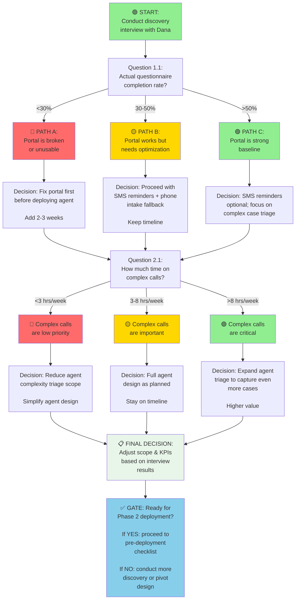

# DISCOVERY QUESTIONS FOR DANA
## Scenario 5: Westbridge Family Medicine — Validation Questions for Agent Design

**Stakeholder:** Dana Velazquez, Practice Manager  
**Purpose:** Ask targeted questions to validate/invalidate design assumptions; identify which answers would materially change the MedRec Agent design  
**Format:** Structured by topic; prioritized by impact  
**Timeline:** Conduct interviews T-3 weeks before Phase 2 deployment (Week 1 of deployment planning)

---

## PART 1: EXECUTIVE SUMMARY

### **Why These Questions Matter**

The MedRec Agent design rests on 12 key assumptions (see Part 2 of this document). Each assumption has a **confidence level** (60–95%) and an **impact assessment** (what changes if the assumption is wrong).

**This document** contains 47 discovery questions organized by topic. Each question is tagged with:
- **Assumption #:** Which assumption does this validate?
- **Confidence Level:** How confident are we before asking Dana?
- **If Answer = X:** What changes in the design?
- **Priority:** How critical is this to moving forward?

### **How to Use This Document**

1. **Schedule 2–3 interviews with Dana** (60–90 minutes each)
2. **Work through questions by topic** (don't dump all 47 at once)
3. **Listen for nuance:** Dana's answers may reveal things beyond the yes/no
4. **Document everything:** Record or take detailed notes
5. **Follow up on surprises:** If Dana's answer contradicts an assumption, dig deeper

---

## PART 2: ASSUMPTION INVENTORY (Quick Reference)

| # | Assumption | Current Confidence | If Wrong, Design Impact | Priority |
|---|---|---|---|---|
| **1** | DoseSpot covers 80%+ of prescribed meds | 85% | Agent relies too much on incomplete data | HIGH |
| **2** | OTC meds & supplements are missing from DoseSpot | 98% | (Confirmed; low priority) | LOW |
| **3** | Patient questionnaire completion rate is ~40% | 60% | If >60%, fewer phone calls needed; if <30%, agent must do 100% phone intake | CRITICAL |
| **4** | Non-English speakers & geriatric patients require phone intake | 80% | If false, triage criteria change; if true, need Dana's validation | HIGH |
| **5** | Check-in verbal confirmation is often rushed | 85% | If systematic, risk profile is lower; if ad-hoc, MedRec safety net is critical | HIGH |
| **6** | Dana's complex case calls prevent 15–20% of med reconciliation failures | 70% | If <10%, lower priority for agent triage; if >25%, higher priority | HIGH |
| **7** | Drug interaction detection is critical to patient safety | 95% | (Confirmed; low priority) | LOW |
| **8** | Insurer patterns (Wellpath, Humana, Aetna) are stable >90% | 70% | If <70%, agent can't rely on pattern learning; manual fallback required | MEDIUM |
| **9** | DoseSpot interaction alerts are >90% accurate | 80% | If <80%, alert fatigue higher; physician trust erodes | MEDIUM |
| **10** | Medication reconciliation volume is 153 patients/day × 85% = ~130 cases/day | 80% | If <60%, prioritization may change; volume justifies investment | MEDIUM |
| **11** | Dana spends ~5 hours/week on complex case phone calls | 70% | If <3 hrs, ROI drops; if >8 hrs, agent becomes even more valuable | HIGH |
| **12** | Patient questionnaire abandonment improves to 50%+ with SMS reminders | 60% | If <48%, need different approach (email-only, phone intake); if >55%, model looks good | CRITICAL |

---

## PART 3: DISCOVERY QUESTIONS BY TOPIC

### **TOPIC 1: PATIENT QUESTIONNAIRE COMPLETION & ABANDONMENT**

**Context:** MedRec Agent relies on patient self-report (pre-visit questionnaire) to catch OTC meds, supplements, and medication changes. Current rate: ~40% completion. Agent design assumes SMS reminders improve this to 50%+.

---

#### **Question 1.1: Baseline Completion Rate (Priority: CRITICAL)**

**Ask:** "Can you pull actual completion data from athenahealth for the past 3 months? What % of patients who receive the pre-visit questionnaire actually complete it?"

**Why:** Current assumption is ~40%, but this is Dana's rough estimate. Actual data could be 30%, 50%, or 65%.

**If Answer = 30%:** Design implication = Agent cannot rely on patient self-report; must prioritize phone intake (front desk calls 70% of patients)

**If Answer = 50%+:** Design implication = Agent is on track; SMS reminders may not be necessary; focus on reminders for non-completers

**If Answer = <25%:** Design implication = Patient portal is broken or patients don't understand the form; need form redesign or alternate channel (phone-first)

**Follow-up Questions:**
- "Does completion rate vary by patient age, language, or insurance type?"
- "Are there days of the week when completion is higher/lower?"
- "Do patients who complete the form actually read the pre-filled DoseSpot data, or just skip to the end?"

---

#### **Question 1.2: Reasons for Non-Completion (Priority: HIGH)**

**Ask:** "For patients who don't complete the questionnaire, what's the reason? Portal didn't work? They forgot? They didn't understand the form? Too many questions?"

**Why:** If non-completion is due to portal bugs, fixing the portal is better than SMS reminders. If it's because they forgot, reminders help. If it's literacy/language, need different approach.

**If Answer = "Portal is buggy":** Design implication = Fix portal first; agent assumes portal works

**If Answer = "They forgot":** Design implication = SMS/email reminders are useful; agent design is sound

**If Answer = "Form is confusing":** Design implication = Redesign form; simplify questions; maybe do phone intake for everyone (slower, but more reliable)

**If Answer = "Too many questions":** Design implication = Shorten form; move OTC/supplement questions to phone intake only

---

#### **Question 1.3: Impact of SMS Reminders (Priority: CRITICAL)**

**Ask:** "If we send SMS reminders at T-5, T-3, and T-1 days, do you think that would help patients remember to complete the form? Or do you think they'd ignore the SMS?"

**Why:** This is speculative, but Dana has intuition about patient behavior.

**If Answer = "SMS would definitely help, patients are responsive":** Design implication = Deploy Twilio SMS service; expected improvement: 40% → 50%+

**If Answer = "SMS might cause more problems (spam complaints, opt-outs)":** Design implication = Email reminders only; accept 40% completion rate

**If Answer = "Most non-completers won't respond to any reminder; they just don't want to do it":** Design implication = Plan for 100% phone intake for non-responders (higher front desk workload)

**Follow-up Questions:**
- "Have patients complained about too many appointment reminders in the past?"
- "Do you get any patient complaints about privacy/spam?"
- "What time of day do you think SMS reminders would be most effective?"

---

#### **Question 1.4: Patient Language Barriers (Priority: HIGH)**

**Ask:** "What % of your patients are non-English speakers? Which languages? Does the pre-visit questionnaire support these languages, or do they need a translator?"

**Why:** If 20%+ are non-English, they may need phone intake. Current form likely only supports English.

**If Answer = ">15% non-English; no language support":** Design implication = Triage criteria must include "non-English speaker" → flag for Dana's call; can't rely on portal form

**If Answer = "<5% non-English":** Design implication = Minor issue; existing triage criteria sufficient

**If Answer = "Form supports multiple languages via athenahealth":** Design implication = Agent can use portal; no language barrier

**Follow-up Questions:**
- "Which languages are most common?"
- "Do you have staff who speak these languages, or do you use a professional interpreter?"
- "For non-English patients, does someone from front desk call them?"

---

#### **Question 1.5: Geriatric Patient Portal Usage (Priority: HIGH)**

**Ask:** "What % of your patients are >75 years old? Do they typically use the patient portal, or do they need phone calls?"

**Why:** If geriatric patients don't use portals, agent cannot rely on questionnaire completion for them.

**If Answer = ">20% geriatric; most don't use portal":** Design implication = Triage criteria "age >75" → auto-flag for Dana's call; can't rely on portal

**If Answer = "<10% geriatric":** Design implication = Age-based triage less critical; focus on other risk factors

**If Answer = "Some geriatric patients use portal, some don't; depends on family support":** Design implication = Triage criteria "age >75 OR recent ER OR polypharmacy >10" (multiple pathways to flag)

**Follow-up Questions:**
- "Do family members fill out forms on behalf of geriatric patients?"
- "For geriatric patients, does front desk do phone intake proactively?"
- "Do geriatric patients have different medication complexity than younger patients?"

---

### **TOPIC 2: DANA'S COMPLEX CASE PHONE CALLS**

**Context:** Dana spends ~5 hours/week calling complex patients (geriatric, non-English, recent hospitalization, polypharmacy >10 meds, recent ER, unstable insurance). These calls catch ~15–20% of med reconciliation failures that DoseSpot + questionnaire miss. MedRec Agent's main value is freeing Dana's time by automating triage so Dana can focus on deeper calls.

---

#### **Question 2.1: How Much Time Do You Spend on Complex Case Calls? (Priority: CRITICAL)**

**Ask:** "Can you track your time this week on complex case phone calls? How many patients do you call per day? How long does each call take?"

**Why:** Current assumption is ~5 hours/week (or ~1 hour/day). Actual time might be 2 hours/week (less valuable) or 8 hours/week (highly valuable).

**If Answer = "<3 hours/week":** Design implication = Complex case calls are lower priority for agent optimization; focus on other automation

**If Answer = "5–8 hours/week":** Design implication = Agent optimization is high-value; design is on track

**If Answer = ">8 hours/week":** Design implication = Complex case calls are Dana's biggest bottleneck; agent triage would free significant time

**Follow-up Questions:**
- "How many of these calls could be delegated to front desk staff (if front desk were trained)?"
- "Do you call every complex case, or only some?"
- "What % of your calls result in finding something DoseSpot missed?"

---

#### **Question 2.2: What % of Complex Cases Reveal Something DoseSpot Missed? (Priority: HIGH)**

**Ask:** "Of the patients you call, what % reveal something that wasn't in DoseSpot or the athenahealth chart? For example: they're taking an OTC med, they stopped a med without telling us, they're seeing another provider who prescribed something new, etc."

**Why:** If Dana's calls only find problems in 5% of cases, they're lower priority. If 20%+, they're critical.

**If Answer = "<10%":** Design implication = Complex case calls are routine validation; lower safety impact; agent triage less critical

**If Answer = "15–25%":** Design implication = Complex case calls catch real gaps; agent should flag all high-risk patients for Dana

**If Answer = ">25%":** Design implication = DoseSpot/questionnaire are very incomplete for complex patients; Dana's calls are essential; agent should flag aggressively

**Follow-up Questions:**
- "What types of issues do you find most often? (e.g., OTC meds, stopped meds, outside-provider meds, non-adherence, side effects?)"
- "Can you give me an example of a call where you found something important?"
- "For patients you don't call, do problems ever show up at the visit or after?"

---

#### **Question 2.3: Complexity Criteria Accuracy (Priority: HIGH)**

**Ask:** "I've suggested that we auto-flag patients for your calls based on: age >75, polypharmacy >10 meds, recent hospitalization (last 30 days), non-English speaker, recent ER visit (last 30 days), unstable insurance. Do you think these criteria would catch the patients who actually need your calls?"

**Why:** Agent design relies on these criteria to triage. If criteria are too strict, high-risk patients slip through. If too loose, Dana gets overwhelmed with flags.

**If Answer = "These criteria are good, but you're missing one: [new criteria]":** Design implication = Add new criteria to agent logic

**If Answer = "These criteria are too strict; you'd miss half the important cases":** Design implication = Adjust thresholds (e.g., age >70, polypharmacy >8) or add new pathways

**If Answer = "These criteria are way too loose; I'd get flagged for half my patients":** Design implication = Tighten criteria or add additional filtering (e.g., "age >75 AND recent hospitalization" instead of just "age >75")

**If Answer = "Can you also flag based on [clinical characteristic]? (e.g., patient has diabetes + renal disease)":** Design implication = Ask Dana to provide clinical thresholds; agent would need access to problem list

**Follow-up Questions:**
- "For patients who are just barely over the threshold (e.g., age 74, 9 meds), do you call them?"
- "Do you ever call patients who don't match any of these criteria, based on gut feeling?"
- "If the agent flags 30 patients/day for your calls, is that too many?"

---

#### **Question 2.4: Can Other Staff Members Do These Calls? (Priority: MEDIUM)**

**Ask:** "Do you think front desk staff (with training) could handle some of these complex case calls? Or is your expertise required?"

**Why:** If front desk can handle 50% of complex cases, agent could route easier cases to them; Dana focuses on hardest cases.

**If Answer = "Front desk could definitely do some of these; I could train them":** Design implication = Create two-tier routing: easy flags to front desk, hard flags to Dana

**If Answer = "No, these calls require my judgment; front desk isn't equipped":** Design implication = All complex flags route to Dana only; agent can't delegate

**If Answer = "Maybe; let's try a pilot":** Design implication = Agent design includes routing rules; can adjust based on pilot results

**Follow-up Questions:**
- "What skills are required to do these calls well? (e.g., clinical knowledge, listening skills, patient relationship, ability to spot red flags?)"
- "How much training would front desk need?"
- "Would you be willing to mentor staff on complex case calls?"

---

### **TOPIC 3: DOSSPOT DATA QUALITY & COMPLETENESS**

**Context:** Agent relies on DoseSpot pharmacy fill history to pre-fill questionnaire and identify gaps. But DoseSpot misses OTC, supplements, outside-provider meds, and adherence context.

---

#### **Question 3.1: How Complete Is DoseSpot? (Priority: HIGH)**

**Ask:** "What % of your patients have medications in DoseSpot that match your athenahealth chart? How often do you find DoseSpot is missing recent fills or has outdated info?"

**Why:** If DoseSpot is >90% complete, agent can rely on it. If <60%, agent needs more patient self-report and manual verification.

**If Answer = "DoseSpot usually has the major meds, but misses 10–20% of prescriptions":** Design implication = Agent should flag "DoseSpot_confidence: MEDIUM" for cases with gaps

**If Answer = "DoseSpot is pretty complete; 90%+ matches our chart":** Design implication = Agent can rely on DoseSpot as starting point; patient self-report is secondary

**If Answer = "DoseSpot is often outdated; fill history lags our chart by weeks":** Design implication = Agent should re-query DoseSpot at T-0 day (not just T-5) to catch recent changes

**Follow-up Questions:**
- "Are there certain insurance plans where DoseSpot data is more/less complete?"
- "Does DoseSpot miss mail-order pharmacy fills?"
- "Do patients sometimes fill prescriptions elsewhere (e.g., online, international pharmacies)?"

---

#### **Question 3.2: OTC Meds & Supplements (Priority: MEDIUM)**

**Ask:** "When patients mention OTC meds or supplements, how often do they appear in DoseSpot? Or does DoseSpot miss them entirely?"

**Why:** Confirm that DoseSpot doesn't capture OTC (this is our assumption; likely true).

**If Answer = "DoseSpot misses all OTC; patient self-report is only source":** Design implication = Confirmed; agent must ask patient directly

**If Answer = "Sometimes DoseSpot has OTC meds if they filled through partner pharmacies":** Design implication = Some OTC meds in DoseSpot; agent should not assume all OTC are missing

**Follow-up Questions:**
- "What OTC meds do patients mention most often? (e.g., ibuprofen, acetaminophen, vitamins, melatonin)"
- "Do you think patients forget to mention OTC meds, or do they intentionally not mention them?"

---

#### **Question 3.3: Outside-Provider Medications (Priority: HIGH)**

**Ask:** "How often do you discover that a patient is seeing another provider (rheumatologist, cardiologist, etc.) and taking meds you don't know about? Where do you typically find out about these?"

**Why:** If common, agent needs to ask about outside providers systematically.

**If Answer = "Pretty common; maybe 10–15% of patients have outside meds":** Design implication = Agent should ask "Do you see any other doctors? Any new meds from them?" as standard question

**If Answer = "Rare; when it happens, patient mentions it or we see it in their insurance claims":** Design implication = Lower priority; current triage sufficient

**If Answer = "We have referral relationships with most local specialists; they send notes to us":** Design implication = Agent could check referral notes for recent specialist visits

**Follow-up Questions:**
- "Which types of specialists are most likely to prescribe meds you don't know about?"
- "Do insurance claims data give you info about outside pharmacy fills?"

---

### **TOPIC 4: MEDICATION RECONCILIATION AT CHECK-IN**

**Context:** Front desk does verbal confirmation at check-in (T-0 morning, 3–5 minutes before rooming patient). This is the last safety net. MedRec Agent assumes this is often rushed or ad-hoc.

---

#### **Question 4.1: Is Check-In Confirmation Systematic or Ad-Hoc? (Priority: HIGH)**

**Ask:** "Does front desk have a checklist or standard process for confirming medications at check-in? Or does it depend on whoever's working that day and how busy it is?"

**Why:** If systematic, safety net is reliable. If ad-hoc, agent needs to enforce it.

**If Answer = "Mostly ad-hoc; depends on front desk diligence and time pressure":** Design implication = Agent should enforce EHR workflow (cannot room patient without "Med confirmation completed" checkbox)

**If Answer = "We have a standard checklist; front desk always does it":** Design implication = Safety net is reliable; agent adds pre-visit summary to help, but doesn't change critical path

**If Answer = "It's supposed to be systematic, but I know it gets skipped sometimes when we're busy":** Design implication = Agent workflow enforcement is critical; Artefact 5.2 failure mode likely to repeat

**Follow-up Questions:**
- "On average, how much time does front desk spend on med confirmation per patient?"
- "Does front desk ever skip this step? If so, how often?"
- "What would make this step more reliable? (more time, checklist, training, EHR enforcement?)"

---

#### **Question 4.2: What Gets Caught at Check-In? (Priority: HIGH)**

**Ask:** "When front desk does verbal confirmation, what kinds of discrepancies do you typically catch? (e.g., patient stopped a med, patient is taking OTC, patient mentions side effect, something doesn't match the chart?)"

**Why:** If front desk rarely catches problems, check-in confirmation is just a formality. If they often catch problems, it's a critical safety net.

**If Answer = "Pretty often; maybe 20–30% of patients mention something that wasn't on the pre-filled list":** Design implication = Check-in is high-value; agent should enhance it with pre-visit summary highlighting known gaps

**If Answer = "Rarely; most of the time it's just 'yep, that looks right'":** Design implication = Check-in is routine verification; agent summary helps but isn't critical

**If Answer = "Sometimes; especially for complex patients":** Design implication = Confirmed; agent should flag complex patients so front desk pays extra attention

**Follow-up Questions:**
- "Do you ever hear about med issues AFTER the visit that should have been caught at check-in?"
- "What would help front desk catch more issues? (more time, training, visual cues?)"

---

#### **Question 4.3: Time Available for Check-In (Priority: MEDIUM)**

**Ask:** "Realistically, how much time can front desk spend on med confirmation per patient? Is it 5 minutes, or is it rushed into 1–2 minutes?"

**Why:** If only 1–2 minutes available, verbal confirmation is superficial. Agent needs to do more work upfront.

**If Answer = "Maybe 1–2 minutes if busy; 5 minutes if slow":** Design implication = Agent pre-visit summary is critical; front desk needs to focus on high-risk patients

**If Answer = "3–5 minutes consistently":** Design implication = Front desk has adequate time; agent summary enhances but doesn't change workflow

**If Answer = "Not enough time; it's always rushed":** Design implication = Agent must handle more work upfront; front desk does quick spot-check only

---

### **TOPIC 5: DRUG INTERACTION DETECTION & SEVERITY**

**Context:** MedRec Agent consolidates DoseSpot interaction warnings and separates CRITICAL from MODERATE. Physician reviews CRITICAL alerts; MODERATE alerts are notes only.

---

#### **Question 5.1: DoseSpot Interaction Accuracy (Priority: HIGH)**

**Ask:** "How accurate are DoseSpot's drug-drug interaction warnings? Do you think they catch most important interactions, or do they flag a lot of benign stuff?"

**Why:** If DoseSpot is very accurate, physician trusts alerts. If lots of false positives, physician starts ignoring alerts (alert fatigue).

**If Answer = "DoseSpot is usually right; I've learned to trust it":** Design implication = Agent can surface DoseSpot alerts to physician with confidence

**If Answer = "DoseSpot flags a lot of stuff, but most of it is benign; not clinically significant":** Design implication = Agent needs to filter aggressively; only surface CRITICAL interactions to physician to reduce alert fatigue

**If Answer = "Sometimes DoseSpot misses interactions; I've caught things DoseSpot didn't flag":** Design implication = Agent should supplement DoseSpot with clinical rules (e.g., patient age + renal function + drug combination)

**Follow-up Questions:**
- "Can you give examples of interactions DoseSpot flags that are NOT clinically significant?"
- "Can you give examples of interactions DoseSpot MISSED that caused problems?"

---

#### **Question 5.2: CRITICAL vs. MODERATE Interaction Classification (Priority: HIGH)**

**Ask:** "I've defined CRITICAL interactions as: dual NSAIDs, warfarin + aspirin, ACE-I + K-sparing diuretic + renal disease, contraindicated combos. And MODERATE as: sedating drug combinations, statin + fibrate, CYP3A4 inhibitor + substrate. Do you think this split is reasonable? Should any interactions move between categories?"

**Why:** Physician needs clear guidance on which interactions require immediate action (CRITICAL) vs. just a note (MODERATE).

**If Answer = "This split looks good; maybe add [new interaction] to CRITICAL":** Design implication = Add new interaction to CRITICAL list; agent logic updated

**If Answer = "You're flagging too much as CRITICAL; physicians will ignore these alerts":** Design implication = Move some interactions to MODERATE; tighten CRITICAL threshold

**If Answer = "You're not flagging enough as CRITICAL; some interactions in MODERATE should be CRITICAL":** Design implication = Move interactions up; loosen CRITICAL threshold for safety

**Follow-up Questions:**
- "What's the worst interaction you've seen in your practice?"
- "Are there any interactions that are context-dependent? (e.g., critical if renal disease, benign if normal renal function)"

---

#### **Question 5.3: Patient Age & Context in Interactions (Priority: MEDIUM)**

**Ask:** "Do you think the same drug-drug interaction carries different risk depending on patient age or other context? For example, is a sedating antihistamine more risky for a 85-year-old than a 40-year-old?"

**Why:** If yes, agent should incorporate patient context into interaction severity.

**If Answer = "Absolutely; elderly patients are much more sensitive to sedating drugs":** Design implication = Agent should assess patient age/renal function/comorbidities when classifying interaction severity

**If Answer = "Not really; if an interaction is bad, it's bad regardless of age":** Design implication = Agent can use simple classification (CRITICAL/MODERATE); no need for context

**Follow-up Questions:**
- "For geriatric patients, are there any drugs you'd recommend avoiding entirely?"
- "Do you track patient falls or adverse events that might be related to drug interactions?"

---

### **TOPIC 6: PRIOR-AUTHORIZATION & AVAILITY INTEGRATION**

**Context:** MedRec Agent displays PA status in pre-visit summary. But Availity PA status API is not available; Dana manually checks portal daily. This is a major gap.

---

#### **Question 6.1: Manual PA Status Checks (Priority: MEDIUM)**

**Ask:** "You mentioned that you manually check Availity every morning for PA status. How long does this take? Is it part of your daily routine, or does it feel like a burden?"

**Why:** If Dana checks Availity anyway, MedRec Agent just needs to read from Prior-Auth Check agent. If Dana checks but it's a burden, agent could automate (if Availity API becomes available).

**If Answer = "It's just a quick morning task; 5–10 minutes":** Design implication = Acceptable; agent displays PA status if available from Prior-Auth agent

**If Answer = "It's tedious; I have to log in to portal, check each case individually":** Design implication = Good motivation for agent automation (if Availity API available)

**If Answer = "I don't check every day; I only check when I remember or when something seems urgent":** Design implication = Front desk often discovers PA issues at check-in; agent should enforce T-0 PA verification

---

#### **Question 6.2: Availity API Access (Priority: MEDIUM)**

**Ask:** "Have you ever asked Availity if they offer an automated API for checking PA status? Or do you know if they have any integration capabilities with athenahealth?"

**Why:** If Availity has API, MedRec Agent design changes significantly (can automate PA status pulls).

**If Answer = "I don't think Availity has an API; they're pretty old-school":** Design implication = Agent displays last-known PA status; front desk verifies manually at check-in

**If Answer = "I haven't asked; but you could reach out to Availity support":** Design implication = Add "Verify Availity API availability" to pre-deployment checklist

**If Answer = "Availity has some integration, but it's limited; mostly file-based":** Design implication = Agent might be able to use SFTP pull for PA status (slower, but possible)

---

### **TOPIC 7: PATIENT VOLUME & WORKLOAD**

**Context:** Volume estimates are critical to ROI calculation and prioritization. Current estimate: 153 patients/day × 85% = ~130 med recon cases/day.

---

#### **Question 7.1: Patient Volume Confirmation (Priority: HIGH)**

**Ask:** "What's your typical daily volume? How many patients do you see per day across both locations? And what % of those need pre-visit medication reconciliation?"

**Why:** If actual volume is 50/day (not 153), investment ROI drops significantly.

**If Answer = "Around 150–180 patients/day; 85%+ need med recon":** Design implication = Volume estimate confirmed; agent investment justified

**If Answer = "More like 100 patients/day":** Design implication = Volume is lower; recalculate ROI; investment still justified but smaller return

**If Answer = "<80 patients/day":** Design implication = Volume too low to justify agent; reconsider investment

**Follow-up Questions:**
- "Is volume consistent throughout the week, or are there busy days and slow days?"
- "Are there seasonal variations? (e.g., busier in winter, slower in summer?)"

---

#### **Question 7.2: Workload Distribution (Priority: MEDIUM)**

**Ask:** "How is the med recon work distributed across your team? Who does what? (e.g., front desk handles some, billing handles some, you handle some?)"

**Why:** Agent design assumes Dana is the bottleneck. If front desk already handles most med recon, agent frees different time.

**If Answer = "Front desk does the questionnaire follow-up; I do the complex case calls":** Design implication = Agent removes Dana's monitoring burden; front desk becomes the bottleneck (need to handle more phone intake)

**If Answer = "It's mostly you; front desk just does check-in":** Design implication = Agent frees significant Dana time; high-value optimization

**If Answer = "Shared across multiple people; pretty distributed":** Design implication = Agent impact more diffuse; harder to measure time freed for Dana

---

### **TOPIC 8: INTEGRATION FEASIBILITY & RISKS**

**Context:** MedRec Agent requires integrations with 4 systems (athenahealth, DoseSpot, Availity, Twilio). Each integration has technical and organizational risks.

---

#### **Question 8.1: athenahealth API Access (Priority: MEDIUM)**

**Ask:** "Does Westbridge currently have API access to athenahealth? Or would this need to be set up? And is there any organizational barrier to giving an agent read/write access to patient data?"

**Why:** If API access doesn't exist, deployment is delayed. If organizational concern about agent access, may need security review.

**If Answer = "We have API access already; IT would just set up new credentials for the agent":** Design implication = Straightforward; 1–2 week setup

**If Answer = "We don't have API access; would need to request from athenahealth support":** Design implication = +2–3 weeks for athenahealth to enable; add to timeline

**If Answer = "IT is nervous about giving an agent write access to patient records":** Design implication = Need to address security concerns; might need CISO approval; add to governance

---

#### **Question 8.2: DoseSpot API Access (Priority: MEDIUM)**

**Ask:** "Same question for DoseSpot: do you currently have API access? Would we need to request it? And do you have a relationship with DoseSpot support, or would this be a new vendor interaction?"

**Why:** If new vendor interaction needed, add vendor management overhead.

**If Answer = "DoseSpot support is good; they'd set up API access quickly":** Design implication = Straightforward; 1–2 week setup

**If Answer = "DoseSpot is slow to respond; good luck getting them to set anything up":** Design implication = Plan for delays; manage expectations

---

#### **Question 8.3: Credential Security (Priority: HIGH)**

**Ask:** "How does Westbridge currently manage API credentials? Do you use a credential vault (like AWS Secrets Manager), or are credentials stored in config files or passed around?"

**Why:** HIPAA requires secure credential management. If current practices are loose, agent deployment forces security upgrade (good thing, but needs planning).

**If Answer = "We have a vault; IT manages credentials securely":** Design implication = Use existing vault for agent credentials; straightforward

**If Answer = "We don't have a vault; credentials are in config files or shared via email":** Design implication = NEED TO FIX THIS BEFORE AGENT DEPLOYMENT; add security infrastructure to timeline

**Follow-up Questions:**
- "How often are API credentials rotated?"
- "If an API credential is compromised, do you have a process to revoke and re-issue it?"
- "Are any API credentials shared across multiple systems/people?"

---

#### **Question 8.4: Incident Response & Breach Notification (Priority: HIGH)**

**Ask:** "Does Westbridge have a written incident response plan for data breaches? What would happen if an agent API credential was compromised and unauthorized access was detected?"

**Why:** HIPAA requires incident response procedures. If not documented, this is a governance gap.

**If Answer = "Yes, we have a plan; IT + Legal are involved":** Design implication = Agent deployment uses existing incident response

**If Answer = "No written plan; we'd figure it out if it happened":** Design implication = NEED TO CREATE PLAN BEFORE AGENT DEPLOYMENT; add to pre-deployment governance tasks

---

### **TOPIC 9: REGULATORY & COMPLIANCE**

**Context:** MedRec Agent handles patient health information (PHI). Westbridge needs to ensure compliance with HIPAA, state laws, and internal policies.

---

#### **Question 9.1: Business Associate Agreements (Priority: CRITICAL)**

**Ask:** "Do you know if Westbridge has signed Business Associate Agreements (BAAs) with DoseSpot, Availity, and Twilio? Where would I find these documents?"

**Why:** HIPAA requires BAAs with all vendors handling PHI. If BAAs don't exist, agent deployment is blocked until they're signed.

**If Answer = "I'm not sure; you'd need to ask IT/Legal":** Design implication = Add BAA verification to pre-deployment checklist; escalate to Legal if missing

**If Answer = "We have BAAs with athenahealth and DoseSpot; not sure about others":** Design implication = Verify Availity + Twilio BAAs; sign if needed

**Follow-up Questions:**
- "Who at Westbridge is responsible for managing vendor BAAs?"
- "Has anyone reviewed these BAAs for completeness? (e.g., breach notification requirements, data retention, subcontractor oversight)"

---

#### **Question 9.2: Patient Consent for SMS Reminders (Priority: HIGH)**

**Ask:** "Do you currently have documented patient consent for SMS reminders? Or do we need to collect this consent before deploying Twilio?"

**Why:** HIPAA + TCPA (Telephone Consumer Protection Act) require explicit opt-in for SMS.

**If Answer = "We don't have SMS consent documented; patients only opted in to email reminders":** Design implication = Before SMS deployment: audit existing consent + collect new SMS opt-ins from patients

**If Answer = "Patients opted into 'all communications' during registration, which should include SMS":** Design implication = Verify consent language in registration form; if ambiguous, collect explicit SMS opt-in

**If Answer = "We can ask during check-in: 'Can we send you appointment reminders via SMS?'":** Design implication = Front desk collects consent verbally; document in chart

---

#### **Question 9.3: Data Retention Policies (Priority: MEDIUM)**

**Ask:** "Does Westbridge have written data retention policies? How long do you keep patient records? How long do you keep audit logs?"

**Why:** HIPAA requires reasonable retention policies. If Westbridge hasn't documented these, this is a governance gap.

**If Answer = "We keep records for 7 years post-discharge (standard); audit logs for 6 years":** Design implication = Agent logging adheres to existing policy

**If Answer = "I'm not sure; you'd need to ask Legal/Compliance":** Design implication = Add retention policy review to pre-deployment governance

---

### **TOPIC 10: MEASURABLE OUTCOMES & METRICS**

**Context:** Agent success depends on measurable KPIs. Want to confirm which metrics matter most to Dana.

---

#### **Question 10.1: Safety Metrics (Priority: HIGH)**

**Ask:** "What's the most important outcome for you? Is it catching drug interactions? Reducing patient wait times? Freeing your time? Or something else?"

**Why:** This reveals Dana's priorities and helps define success metrics.

**If Answer = "Safety first; catching interactions before they cause harm":** Design implication = Primary KPI: <1% false-negative rate (missed interactions); secondary KPI: time freed

**If Answer = "Efficiency; reduce the time I spend on routine work":** Design implication = Primary KPI: time freed for Dana; secondary KPI: patient safety

**If Answer = "Both equally":** Design implication = Balanced scorecard; both safety + efficiency are monitored

**Follow-up Questions:**
- "Have you tracked adverse events related to med interactions? What's your baseline?"
- "What would be an acceptable false-negative rate for drug interactions?"

---

#### **Question 10.2: Visit Abort Prevention (Priority: MEDIUM)**

**Ask:** "Remember Artefact 5.2, where patient TJ's visit was aborted because PA wasn't verified at check-in? How often does this happen? Is it a big problem, or a rare edge case?"

**Why:** If visit aborts are common, visit abort prevention is a high-value metric.

**If Answer = "This happens maybe once a month; it's annoying but not catastrophic":** Design implication = Visit abort prevention is medium-value metric; monitor but not critical

**If Answer = "This happens maybe once a week; patients are frustrated, we lose slots":** Design implication = Visit abort prevention is high-value metric; critical to monitor

**If Answer = "I can't think of other instances; that TJ case was unusual":** Design implication = Visit abort prevention is lower-value metric; focus on other outcomes

**Follow-up Questions:**
- "What's the cost to Westbridge of a visit abort? (lost revenue, staff time, patient dissatisfaction?)"
- "How would systematic pre-visit PA verification prevent this?"

---

#### **Question 10.3: Measurable Success Thresholds (Priority: MEDIUM)**

**Ask:** "If the agent achieves: questionnaire completion 50%+, complex case capture 20%, interaction alerts 95%+ accurate, check-in time reduced by 3 min, and frees 6 hrs/week for you... would that feel like success?"

**Why:** Validate that the KPI targets in the Agent Purpose Document are realistic and aligned with Dana's expectations.

**If Answer = "Yes, that would be great success":** Design implication = Agent Purpose Document KPIs are validated

**If Answer = "No, the targets are too ambitious":** Design implication = Adjust KPI targets; reset expectations

**If Answer = "Yes, but I'd also want to see [additional metric]":** Design implication = Add new KPI to Agent Purpose Document

---

## PART 4: FOLLOW-UP LOGIC & DECISION TREE



---

## PART 5: INTERVIEW PLANNING & LOGISTICS

### **Interview Schedule (Recommended)**

**Interview 1 (60 minutes): Patient Behavior & Questionnaire**
- Topics: 1, 2 (first part), 7
- Focus: Understanding patient engagement with pre-visit form; volume confirmation
- Deliverable: Validated completion rate; confirmation of volume

**Interview 2 (75 minutes): Dana's Complex Calls & Safety**
- Topics: 2 (continued), 3, 4, 5
- Focus: Understanding Dana's cognitive work; what she catches; interaction priorities
- Deliverable: Validated complexity criteria; interaction classification

**Interview 3 (45 minutes): Technical & Compliance**
- Topics: 6, 8, 9
- Focus: Integration feasibility; compliance/governance gaps
- Deliverable: Pre-deployment checklist; compliance action items

### **Interview Best Practices**

✅ **Do:**
- Send questions in advance (don't surprise Dana)
- Ask open-ended questions first ("Tell me about..."), then drill down
- Listen for nuance; if Dana says something interesting, explore it
- Take detailed notes or record (with permission)
- Confirm your understanding ("So if I'm hearing you right, you're saying...?")
- Thank Dana for her time; acknowledge her expertise

❌ **Don't:**
- Ask all 47 questions in one interview (overwhelming)
- Interrupt Dana while she's explaining
- Lead questions ("You probably spend about 5 hours/week on calls, right?")
- Argue with Dana's answers ("But my assumption was...?")
- Rush through answers; give Dana time to think

### **Documentation Template**

For each question, record:
- **Q:** [Question number and text]
- **Dana's answer:** [Direct quote or paraphrase]
- **Follow-ups asked:** [Any follow-up questions you asked]
- **Key insight:** [What surprised you or validated assumption]
- **Design impact:** [How does this answer change agent design?]
- **Confidence level post-interview:** [Updated confidence: 60% → 85%?]

---

## PART 6: GO/NO-GO DECISION CRITERIA

### **Green Light for Phase 2 Deployment (GO)**

✅ **Proceed if:**
- Patient questionnaire completion is 35%+ (or SMS reminders expected to improve to 45%+)
- Dana spends 3+ hours/week on complex case calls (or can free 3+ hours)
- Complex case triage criteria are validated (Dana agrees with criteria or suggests improvements)
- Check-in confirmation is at least partially systematic (not 100% ad-hoc)
- DoseSpot completeness is >70% (or front desk phone intake is scalable fallback)
- Interaction alert accuracy is >80% (or willing to refine thresholds)
- At least 3 of 4 vendor BAAs (athenahealth, DoseSpot, Twilio, Availity) are signed
- IT/Legal support deployment (or at least don't block it)
- Credential management is secure (vault exists or will be created pre-deployment)

### **Yellow Light: Conditional Proceed (CONDITIONAL)**

⚠️ **Proceed with caveats if:**
- Questionnaire completion is 25–35% (need to accept higher reliance on phone intake)
- Dana spends 1–3 hours/week on complex calls (lower value, but still worthwhile)
- One vendor BAA is missing (but vendor willing to sign pre-deployment)
- Portal needs minor updates (1–2 week fix)
- Credential management is loose (but IT willing to implement vault during deployment)

**Action:** Deploy on extended timeline; add 2–4 weeks for risk mitigation

### **Red Light: STOP & RECONSIDER (NO-GO)**

❌ **Do NOT proceed if:**
- Questionnaire completion is <20% (portal is broken or unusable)
- Dana's complex calls are <1 hour/week (insufficient value to justify agent)
- Patient volume is <80 patients/day (insufficient scale)
- Multiple vendor BAAs are missing AND vendors won't sign (legal barrier)
- IT/Legal blocks agent deployment (organizational barrier)
- No secure credential management (HIPAA compliance risk)
- Interaction alert accuracy <60% (too much alert fatigue risk)

**Action:** Pivot to different use case (Prior-Auth automation Phase 3) or defer MedRec Agent to later phase

---

## PART 7: SAMPLE DISCOVERY INTERVIEW TRANSCRIPT

### **Excerpt: Interview 1 with Dana (First 20 minutes)**

> **You:** "Thanks for making time, Dana. I wanted to dig into some specifics about the pre-visit questionnaire. Can you tell me: what % of patients who receive the form actually complete it?"
>
> **Dana:** "Oh man, that's... I've never tracked it officially. But my gut says like 40%? Probably a bit less some days. I know front desk is always calling people to remind them."
>
> **You:** "Can you pull the actual number from athenahealth? I'd really like the real data."
>
> **Dana:** "Sure, I can ask IT. But honestly, I think it's closer to 35%. And of those who complete it, I'd say maybe 60% actually read the pre-filled stuff and make changes. The rest just click through."
>
> **You:** "So effectively, you're getting useful questionnaire data from about 21% of patients? (35% × 60%)"
>
> **Dana:** "Yeah, when you put it that way, it sounds pretty bad. [laughs] That's why I do the calls. For the complex patients especially, I can't trust the form."
>
> **You:** "Which brings me to my next question. You mentioned complex patient calls. How much time do you spend on those per week?"
>
> **Dana:** "Oof. Some weeks are lighter, some weeks are heavy. But on average? I'd guess 5–6 hours a week. Maybe more when we have a lot of geriatric patients or post-hospitalizations."
>
> **You:** "So if an agent could identify which patients need your calls and automatically flag them for you, that would free up some of that time?"
>
> **Dana:** "Absolutely. Right now I'm kind of doing it ad-hoc. I'll look at a chart and think, 'This patient is 82, on 12 meds, just got out of the hospital... I should call.' But if the system flagged that for me, I'd save time on screening."
>
> **You:** "What about patients you DON'T call? Do problems ever show up?"
>
> **Dana:** "Yeah, definitely. Sometimes at the visit, the patient mentions something that wasn't in the chart. Or a pharmacist calls us after the visit. Or we find out later the patient had a bad reaction because of a drug interaction we missed."
>
> **You:** "When you DO call a complex patient, what % of the time do you find something that wasn't in DoseSpot or the chart?"
>
> **Dana:** "Hmm. I'd say 20–25%? They mention they stopped a med because it upset their stomach. Or they're taking something from another doctor. Or they're using supplements. DoseSpot just doesn't know about that stuff."
>
> **You:** "That's really valuable insight. So about 1 in 4 calls finds a real gap?"
>
> **Dana:** "Yeah, and those are the important ones. Those are the interactions I'm worried about."

---

## PART 8: ANALYSIS & RECOMMENDATIONS TEMPLATE

After completing all interviews, use this template to synthesize findings:

```yaml
DISCOVERY INTERVIEW ANALYSIS SUMMARY

Conducted: [dates]
Interviewees: [names/roles]
Total hours of interviews: [number]

KEY FINDINGS:

Assumption 1 (Questionnaire completion 40%):
  Dana's answer: "35% completion; 60% of completers actually read pre-fills"
  Updated confidence: 85% (was 60%)
  Design implication: Lower effective completion rate; higher reliance on phone intake
  Action: Confirm with athenahealth data before final deployment

Assumption 2 (Dana's complex calls 5 hrs/week):
  Dana's answer: "5–6 hours/week; maybe more during busy weeks"
  Updated confidence: 80% (was 70%)
  Design implication: Complex call volume is consistent; agent value confirmed
  Action: Track time weekly post-deployment

Assumption 3 (Complex case criteria accurate):
  Dana's answer: "Your criteria are good; maybe add 'unstable insurance' and 'recent ER'"
  Updated confidence: 85% (was 75%)
  Design implication: Agent criteria are mostly correct; minor additions needed
  Action: Add ER visit flag + insurance instability to triage logic

[Continue for all major assumptions...]

RECOMMENDATION:

🟢 GO for Phase 2 deployment with timeline: [4–6 weeks]

Risk mitigations:
  - Collect SMS consent from all patients (estimated 2 weeks)
  - Verify DoseSpot + Twilio BAAs (estimated 1 week)
  - Implement secure credential vault (estimated 1 week)

Updated success metrics:
  - Questionnaire completion: 35% → 45% (with SMS reminders)
  - Complex case capture: 18–22% (with agent triage)
  - Time freed for Dana: 5–6 hours/week (validated)
  - Patient safety: <1% false-negative interaction rate (target)
```

---

## END OF DISCOVERY QUESTIONS FOR DANA
