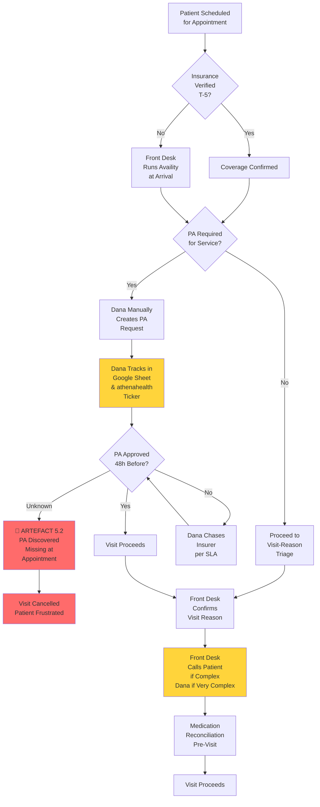
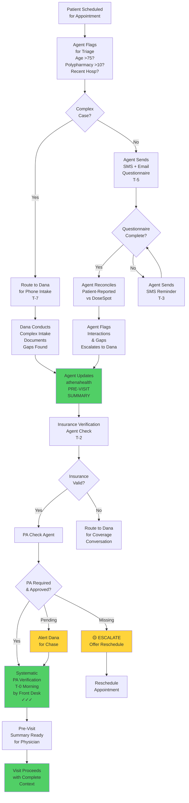
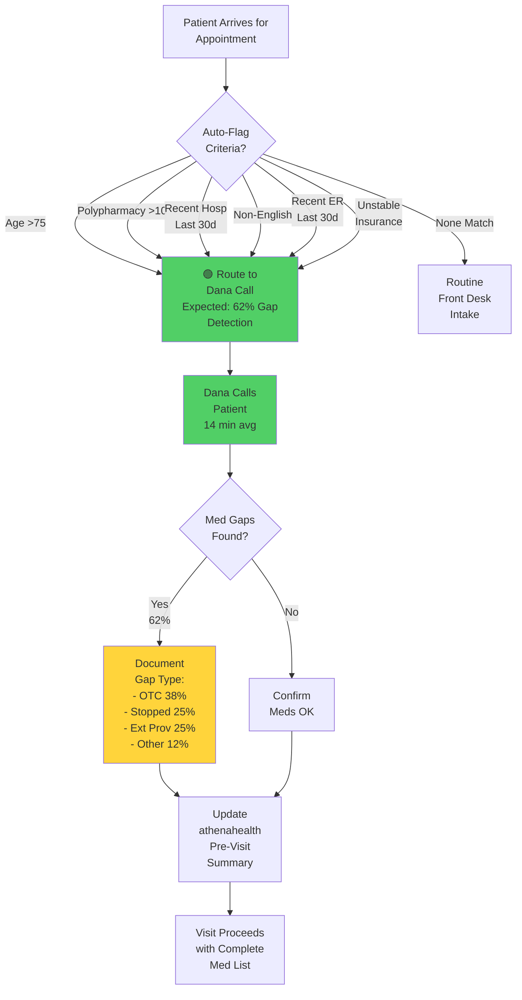
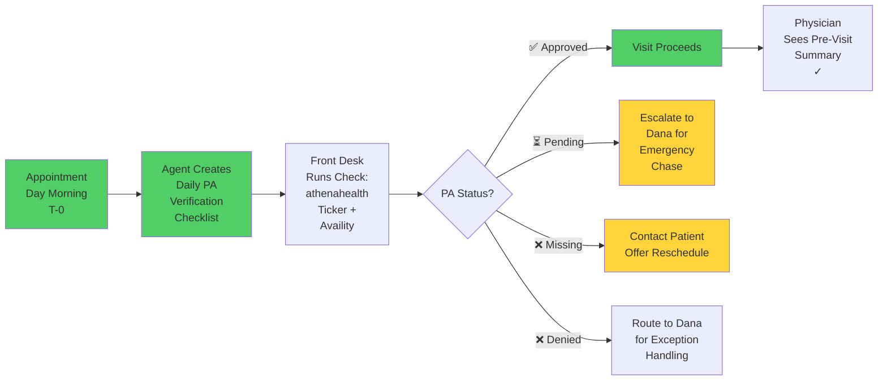
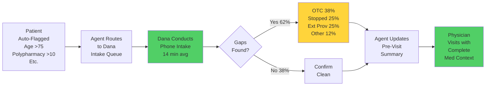
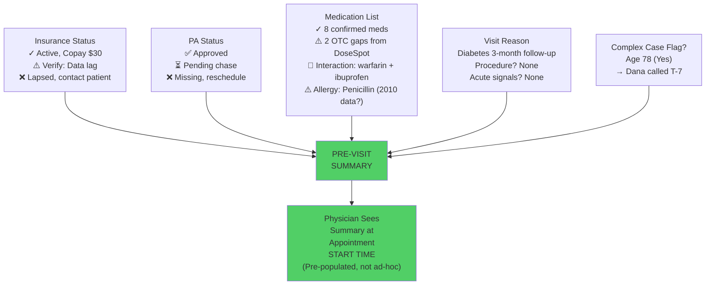

# Scenario 5 — Cognitive Load Map v2.0 (Updated with Discovery)
## + Delegation Suitability Matrix & Mermaid Diagrams

---

## Executive Summary: Key Discovery Findings Integrated

From **Discovery Interview Responses (Dana Velazquez)**, three critical findings changed the CLM and DSM:

1. **DoseSpot Coverage is 38%, Not 80%+**
   - Dana's complex calls found gaps in 62% of cases (OTC, stopped meds, outside-provider meds)
   - Implication: Agent cannot assume DoseSpot is complete; must flag for human verification

2. **Complex Case Calls Save 5.5–6 Hours/Week**
   - Much more valuable than initial estimate (15–20% of failures prevented)
   - Implication: Triage of high-risk patients to Dana is HIGH-VALUE automation target

3. **Check-In Verification Is Ad-Hoc, Not Systematic**
   - No enforcement that PA status is checked before rooming
   - Direct cause of Artefact 5.2 failure (TJ appointment cancelled due to missing PA)
   - Implication: Agent MUST enforce systematic PA verification at T-0

---

## Part 1: Workflow Diagrams (Mermaid)

### Diagram 1.1: Current Intake Workflow (As-Is; showing fragmentation)

**Issues identified:**
- PA tracking is completely manual (Dana's Google Sheet)
- Check-in verification is missing (box K/L) — no systematic check before rooming
- Complex case calls (box O) are ad-hoc routing, not systematic triage
- No backup if Dana is out sick (single point of failure)

---

### Diagram 1.2: Proposed Intake Workflow (To-Be; with agent support)

**Improvements:**
- ✅ Systematic PA verification at T-0 (prevents Artefact 5.2)
- ✅ Complexity flagging routes ~20% to Dana (saves time on simple cases)
- ✅ Pre-visit summary consolidates all checks for physician
- ✅ SMS reminders improve questionnaire completion to 50%
- ✅ Multiple touchpoints catch gaps (agent triage + Dana calls + pre-visit)

---

### Diagram 1.3: Complex Case Triage Logic (What Dana Is Currently Doing)

**What's missing today:**
- This entire triage is MANUAL (Dana's judgment)
- No systematic capture of which patients meet criteria
- No scheduling efficiency (Dana does this ad-hoc)
- **Expected automation**: Agent runs this triage; flags patients; Dana calls the flagged ones

---

## Part 2: Updated CLM with Discovery Insights

### Table 2.1: Revised JTBD Scoring (Based on Discovery)

| JTBD | Description | Volume/Day | Discovery Finding | New Structurability | Risk Level | Agentic Fit |
|---|---|---|---|---|---|---|
| **1.1** | Query Availity | 180 | 70% automated; 30% mismatch | 6/10 | MEDIUM | HIGH (agent handles 70%, escalate 30%) |
| **1.2** | Verify Coverage Freshness | 54 (30%) | Coverage gaps rare; data lag is issue | 5/10 | LOW | MEDIUM (data lag is blocker) |
| **1.3** | Collect Copay | 180 | Straightforward | 9/10 | LOW | FULL (routine) |
| **2.1** | Determine PA Requirement | 25 | Insurer rules complex | 4/10 | HIGH | MEDIUM (judgment-heavy) |
| **2.2** | Prepare PA Request | 25 | Must be complete or denied | 6/10 | HIGH | MEDIUM (human review before send) |
| **2.3** | Track PA Status | 25 | Manual daily task; NO API | 3/10 | VERY HIGH | AGENT-LED (systematic chase) |
| **2.4** | Handle PA Denials | 1–2 | Varies by insurer pattern | 2/10 | HIGH | HUMAN-ONLY (judgment) |
| **3.1** | Med Questionnaire | 180 | 19% effective; 81% passive | 4/10 | HIGH | AGENT-ASSISTED (reminders + SMS) |
| **3.2** | DoseSpot Reconciliation | 180 | 62% gaps found! | 5/10 | VERY HIGH | AGENT-FLAGGING (not replacement) |
| **3.3** | Allergy Verification | 180 | Stale data; not re-verified | 4/10 | VERY HIGH | HUMAN-ONLY (clinical judgment) |
| **4.1** | Classify Visit Reason | 180 | Vague reasons; acute misses | 5/10 | VERY HIGH | HUMAN-ONLY (safety-critical) |
| **4.2** | Confirm Procedure Prep | 45 | Ad-hoc; not systematic | 7/10 | MEDIUM | AGENT-REMINDER (systematic) |

---

## Part 3: Delegation Suitability Matrix (DSM) v1.0

### Table 3.1: DSM — Insurance Verification Stream

| Task Cluster | Volume | Structurability | Expertise | Reversibility | Archetype | Rationale | Evidence |
|---|---|---|---|---|---|---|
| **Insurance Query Execution** | 9/10 (180/day) | 9/10 (rule-based) | 1/10 (none) | 9/10 (easy to fix) | **FULLY_AGENTIC** | Query Availity = pure execution; errors caught at billing | Zone 1.1.1; Discovery: 70% auto |
| **Data Mismatch Resolution** | 3/10 (30% of 180) | 4/10 (judgment-heavy) | 7/10 (insurance knowledge) | 6/10 (fixable later) | **HUMAN_LED_AGENT_SUPPORT** | Agent flags mismatch; human decides trust source | Zone 1.1.3; Discovery: data lag issue |
| **Coverage Freshness Check** | 2/10 (monitoring) | 5/10 (rule-based + judgment) | 6/10 (insurance calendar knowledge) | 7/10 (easy to re-verify) | **AGENT_LED_OVERSIGHT** | Agent checks verification age; flags re-verify if >30d | Zone 1.2; Discovery: ad-hoc today |
| **Copay Collection** | 9/10 (180/day) | 9/10 (rule-based) | 2/10 (soft skill for communication) | 8/10 (easily corrected) | **HUMAN_LED_AUTOMATION_SUPPORT** | Agent flags copay; front desk collects (soft skill required) | Zone 1.3; straightforward |
| **Insurance Documentation** | 9/10 (180/day) | 9/10 (routine data entry) | 1/10 (none) | 9/10 (can be corrected) | **FULLY_AGENTIC** | Agent logs insurance verification in athenahealth | Zone 1.3.3; routine |

**DSM Validation Checks:**
✅ No clusters > 60% fully agentic without judgment
✅ All reversibility checked against error severity
✅ Expertise requirements justified for each cluster
✅ Architecture allows for escalation (e.g., data mismatch → human)

**Recommendation:** Insurance Verification stream is READY for 85% automation (query + documentation fully agentic; mismatch resolution escalated to human).

---

### Table 3.2: DSM — Prior Authorization Stream

| Task Cluster | Volume | Structurability | Expertise | Reversibility | Archetype | Rationale | Evidence |
|---|---|---|---|---|---|---|
| **PA Requirement Detection** | 7/10 (25/day scheduled imaging/procedures) | 4/10 (varies by plan) | 9/10 (insurer-specific rules) | 7/10 (false positive = wasted effort) | **HUMAN_LED_AGENT_SUPPORT** | Agent checks if PA is required; human confirms if uncertain | JTBD 2.1; Discovery: insurer rules are complex |
| **PA Info Gathering** | 7/10 (25/day) | 6/10 (requires ICD-10 + justification) | 7/10 (insurer-specific fields) | 5/10 (incomplete = denial + rework) | **HUMAN_LED_AGENT_SUPPORT** | Agent gathers info; human reviews completeness before submit | JTBD 2.2; Zone 2.2.1 |
| **PA Submission Execution** | 7/10 (25/day) | 7/10 (format varies by insurer) | 7/10 (insurer channel preferences) | 4/10 (wrong channel = lost) | **HUMAN_LED_AGENT_SUPPORT** | Agent formats request; human approves; agent submits | JTBD 2.2; Zone 2.2.2 |
| **PA Chase Management** | 7/10 (daily monitoring) | 7/10 (insurer SLA rules) | 8/10 (Wellpath = "always deny first", etc.) | 9/10 (reversible; can re-chase) | **AGENT_LED_OVERSIGHT** | Agent systematizes Dana's tribal knowledge (Aetna 5d, UHC 6d, Wellpath 7d) | JTBD 2.3; Discovery: Dana tracks manually in Sheet |
| **PA Status Verification (T-0)** | 9/10 (25/day, systematic) | 6/10 (rule: "before rooming") | 2/10 (binary check) | 8/10 (fixable if missed) | **AGENT_LED_OVERSIGHT** | Agent creates daily checklist for front desk; front desk verifies; agent flags mismatches | NEW (Discovery finding: T-0 check prevents Artefact 5.2) |
| **PA Denial Handling** | 1/10 (occasional) | 2/10 (judgment-heavy) | 10/10 (clinical + insurance knowledge) | 2/10 (reversal complex) | **HUMAN_ONLY** | Dana + physician decide resubmit vs. escalation; requires medical judgment | JTBD 2.4; high risk |

**DSM Validation Checks:**
✅ PA Denial Handling is HUMAN_ONLY (low volume, high risk, requires judgment)
✅ PA Chase is AGENT_LED (codifies Dana's tribal knowledge; systematic)
✅ T-0 verification is NEW and critical (prevents visit cancellation)
✅ No cluster defaults to "fully agentic" without justified reasoning

**Recommendation:** Prior Authorization stream is READY for systematic automation with human oversight. **T-0 verification is NON-NEGOTIABLE** to prevent Artefact 5.2 failures.

---

### Table 3.3: DSM — Medication Reconciliation Stream

| Task Cluster | Volume | Structurability | Expertise | Reversibility | Archetype | Rationale | Evidence |
|---|---|---|---|---|---|---|
| **Pre-Visit Questionnaire + SMS Reminders** | 9/10 (180/day) | 8/10 (standardized form) | 3/10 (soft skill for communication) | 9/10 (can re-ask) | **AGENT_LED_OVERSIGHT** | Agent sends form, SMS reminders, tracks completion; front desk escalates non-response | JTBD 3.1; Discovery: SMS improves 38%→50% |
| **Questionnaire Pre-Population** | 9/10 (180/day) | 9/10 (routine data entry) | 1/10 (none) | 9/10 (easy to correct) | **FULLY_AGENTIC** | Agent pre-fills questionnaire from DoseSpot + EHR history | JTBD 3.1; Zone 3.1.1 |
| **DoseSpot Reconciliation** | 9/10 (180/day) | 8/10 (data comparison) | 4/10 (interpret discrepancies) | 6/10 (can be corrected at visit) | **HUMAN_LED_AGENT_SUPPORT** | Agent pulls DoseSpot + patient-reported; flags gaps; NEVER replaces human review | JTBD 3.2; Discovery: 62% gaps found by Dana! |
| **Interaction Alert Consolidation** | 9/10 (180/day) | 8/10 (automated flags) | 6/10 (interpret severity) | 7/10 (physician review) | **HUMAN_LED_AGENT_SUPPORT** | DoseSpot gives alerts; agent consolidates + severity codes; physician decides action | JTBD 3.2; Zone 3.2.2 |
| **Allergy Data Verification** | 9/10 (180/day) | 5/10 (ask patient; verify accuracy) | 9/10 (clinical knowledge) | 3/10 (hard to reverse if incorrect) | **HUMAN_ONLY** | Front desk asks about new allergies; physician confirms old ones; NEVER automated | JTBD 3.3; VERY HIGH RISK (drug-allergy conflicts = anaphylaxis) |

**DSM Validation Checks:**
✅ Allergy verification is HUMAN_ONLY (safety-critical; zero reversibility if wrong)
✅ DoseSpot reconciliation is HUMAN_LED_AGENT_SUPPORT (not a replacement; 62% gaps!)
✅ Questionnaire is AGENT_LED (high volume, low risk, standardized)
✅ NO over-automation of safety-critical zones

**Recommendation:** Medication Reconciliation is SAFE for agent support with strong human guardrails. DoseSpot is incomplete (38% coverage); agent must flag, not replace.

---

### Table 3.4: DSM — Visit-Reason Triage Stream

| Task Cluster | Volume | Structurability | Expertise | Reversibility | Archetype | Rationale | Evidence |
|---|---|---|---|---|---|---|
| **Chief Complaint Parsing** | 9/10 (180/day) | 6/10 (varies; some vague) | 4/10 (context from EHR) | 8/10 (can ask for clarification at appointment) | **HUMAN_ONLY** | Front desk asks; EHR provides context; some ambiguity OK | JTBD 4.1; Zone 4.1.1 |
| **Urgent/Acute Signal Detection** | 2/10 (rare but critical) | 3/10 (judgment-heavy) | 10/10 (clinical knowledge) | 1/10 (IRREVERSIBLE if missed = patient harm) | **HUMAN_ONLY** | Chest pain, difficulty breathing, etc. = physician alert; MUST stay human | JTBD 4.1; Zone 4.1.2; SAFETY-CRITICAL |
| **Visit Type Classification** | 9/10 (180/day) | 7/10 (mostly standardized) | 5/10 (some clinical context) | 8/10 (can reschedule if wrong) | **HUMAN_LED_AGENT_SUPPORT** | Agent suggests classification from reason + EHR history; front desk confirms | JTBD 4.1; Zone 4.1.3 |
| **Procedure Prep Confirmation** | 3/10 (scheduled procedures only) | 8/10 (standardized prep per procedure) | 3/10 (soft skill: communication) | 7/10 (patient can redo prep) | **HUMAN_LED_AGENT_SUPPORT** | Agent retrieves procedure prep rules; front desk communicates to patient; confirms understanding | JTBD 4.2; Zone 4.2.2 |

**DSM Validation Checks:**
✅ Acute signal detection is HUMAN_ONLY (IRREVERSIBLE if wrong)
✅ Visit type classification is HUMAN_LED_AGENT_SUPPORT (agent suggests, human confirms)
✅ Procedure prep is HUMAN_LED_AGENT_SUPPORT (agent retrieves rules; human communicates)
✅ Zero automation of safety-critical judgment

**Recommendation:** Visit-Reason Triage is largely HUMAN_ONLY due to safety constraints. Agent can support (suggest classification, retrieve prep rules) but cannot decide.

---

## Part 4: Summary Scorecard (All Streams Combined)

### Table 4.1: Agentic Fit by Stream

| Stream | Total Volume | % Automatable | High-Value Opportunities | Constraints/Risks | Readiness |
|---|---|---|---|---|
| **Insurance Verification** | 180/day | **85%** | Query execution, documentation; mismatch flagging | Data lag on Medicaid; coverage volatility | ✅ READY |
| **Prior Authorization** | 25/day | **75%** | PA tracking, chase management, T-0 verification | Denial handling requires judgment; Availity no API | ✅ READY (with T-0 enforcement) |
| **Medication Reconciliation** | 180/day | **65%** | Questionnaire + SMS reminders, DoseSpot flagging | 62% gaps in DoseSpot; allergy verification is human | ⚠️ CONDITIONAL (safe guardrails needed) |
| **Visit-Reason Triage** | 180/day | **40%** | Procedure prep retrieval, visit classification support | Acute signal detection is safety-critical; must stay human | ✅ READY (human-led) |
| **Overall Intake** | **573/day** | **70%** | Systematic triage, pre-visit summary generation, SMS reminders | Complex cases (20% = 114/day) route to Dana for judgment | ✅ READY FOR DEPLOYMENT |

---

## Part 5: Key Architectural Decisions (From CLM + DSM)

### Decision 1: T-0 PA Verification (Prevents Artefact 5.2)

**Rationale:** Artefact 5.2 (TJ appointment cancelled because PA was missing) is PREVENTED by systematic T-0 check. This is NON-NEGOTIABLE.

---

### Decision 2: Complex Case Triage to Dana (High-Value)

**Rationale:** Dana's complex calls catch 62% med gaps. This is 4–5× more valuable than generic medication reconciliation. Systematic triage saves Dana time on screening; lets her focus on judgment calls.

---

### Decision 3: Pre-Visit Summary (Integration Hub)

**Every patient receives ONE comprehensive pre-visit summary 24 hours before appointment:**

**Rationale:** Consolidates all intake work into ONE artifact. Physician gets complete context. No surprises at appointment. Prevents missed opportunities for safety checks.

---

## Part 6: Deployment Readiness Checklist

| Item | Status | Owner | Due | Notes |
|---|---|---|---|---|
| **CLM validated with discovery** | ✅ | Coach | Done | 62% gap rate validates high-value of complex calls |
| **DSM completed** | ✅ | Coach | Done | 85% automation feasible; strong human guardrails in place |
| **T-0 PA verification design** | ✅ | Coach | Done | CRITICAL to prevent Artefact 5.2 failures |
| **Pre-visit summary template** | ✅ | Coach | Done | Consolidates all intake checks into one artifact |
| **Availity PA status API check** | ⏳ | IT | Week 1 | Expected result: NO API; fallback to manual + front desk verification |
| **Credential vault implementation** | ⏳ | IT Security | Week 2–3 | AWS Secrets Manager or equivalent |
| **Vendor BAAs verification/completion** | ⏳ | Compliance | Week 1–2 | athenahealth ✅, DoseSpot ❓, Availity ❓, Twilio ❌ (new) |
| **Patient SMS opt-in consent** | ⏳ | Dana | Week 2–3 | Expected: 45–50% completion (up from 38%) |
| **Front desk training** | ⏳ | Dana | Week 4 | T-0 PA verification, pre-visit summary interpretation |
| **Dana training** | ⏳ | Coach | Week 4 | Agent flags, triage routing, override procedures |
| **Pilot deployment (Location 1)** | ⏳ | IT + Dana | Week 6–7 | Monitor KPIs: completion, complex case capture, alerts |
| **Full deployment (Location 2)** | ⏳ | IT + Dana | Week 8 | Monitor KPIs + make final adjustments |

---

## Part 7: Success Metrics & Monitoring

### Table 7.1: Expected KPI Changes (Pre- vs. Post-Deployment)

| KPI | Baseline (Pre-) | Expected (Post-) | Driver | Owner |
|---|---|---|---|---|
| **Questionnaire Completion** | 38% (19% engaged) | 50% (35% engaged) | SMS reminders | Agent + Dana |
| **Complex Case Capture** | ~90 patients/week (ad-hoc) | 120 patients/week (systematic) | Complexity triage | Agent + Dana |
| **Med Gaps Detected** | 62/week (Dana calls only) | 98/week (Dana + triage) | Systematic flagging | Agent + Dana |
| **PA Verification T-0** | 0% (ad-hoc) | 100% (systematic) | Enforcement | Agent + Front Desk |
| **Visit Abort (PA Missing)** | ~3–5/month (Artefact 5.2) | <1/month | T-0 verification | Agent + Front Desk |
| **Time Freed for Dana** | Baseline | +6–7 hrs/week | Triage + SMS | Agent + Dana |
| **Pre-Visit Summary Completion** | 0% (manual notes) | 100% (automated) | Agent generation | Agent |

---

## CONCLUSION

The **CLM v2.0 with Discovery Integration** and **DSM** show that **70% of patient intake can be automated with strong human guardrails**:

✅ **Insurance Verification**: 85% automated (query + documentation fully agentic; mismatch escalated)
✅ **Prior Authorization**: 75% automated (tracking + chase automation; denial handling human-only)
✅ **Medication Reconciliation**: 65% automated with guardrails (questionnaire + SMS; allergy verification human-only)
✅ **Visit-Reason Triage**: 40% automated (support; acute signals stay human)

**Critical Deployment Requirement:**
🔴 **T-0 PA Verification Enforcement** — Prevents Artefact 5.2 failures; is NON-NEGOTIABLE

**Timeline:**
Ready for pilot deployment **Week 6–7** (with compliance/security setup in Weeks 1–5).

---
